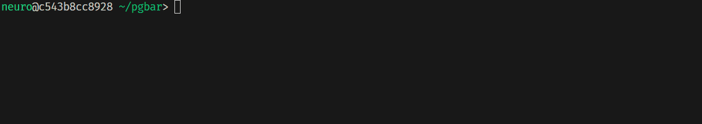

# pgbar - ProgressBar for C++11

**Contents**  
- [pgbar - ProgressBar for C++11](#pgbar---progressbar-for-c11)
  - [Styles](#styles)
  - [How to use](#how-to-use)
    - [Before C++20](#before-c20)
    - [After C++20](#after-c20)
  - [Public Functions](#public-functions)
    - [pgbar/pgbar.hpp](#pgbarpgbarhpp)
    - [pgbar/range.hpp](#pgbarrangehpp)
  - [Instructions for Use](#instructions-for-use)
  - [FAQ](#faq)
    - [Will it slow down the program?](#will-it-slow-down-the-program)
    - [Can it be used on Windows/Linux?](#can-it-be-used-on-windowslinux)
    - [What kind of C++ version is required?](#what-kind-of-c-version-is-required)
    - [What distinguishes it from other C++ progress bars on GitHub?](#what-distinguishes-it-from-other-c-progress-bars-on-github)
- [pgbar - ProgressBar for C++11 - zh\_cn](#pgbar---progressbar-for-c11---zh_cn)
  - [风格样式](#风格样式)
  - [使用例](#使用例)
    - [在 C++20 以前](#在-c20-以前)
    - [在 C++20 之后](#在-c20-之后)
  - [公有方法](#公有方法)
    - [pgbar/pgbar.hpp](#pgbarpgbarhpp-1)
    - [pgbar/range.hpp](#pgbarrangehpp-1)
  - [使用须知](#使用须知)
  - [FAQ](#faq-1)
    - [会拖慢程序吗？](#会拖慢程序吗)
    - [能在 Windows/Linux 上使用吗？](#能在-windowslinux-上使用吗)
    - [需要什么样的 C++ 版本？](#需要什么样的-c-版本)
    - [与 Github 上的其他 C++ 进度条有什么区别？](#与-github-上的其他-c-进度条有什么区别)

A simple tqdm-like, header-only progress bar for C++11 and higher standards.

No third party dependencies required.

## Styles
```
[---------------                         ] [ 36.63%  |  36638968/100000000 |  21.27 MHz |   1s < 3s   ]
```

> The "Hz" indicates how many tasks are performed per second.

The status bar is colored using escape sequences by default.

If your terminal doesn't support this or don't want the coloring effect, define a macro at the beginning of the program.

You can also use multiple constants from pgbar::style::dye to customize the color of the status bar.
```cpp
#define PGBAR_NOT_COL // This will cancel the character coloring of the status bar.
#include "pgbar/pgbar.hpp"
// ...
```


## How to use
### Before C++20
```cpp
#include "pgbar/range.hpp"

int main()
{
  size_t TOTAL = 10000;

  pgbar::pgbar<> bar { TOTAL, 2 }; // Object must be created first, then set the output style of the progress bar
  bar.set_todo( " " ).set_done( "#" );
  for ( size_t i = 0; i < (TOTAL / 2); ++i ) {
    bar.update(); // Normal update
    // Do anything you want here...
  }

  bar.reset(); // Reset the progress bar state and change the output style
  for (auto iter : pgbar::range(TOTAL, bar)) // Equivalent to `for (size_t i = 0; i < TOTAL; ++i)`...
    continue; // If you don't want to call `update()`, you can use `range` from 'pgbar/range.hpp'
  // Delegates updating and task setting to the iterator

  // See demo/cxx11.cpp for details
}
```
### After C++20
If C++20 is enabled, the pgbar object can accept a pgbar::style object as an initialization parameter.

It is relying on the designated initializer syntax.
```cpp
#include "pgbar/pgbar.hpp"

int main()
{
  size_t TOTAL = 10000;

  pgbar::pgbar bar { pgbar::style {
    .todo_char = " ",
    .done_char = "#",
    .total_tasks = TOTAL,
    .each_setp = 2,
    .option = pgbar::style::bar | pgbar::style::rate
  } };
  for ( size_t i = 0; i < (TOTAL / 2); ++i ) {
    bar.update(); // Normal update
    // Do anything you want here...
  }
  // Similarly, the pgbar's set_style method also accepts a pgbar::style object to set the object style
  // See demo/cxx20.cpp for details
}
```
The available optional fields in `pgbar::style`, along with their actual types, are as follows:
```cpp
struct style {
  std::optional<...> todo_char;    // Blank part of the progress bar
  std::optional<...> done_char;    // Character to fill the progress bar
  std::optional<...> left_bracket; // Left bracket enclosing the progress bar
  std::optional<...> right_bracket;// Right bracket enclosing the progress bar
  std::optional<...> total_tasks;  // Total number of tasks
  std::optional<...> each_setp;    // Equivalent update count for each update
  std::optional<...> bar_length;   // Length of the progress bar to occupy in the terminal
  std::optional<...> color;        // Color effect of the status information on the right side of the progress bar
  std::optional<...> option;       // Styling switches, a bit vector
};
```

## Public Functions
### pgbar/pgbar.hpp
The header file provides several methods related to the progress bar object `pgbar`, including template type predicates and member methods of the object itself.
```cpp
#include "pgbar/pgbar.hpp"
using namespace pgbar; // Ignore namespace prefix

/* Template type predicate, checks if the given type is a pgbar object */
template<typename B>
struct is_pgbar { constexpr bool value; };

/* Template type predicate, checks if the given type is a renderer object accepted by pgbar */
template<typename R>
struct is_renderer { constexpr bool value; };

/* Template type predicate, checks if the given type is acceptable by a pgbar object as an output stream object */
template<typename S>
struct is_stream { constexpr bool value; };

/* Notify the progress bar that it needs updating. */
void pgbar::update()

/* Requests the progress bar to advance its iteration progress by next_step steps,
 * steps beyond the total number of tasks will be ignored. */
void pgbar::update(size_t next_step)

/* Check if the progress bar object has been started. */
bool pgbar::is_updated() const noexcept

/* Check if the progress bar object has finished updating. */
bool pgbar::is_done() const noexcept

/* Set the number of tasks to be updated each time `update()` is called. */
pgbar& pgbar::set_step(size_t _step) noexcept

/* Set the total number of tasks the progress bar needs to handle. */
pgbar& pgbar::set_task(size_t _total_tsk) noexcept

/* Set the character for the unfilled part of the progress bar. */
pgbar& pgbar::set_done(std::string _done_ch)

/* Set the character used to fill the progress bar. */
pgbar& pgbar::set_todo(std::string _todo_ch)

/* Set the style of the left bracket of the progress bar, can be passed an empty string. */
pgbar& pgbar::set_lbracket(std::string _l_bracket)

/* Set the style of the right side of the progress bar. */
pgbar& pgbar::set_rbracket(std::string _r_bracket)

/* Set the length of the progress bar, indicating how many characters the progress bar occupies after output. */
pgbar& pgbar::set_bar_length(size_t _length) noexcept

/* Set the color of the status information bar using the given constant values from pgbar::style::dye.
 * This function has no actual effect when the macro PGBAR_NOT_COL is activated. */
pgbar& pgbar::set_color(/* literal type */ _dye) noexcept

/* Use bitwise operations to set the information to be displayed based on multiple predefined options. */
pgbar& pgbar::set_style(pgbar::style::Type _selection) noexcept

/* This function is only available under the C++20 standard.
 * Set the style of the progress bar object based on the field values of style.
 * See demo/cxx20.cpp for details. */
pgbar& pgbar::set_style(style _selection)
```
### pgbar/range.hpp
```cpp
#include "pgbar/range.hpp"
using namespace pgbar; // Ignore namespace prefix
// The following function signatures will hide unnecessary template parameters

/* Only accept integer and floating-point types */
range(_startpoint, _endpoint, _step, BarT& _bar)
range(_endpoint, _step, BarT& _bar)
/* The following two functions only accept integer types */
range(_startpoint, _endpoint, BarT& _bar)
range(_endpoint, BarT& _bar)

/* Functions accepting iterator types as range */
range(_startpoint, _endpoint, BarT& _bar) // Only supports iterators that move using increment/decrement operators

/* Accepts an iterable container type (including raw arrays) as a range,
 * requiring the container to use `iterator` as the iterator name */
range(container, BarT& _bar) // Raw arrays do not have iterator name requirements
```

## Instructions for Use
If `update()` is called again (directly or indirectly) without executing `reset()` after the progress bar has finished updating, it will throw the exception `bad_pgbar`.

Calling `update()` without setting the total number of tasks will also throw the exception `bad_pgbar`.

Attempting to update tasks with an incremental step size of 0 when calling `update()` will also throw the exception `bad_pgbar`.

When using `range`, specifying an incorrect range (such as an endpoint smaller than the starting point) will also throw the exception `bad_pgbar`.

The progress bar object considers the output stream object type and renderer type as part of the type parameters, with the default output stream object bound to `std::cerr`.

By default, the progress bar uses multithreaded rendering for terminal output, and you can switch rendering modes using `pgbar::singlethread` and `pgbar::multithread`.

After completing tasks, if you need to reset the progress bar style, you must execute `reset()` first, otherwise the change will not take effect.

Attempting to call non-`const` member methods while the progress bar is running is invalid but will not throw an exception.

## FAQ
### Will it slow down the program?
If using a multithreaded renderer, the answer is no. In the case of multithreaded rendering, the program consists of a notification thread (i.e., the main thread) and a rendering thread.

In that case, each update is handled by the main thread, which changes the internal iteration count of the progress bar (i.e., each call to `update()`).

The actual terminal display is handled by a background rendering thread.

The refresh rate of the rendering thread is designed to be approximately 25Hz.

By splitting threads, the updates of the progress bar itself do not affect the operation of the main thread.

Only at specific time points will the synchronization between the rendering thread and the main thread block the main thread (using spin locks), but this typically does not take up much time.

However, a single-threaded renderer will skip some refreshes at a fixed refresh rate (25Hz).

Each update of the progress bar will be executed by the main thread, so the performance will be much lower than multithreading, but the display effect will be smoother.
### Can it be used on Windows/Linux?
Yes, it can.  Since the code implementation only uses standard library features, it has good cross-platform compatibility.

Some components will enable the concepts feature when compiling with C++20, so make sure your compiler supports it.

The code also checks if its standard output is bound to a terminal, and if not, it will not output strings externally.

**However, if using an output stream object other than `std::ostream`, the program will not attempt to determine whether it is running in a terminal.**
### What kind of C++ version is required?
It requires C++11 and later versions of the C++ standard.
### What distinguishes it from other C++ progress bars on GitHub?
There's not much difference, except for the ability to customize progress bar characters more freely.

There's already [a better progress bar library](https://github.com/p-ranav/indicators) on GitHub, and if you want a more powerful progress bar, I recommend that one.

I wrote this because [tqdm.cpp](https://github.com/tqdm/tqdm.cpp) couldn't run on my machine, [progressbar](https://github.com/gipert/progressbar) was too slow, and [cpptqdm](https://github.com/aminnj/cpptqdm) couldn't run on Windows.

Just for practice, that's all.

- - -

# pgbar - ProgressBar for C++11 - zh_cn
一个简单的，适用于 C++11 及更高标准的 tqdm-like、header-only 进度条.

不需要第三方依赖.

## 风格样式
```
[---------------                         ] [ 36.63%  |  36638968/100000000 |  21.27 MHz |   1s < 3s   ]
```

> 这里的 'Hz' 表示每秒执行了多少次更新.

默认情况下会使用 ASCII 转义序列对状态栏进行染色，如果你的终端不支持、或者不希望有着色效果，可以在程序最开头定义一个宏.

也可以使用 `pgbar::style::dye` 中的多个常量自定义状态栏的颜色.
```cpp
#define PGBAR_NOT_COL // 这会取消状态栏染色.
#include "pgbar/pgbar.hpp"
// ...
```


## 使用例
### 在 C++20 以前
```cpp
#include "pgbar/range.hpp"

int main()
{
  size_t TOTAL = 10000;

  pgbar::pgbar<> bar { TOTAL, 2 }; // 必须先创建对象，再设置进度条的输出样式
  for ( size_t i = 0; i < (TOTAL / 2); ++i ) {
    bar.update(); // Normal update
    // Do anything you want here...
  }

  bar.reset().set_todo( " " ).set_done( "#" ); // 重置进度条状态，并更改输出样式
  for (auto iter : pgbar::range(TOTAL, bar)) // 等于 for (size_t i = 0; i < TOTAL; ++i) ...
    continue; // 不想调用 `update()` 时，可以使用 'pgbar/range.hpp' 中的 `range`
  // 把更新操作和任务数设置交给迭代器进行

  // 详见 demo/cxx11.cpp
}
```
### 在 C++20 之后
如果启用了 C++20，那么 `pgbar` 对象可以接受一个 `pgbar::style` 对象作为初始化进度条样式.

这依赖于 C++20 的指定初始化器语法.
```cpp
#include "pgbar/pgbar.hpp"

int main()
{
  size_t TOTAL = 10000;

  pgbar::pgbar bar { pgbar::style {
    .todo_char = " ",
    .done_char = "#",
    .total_tasks = TOTAL,
    .each_setp = 2,
    .option = pgbar::style::bar | pgbar::style::rate
  } };
  for ( size_t i = 0; i < (TOTAL / 2); ++i ) {
    bar.update(); // Normal update
    // Do anything you want here...
  }
  // 同样的，pgbar 的 set_style 方法也支持接受一个 pgbar::style 对象设置对象样式
  // 详见 demo/cxx20.cpp
}
```
`pgbar::style` 中所有可用且*可选*的字段，以及这些字段的实际类型如下：
```cpp
struct style {
  std::optional<...> todo_char;    // 进度条的空白部分
  std::optional<...> done_char;    // 填充进度条的字符
  std::optional<...> left_bracket; // 括起进度条的左侧括号
  std::optional<...> right_bracket;// 括起进度条的右侧括号
  std::optional<...> total_tasks;  // 任务总数
  std::optional<...> each_setp;    // 每次更新时等价的更新次数
  std::optional<...> bar_length;   // 进度条在终端中要占用的长度
  std::optional<...> color;        // 进度条右侧状态信息的颜色效果
  std::optional<...> option;       // 样式化开关，一个位向量
};
```

## 公有方法
### pgbar/pgbar.hpp
头文件中提供了多个与进度条对象 `pgbar` 有关的方法，包括模板类型谓词及对象本身的成员方法.
```cpp
#include "pgbar/pgbar.hpp"
using namespace pgbar; // 忽略命名空间前缀

/* 模板类型谓词，检查给定类型是否是 pgbar 对象 */
template<typename B>
struct is_pgbar { constexpr bool value; };

/* 模板类型谓词，检查给定类型是否是 pgbar 能接受的渲染器对象 */
template<typename R>
struct is_renderer { constexpr bool value; };

/* 模板类型谓词，检查给定类型是否是渲染器能接受的输出流对象 */
template<typename S>
struct is_stream { constexpr bool value; };

/* 通知进度条该更新了. */
void pgbar::update()

/* 要求进度条的迭代进度一次性前进 next_step 步，超出任务总数的步数会被忽略. */
void pgbar::update(size_t next_step)

/* 检查进度条对象是否已经启动. */
bool pgbar::is_updated() const noexcept

/* 检查进度条对象是否更新完毕. */
bool pgbar::is_done() const noexcept

/* 设置每次调用 `update()` 时更新的任务数. */
pgbar& pgbar::set_step(size_t _step) noexcept

/* 设置进度条需要处理的总任务数. */
pgbar& pgbar::set_task(size_t _total_tsk) noexcept

/* 设置进度条中未被填充部分的字符. */
pgbar& pgbar::set_done(std::string _done_ch)

/* 设置用于填充进度条的字符. */
pgbar& pgbar::set_todo(std::string _todo_ch)

/* 设置进度条左侧的括号样式，可以传入一个空字符串. */
pgbar& pgbar::set_lbracket(std::string _l_bracket)

/* 设置进度条右侧样式. */
pgbar& pgbar::set_rbracket(std::string _r_bracket)

/* 设置进度条的长度，表示进度条在输出后占多少字符长. */
pgbar& pgbar::set_bar_length(size_t _length) noexcept

/* 设置状态信息栏的颜色，使用 pgbar::style::dye 中的给定常量值来设置.
 * 在宏 PGBAR_NOT_COL 激活时该函数没有实际效果. */
pgbar& pgbar::set_color(/* literal type */ _dye) noexcept

/* 根据多个预定选项，使用位操作设定需要显示的信息. */
pgbar& pgbar::set_style(pgbar::style::Type _selection) noexcept

/* 该函数仅限 C++20 标准下可用，根据 style 的字段值设置进度条对象的风格，详见 demo/cxx20.cpp */
pgbar& pgbar::set_style( style _selection )
```
### pgbar/range.hpp
```cpp
#include "pgbar/range.hpp"
using namespace pgbar; // 忽略命名空间前缀
// 以下函数签名会隐藏不必要的模板参数

/* 只接受整型和浮点型 */
range(_startpoint, _endpoint, _step, BarT& _bar)
range(_endpoint, _step, BarT& _bar)
/* 以下两个函数只接受整数类型 */
range(_startpoint, _endpoint, BarT& _bar)
range(_endpoint, BarT& _bar)

/* 接受迭代器类型作为范围的函数 */
range(_startpoint, _endpoint, BarT& _bar) // 仅支持使用自增/自减运算符移动的迭代器

/* 接受一个可迭代的容器类型（包括原始数组）作为范围，要求容器使用 `iterator` 作为迭代器名称 */
range(container, BarT& _bar) // 原始数组没有 iterator 名称要求
```

## 使用须知
如果在进度条更新完成后，没有执行 `reset()` 的情况下（直接或间接地）再次调用 `update()`，会导致异常 `bad_pgbar` 抛出.

如果没有设置任务数就执行 `update()`，同样会抛出异常 `bad_pgbar`.

如果递进步数 `step` 为 0，调用 `update()` 尝试更新任务时也会抛出异常 `bad_pgbar`.

使用 `range` 时，指定了错误的范围（如结尾数值小于开头），同样会抛出异常 `bad_pgbar`.

进度条对象会将输出流对象类型、渲染器类型视作是类型参数的一部分，同时默认情况下的流对象被绑定在 `std::cerr` 上.

默认情况下，进度条会使用多线程渲染终端输出，可以使用 `pgbar::singlethread` 和 `pgbar::multithread` 切换渲染方式.

任务完成后，如果需要重设进度条风格，必须先执行 `reset()`，否则更改不会发生.

在进度条正在运行时，尝试调用非 `const` 成员方法是无效的，但不会抛出异常.

## FAQ
### 会拖慢程序吗？
如果使用的是多线程渲染器，答案是不会. 在多线程渲染的情况下，程序分别由通知线程（即主线程）和一个渲染线程组成.

每次更新时都由主线程负责改变进度条的内部迭代量（即每次调用 `update()` 的操作），实际的终端效果呈现是由后台的渲染线程负责的.

设计时渲染线程的刷新速率被设定为约 25Hz. 通过拆分线程，进度条的更新本身不会影响主线程的运行.

只有到了特定时间点，渲染线程和主线程之间的同步确认才会阻塞主线程（使用自旋锁），不过这通常不会占用很长时间.

但单线程渲染器只会按照固定刷新速率（25Hz）跳过部分刷新，每次进度条更新都会一定会由主线程执行，故性能会比多线程低很多，但显示效果会更流畅.
### 能在 Windows/Linux 上使用吗？
可以的，由于代码实现只使用了标准库功能，因此具有很好的跨平台兼容性.

部分组件在开启 C++20 编译标准时会启用 `concepts` 功能，请确保你的编译器支持.

代码还会判断自己的标准输出是否绑定在终端上，如果输出不在终端中显示则不会对外输出字符串.

**但是如果使用除了 `std::ostream` 以外的输出流对象，程序将不会尝试判断自己是否运行在终端中.**
### 需要什么样的 C++ 版本？
如题，支持 C++11 及以后的 C++ 标准.
### 与 Github 上的其他 C++ 进度条有什么区别？
嗯... 没有太大区别，除了支持更自由的进度条字符设定操作. Github 上已经有一个[更好的进度条库](https://github.com/p-ranav/indicators)了，想用功能更强大的进度条的话，我更推荐那个.

写这个是因为 [tqdm.cpp](https://github.com/tqdm/tqdm.cpp) 没法在我自己的机器上运行，还有 [progressbar](https://github.com/gipert/progressbar) 太慢，以及 [cpptqdm](https://github.com/aminnj/cpptqdm) 没法在 windows 上运行.

纯粹练手，就是这样.
