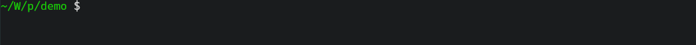

[中文文档见此](docs/README_zh.md)。

## Features
- **Header-only**: All functionality contained within a single `.hpp` file in `include/pgbar`.
- **Low update overhead**: Minimal cost for each progress update.
- **Unicode support**: Parse each string in UTF-8 encoding.
- **RGB color support**: Customizable progress bar colors.
- **Optional thread safety**: Switchable via template parameters.
- **`tqdm`-like interface**: Access provided via template metaprogramming.
- **Modern C++ compliance**: Adheres to best practices in modern C++.

## Styles
### ProgressBar
```
{LeftBorder}{Description}{Percent}{Starting}{Filler}{Lead}{Remains}{Ending}{Counter}{Speed}{Elapsed}{Countdown}{RightBorder}
 30.87% | [=========>                    ] |  662933732/2147483647 |  11.92 MHz | 00:00:55 < 00:02:03
```


### BlockProgressBar
```
{LeftBorder}{Description}{Percent}{Starting}{BlockBar}{Ending}{Counter}{Speed}{Elapsed}{Countdown}{RightBorder}
 35.22% | ██████████▋                    |  47275560/134217727 |  16.80 MHz | 00:00:02 < 00:00:05
```


### SpinnerBar
```
{LeftBorder}{Lead}{Description}{Percent}{Counter}{Speed}{Elapsed}{Countdown}{RightBorder}
\ |  48.64% |  65288807/134217727 |  17.84 MHz | 00:00:03 < 00:00:03
```


### ScannerBar
```
{LeftBorder}{Description}{Percent}{Starting}{Filler}{Lead}{Filler}{Ending}{Counter}{Speed}{Elapsed}{Countdown}{RightBorder}
 39.82% | [---------------------<==>----] |  53458698/134217727 |  17.89 MHz | 00:00:02 < 00:00:04
```


### Usage
```cpp
#include "pgbar/pgbar.hpp"

int main()
{
  pgbar::ProgressBar<> bar { pgbar::option::Remains( "-" ),
                             pgbar::option::Filler( "=" ),
                             pgbar::option::Styles( pgbar::configs::CharBar::Entire ),
                             pgbar::option::TodoColor( "#A52A2A" ),
                             pgbar::option::DoneColor( 0x0099FF ),
                             pgbar::option::StatusColor( pgbar::color::Yellow ),
                             pgbar::option::Tasks( 100 ) };

  for ( auto _ = 0; _ < 100; ++_ )
    bar.tick();
}
```

For more examples, see [QuickStart.md](docs/QuickStart.md) and [demo.cpp](demo/demo.cpp).

## FAQ
### Does updating the progress bar slow down the program?
No, as mentioned in the [Features](#features) section, updating the progress bar has *essentially* zero overhead.

With `O2/O3` optimizations enabled, the performance overhead of the second iteration in the code below will *approach* that of the first iteration[^1].

[^1]: In practice, the overhead of updating the progress bar only adds a single function call and some branching cost.

```cpp
#include "pgbar/pgbar.hpp"

int main()
{
  std::size_t count = 0;
  for ( std::size_t _ = 0; _ < 2147483647; ++_ )
    ++count;

  pgbar::ProgressBar<> bar { pgbar::options::Tasks( 2147483647 ) };
  for ( std::size_t _ = 0; _ < 2147483647; ++_ )
    bar.tick();
}
```

However, the smoothness of the display will depend on the single-core performance of your processor.
### Is it compatible with Windows/Linux?
Absolutely. I designed this library to work seamlessly on both systems, providing a unified visualization of iteration progress.
### Does it support Unicode?
As pointed out at the beginning, there is no problem.

Although only UTF-8 encoded strings are currently supported, using any non-UTF-8 encoded string will result in an exception.

If you are using the C++20, `pgbar`'s functions also support u8 strings.



## License
This project is licensed under the [MIT](LICENSE) license.
