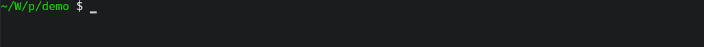

[中文文档见此](docs/README_zh.md)。

## Features
- **Header-only design**: All functionality contained within a single `.hpp` file in `include/pgbar`.
- **Low-overhead updates**: Nanosecond level cost per call.[^1]
- **C++11 & later compatible**: Supports all standard revisions from C++11 through C++23.
- **Unicode support**: Parse each string in UTF-8 encoding.
- **RGB color support**: Customizable progress bar colors.
- **Thread-safe design**: Can be safely used in multi-threaded environments.
- **`tqdm`-like interface**: Chainable methods powered by template metaprogramming.
- **Modern C++ core**: Leverages `constexpr`, RAII, and type traits for zero-cost abstractions.

[^1]: On AMD Ryzen 7 5800H with `-Og` optimization and `Policy::Async` execution strategy, `tick` call overhead measured `≤5ns` in tight loop tests.

## Styles
### ProgressBar
```
{LeftBorder}{Prefix}{Percent}{Starting}{Filler}{Lead}{Remains}{Ending}{Counter}{Speed}{Elapsed}{Countdown}{Postfix}{RightBorder}
 30.87% | [=========>                    ] |  662933732/2147483647 |  11.92 MHz | 00:00:55 | ~00:02:03
```


### BlockBar
```
{LeftBorder}{Prefix}{Percent}{Starting}{Filler}{Lead}{Remains}{Ending}{Counter}{Speed}{Elapsed}{Countdown}{Postfix}{RightBorder}
 35.22% | ██████████▋                    |  47275560/134217727 |  16.80 MHz | 00:00:02 | ~00:00:05
```


### SpinBar
```
{LeftBorder}{Prefix}{Lead}{Percent}{Counter}{Speed}{Elapsed}{Countdown}{Postfix}{RightBorder}
\ |  48.64% |  65288807/134217727 |  17.84 MHz | 00:00:03 | ~00:00:03
```


### SweepBar
```
{LeftBorder}{Prefix}{Percent}{Starting}{Filler}{Lead}{Filler}{Ending}{Counter}{Speed}{Elapsed}{Countdown}{Postfix}{RightBorder}
 39.82% | [-------<=>--------------------] |  53458698/134217727 |  17.89 MHz | 00:00:02 | ~00:00:04
```


### FlowBar
```
{LeftBorder}{Prefix}{Percent}{Starting}{Filler}{Lead}{Filler}{Ending}{Counter}{Speed}{Elapsed}{Countdown}{Postfix}{RightBorder}
 73.93% | [                     ====     ] |   99224978/134217727 |  81.02 MHz | 00:00:01 | ~00:00:00
```


### MultiBar


### DynamicBar


### Usage
```cpp
#include "pgbar/ProgressBar.hpp"

int main()
{
  pgbar::ProgressBar<> bar { pgbar::option::Remains( "-" ),
                             pgbar::option::Filler( "=" ),
                             pgbar::option::Styles( pgbar::config::Line::Entire ),
                             pgbar::option::RemainsColor( "#A52A2A" ),
                             pgbar::option::FillerColor( 0x0099FF ),
                             pgbar::option::InfoColor( pgbar::color::Yellow ),
                             pgbar::option::Tasks( 100 ) };

  for ( auto _ = 0; _ < 100; ++_ )
    bar.tick();
}
```

For more examples, see [QuickStart.md](docs/QuickStart.md) and [demo/](demo/).

## FAQ
### How to build?
#### Header-only
You can copy `include/pgbar` to the inclusion path of the project, and then directly include the corresponding header file within the source file.
#### C++20 Module
If you are using a compiler that already supports the `module` functionality, you can use the `*.ixx` module interface files under `include/` and import it in your project.

> The `include/` contains a compilation `Makefile` for `gcc 15.1`.

`pgbar` supports the following forms of `import`:

```cpp
import pgbar.Core;        // Only import core functions, such as exception types, etc
import pgbar.ProgressBar; // Import as needed. All progress bar modules will automatically import pgbar.Core
import pgbar.MultiBar;    // The functions imported between different modules are orthogonal to each other
import pgbar;             // Import all functions at once
```

When using it officially, be sure to `import std` in the code file at the same time; otherwise, strange compilation errors will occur as of now.
#### Submodule
Use `git` to introduce `pgbar` as a sub-module into your project directory:

```bash
git submodule add https://github.com/Konvt/pgbar path/to/pgbar
git submodule update --init --recursive
```

Then, add the following lines to your `CMakeLists.txt`:

```cmake
add_subdirectory(${CMAKE_SOURCE_DIR}/path/to/pgbar)
# ...
add_executable(TargetName ${SOURCES})
target_link_libraries(TargetName PRIVATE pgbar)
```

The sample files under `demo/` can be compiled using the following commands.

```bash
cmake -S . -DPGBAR_BUILD_DEMO=ON -B build
cmake --build build --target demo
# Or use demo_{filename} to compile the specified file under demo/
```

Or compile directly using the `make` command in the `demo/` folder.

```bash
make all
# Or use {filename} to compile the specified file under demo/
```
#### Installation
Execute the following commands to install `pgbar` to the default directory of the system.

```bash
cmake -S . -DPGBAR_INSTALL=ON -B build
# Or install it to the specified directory:
# cmake -S . -DPGBAR_INSTALL=ON -DCMAKE_INSTALL_PREFIX=/usr -B build
cmake --install build
# Equivalent instructions can be:
# cmake --build build --target install
```

When uninstalling, it needs to rely on the cache files generated during installation. If the cache files has been removed, the installation command generation can be executed again.

Execute the following commands to remove `pgbar` from the system.

```bash
cmake --build build --target uninstall
```

### Does updating the progress bar slow down the program?
No, as mentioned in the [Features](#features) section, updating the progress bar has *essentially* zero overhead.

With `O2/O3` optimizations enabled, the performance overhead of the second iteration in the code below will *approach* that of the first iteration.[^2]

[^2]: In practice, the overhead of updating the progress bar only adds the overload of calling jumps and branches a few more times.

```cpp
#include "pgbar/pgbar.hpp"

int main()
{
  std::size_t count = 0;
  for ( std::size_t _ = 0; _ < 2147483647; ++_ )
    ++count;

  pgbar::ProgressBar<> bar { pgbar::option::Tasks( 2147483647 ) };
  for ( std::size_t _ = 0; _ < 2147483647; ++_ )
    bar.tick();
}
```

However, the smoothness of the display will depend on the single-core performance of your processor.
### Is it compatible with Windows/Linux?
Absolutely. I designed this library to work seamlessly on both systems, providing a unified visualization of iteration progress.

Btw, it should be noted that if it is on the Windows platform, then `pgbar` will depend on the `Windows.h` header file; Moreover, `NOMINMAX` will be defined to disable the `min` and `max` macros.
### Does it support Unicode?
As pointed out at the beginning, there is no problem.

Although only UTF-8 encoded strings are currently supported, using any non-UTF-8 encoded string will result in an exception.

If you are using the C++20, `pgbar`'s functions also support `u8string`.


## License
This project is licensed under the [MIT](LICENSE) license.
