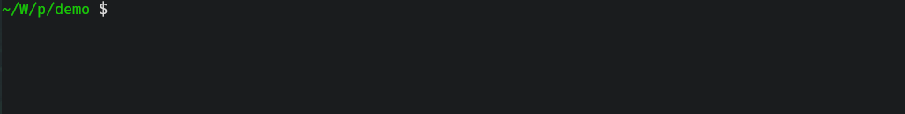

**Contents**
- [Sole Progress Bar](#sole-progress-bar)
  - [`ProgressBar`](#progressbar)
    - [How to use](#how-to-use)
    - [Configuration](#configuration)
      - [Constituent element](#constituent-element)
        - [Variable progress bar length](#variable-progress-bar-length)
      - [Data configuration](#data-configuration)
      - [Thread safety](#thread-safety)
      - [Output stream](#output-stream)
      - [Rendering strategy](#rendering-strategy)
    - [Interaction with iterable types](#interaction-with-iterable-types)
  - [`BlockBar`](#blockbar)
    - [How to use](#how-to-use-1)
    - [Configuration](#configuration-1)
      - [Constituent element](#constituent-element-1)
        - [Variable progress bar length](#variable-progress-bar-length-1)
      - [Data configuration](#data-configuration-1)
      - [Thread safety](#thread-safety-1)
      - [Output stream](#output-stream-1)
      - [Rendering strategy](#rendering-strategy-1)
    - [Interaction with iterable types](#interaction-with-iterable-types-1)
  - [`SweepBar`](#sweepbar)
    - [How to use](#how-to-use-2)
    - [Configuration](#configuration-2)
      - [Constituent element](#constituent-element-2)
        - [Variable progress bar length](#variable-progress-bar-length-2)
      - [Data configuration](#data-configuration-2)
      - [Thread safety](#thread-safety-2)
      - [Output stream](#output-stream-2)
      - [Rendering strategy](#rendering-strategy-2)
    - [Interaction with iterable types](#interaction-with-iterable-types-2)
  - [`SpinBar`](#spinbar)
    - [How to use](#how-to-use-3)
    - [Configuration](#configuration-3)
      - [Constituent element](#constituent-element-3)
      - [Data configuration](#data-configuration-3)
      - [Thread safety](#thread-safety-3)
      - [Output stream](#output-stream-3)
      - [Rendering strategy](#rendering-strategy-3)
    - [Interaction with iterable types](#interaction-with-iterable-types-3)
- [Progress Bar Synthesizer](#progress-bar-synthesizer)
  - [`MultiBar`](#multibar)
    - [How to use](#how-to-use-4)
    - [Helper functions](#helper-functions)
    - [Rendering strategy](#rendering-strategy-4)
  - [`DynamicBar`](#dynamicbar)
    - [How to use](#how-to-use-5)
    - [Helper functions](#helper-functions-1)
    - [Rendering strategy](#rendering-strategy-5)
- [Global configuration](#global-configuration)
  - [Coloring effect](#coloring-effect)
  - [Output stream detection](#output-stream-detection)
  - [Working interval of renderer](#working-interval-of-renderer)
  - [Assertion](#assertion)
- [Auxiliary type](#auxiliary-type)
  - [`NumericSpan`](#numericspan)
    - [Member method](#member-method)
    - [Iterator type](#iterator-type)
  - [`IterSpan`](#iterspan)
    - [Member method](#member-method-1)
    - [Iterator type](#iterator-type-1)
  - [`ProxySpan`](#proxyspan)
    - [Member method](#member-method-2)
    - [Iterator type](#iterator-type-2)
- [FAQ](#faq)
  - [The tick count should be the same as the total number of tasks](#the-tick-count-should-be-the-same-as-the-total-number-of-tasks)
  - [Life cycle of the progress bar object](#life-cycle-of-the-progress-bar-object)
  - [Unicode support](#unicode-support)
  - [Design of renderer](#design-of-renderer)
  - [Propagation mechanism of exception](#propagation-mechanism-of-exception)
  - [Compilation time issue](#compilation-time-issue)
  - [Code structure](#code-structure)
    - [Basic data structure design](#basic-data-structure-design)
    - [Progress bar type design](#progress-bar-type-design)

# Sole Progress Bar
## `ProgressBar`

### How to use
`pgbar::ProgressBar` is a template type; It requires the manual configuration tasks to start using, otherwise you will throw an exception `pgbar::exception::InvalidState`.

The number of tasks can be configured by calling the `config().tasks()` method and passing parameters, or by passing the `pgbar::option::Tasks` wrapper type to the constructor.

```cpp
#include "pgbar/pgbar.hpp"

int main()
{
  {
    pgbar::ProgressBar<> bar;
    try {
      bar.tick();
    } catch ( const pgbar::exception::InvalidState& e ) {
      std::cerr << e.what() << std::endl;
    }
  }
  {
    pgbar::ProgressBar<> bar;
    bar.config().tasks( 200 );

    bar.tick( 20 );    // 20 steps forward
    bar.tick_to( 50 ); // Set the progress to 50%

    for ( int i = 0; i < 100; ++i )
      bar.tick(); // Only one step forward per call
  }
  {
    pgbar::ProgressBar<> bar { pbar::option::Tasks( 150 ) };
    bar.tick_to( 20 );  // Set the progress to 20%
    bar.tick_to( 130 ); // Anything more than 100% is discarded and the progress bar is locked to 100%
  }
}
```

In some special scenarios, if you want to check the progress bar running, or forcibly stop the progress bar running, you can use the `is_running()` and `reset()` methods.

```cpp
#include "pgbar/pgbar.hpp"
#include <cassert>

int main()
{
  pgbar::ProgressBar<> bar { pgbar::option::Tasks( 500 ) };

  for ( int i = 0; i < 400; ++i ) {
    if ( i > 0 ) // Note that the progress bar does not run until the tick() is called once
      assert( bar.is_running() );
    bar.tick();
  }

  assert( bar.progress() == 400 ); // This method can obtain the current iteration number of the progress bar
  bar.reset();
  assert( bar.is_running() == false );
}
```

`ProgressBar` is a move only and swappable type, so you can use another object to move constructs or exchange each other's configuration data with another object.

```cpp
{
  pgbar::ProgressBar<> bar1 { /* Pass some complex configuration data */ };
  pgbar::ProgressBar<> bar2 { std::move( bar1 ) };
}
{
  pgbar::ProgressBar<> bar1 { /* Pass some complex configuration data */ };
  pgbar::ProgressBar<> bar2;
  bar2.swap( bar1 );
  // or
  using std::swap;
  swap( bar1, bar2 );
}
```

However, it is not allowed to swap or move objects during the progress bar operation, otherwise it will cause unpredictable errors.

```cpp
pgbar::ProgressBar<> bar1 { pgbar::option::Tasks( 500 ) };

bar1.tick();
assert( bar1.is_running() );

// pgbar::ProgressBar<> bar2 { std::move( bar1 ) }; No!
```
### Configuration
As mentioned in the previous section, all configuration operations for `ProgressBar` need to be done via the method `config()`.

This method returns a reference to an internal configuration object whose type can be found in `pgbar::config`, which is `pgbar::config::Line`.

`pgbar::config::Line` is a data type that stores all the data members used to describe the `ProgressBar` elements; It can be copied, movable and swappable.

```cpp
#include "pgbar/pgbar.hpp"

int main()
{
  pgbar::config::Line cfg1;

  auto cfg2 = cfg1;              // copy
  auto cfg3 = std::move( cfg1 ); // move
  cfg3.swap( cfg2 );             // swap
  // or
  using std::swap;
  swap( cfg2, cfg3 );
}
```
#### Constituent element
`ProgressBar` consists of the following elements:

```text
{LeftBorder}{Description}{Percent}{Starting}{Filler}{Lead}{Remains}{Ending}{Counter}{Speed}{Elapsed}{Countdown}{RightBorder}
```

The customizable sections are: `LeftBorder`, `Description`, `Starting`, `Filler`, `Lead`, `Remains`, `Ending`, `Speed`, and `RightBorder`, all of which have the same method as the name.

These elements can be found directly in `pgbar::option` with the corresponding wrapper type:

```cpp
pgbar::option::Style;   // Decide which of the above elements needs to be rendered
pgbar::option::Colored; // Switch coloring effect
pgbar::option::Bolded;  // Switch font bold effect

pgbar::option::LeftBorder;  // Modify the starting border to the left of the entire progress bar
pgbar::option::RightBorder; // Modify the end border to the right of the entire progress bar

pgbar::option::Description; // Modify the task description
pgbar::option::TrueMesg;    // Modify the element used to replace the Description section when the progress bar ends
pgbar::option::FalseMesg;   // Modify the element used to replace the Description section when the progress bar ends

pgbar::option::Starting;  // Modify the elements left of the progress bar and right of Percent
pgbar::option::Ending;    // Modify the elements right of the progress bar and left of the Counter
pgbar::option::Filler;    // Modify the fill character of the iterated part
pgbar::option::Lead;      // Modify the frames of the animation section
pgbar::option::Remains;   // Modify the fill character for the uniterated part
pgbar::option::Shift;     // Adjust the animation speed of the animation section (Lead)
pgbar::option::BarLength; // Adjust the length of the progress bar

pgbar::option::SpeedUnit; // Modify the unit in the Speed section
pgbar::option::Magnitude; // Adjust the carry ratio in the Speed section

pgbar::option::Tasks;   // Modify the task number
pgbar::option::Divider; // Modifies the divider between two elements

pgbar::option::DescColor;    // Modify the color of Description
pgbar::option::TrueColor;    // Modify the color of TrueMesg
pgbar::option::FalseColor;   // Modify the color of FalseMesg
pgbar::option::StartColor;   // Modify the color of Starting
pgbar::option::EndColor;     // Modify the color of Ending
pgbar::option::FillerColor;  // Modify the color of Filler
pgbar::option::RemainsColor; // Modify the color of Remains
pgbar::option::LeadColor;    // Modify the color of Lead
pgbar::option::InfoColor;    // Modify the color of Divider, Percent, Counter, Speed, Elapsed and Countdown
```

> `TrueMesg` and `FalseMesg` can be used to display whether the task of progress bar iteration is successfully executed. They can be switched by passing a `bool` parameter to the `reset()` method; By default, the progress bar stops on its own, or calling the `reset()` method without arguments selects `TrueMesg`.

The argument to `pgbar::option::Style` can be obtained by a bit operation performed by multiple static members of `pgbar::config::Line`:

```cpp
pgbar::ProgressBar<> bar { pgbar::option::Style( pgbar::config::Line::Sped | pgbar::config::Line::Per
                                                 | pgbar::config::Line::Elpsd
                                                 | pgbar::config::Line::Cntdwn ) };
```

This method configuration can be cumbersome, so `Line` provides two helper methods, `enable()` and `disable()`, to simplify the above operation.

```cpp
pgbar::ProgressBar<> bar;
bar.config().enable().speed().percent().elapsed().countdown();
// or
bar.config().enable().entire();
bar.config().disable().animation().counter();
// Animation is the progress indicator itself.
// And not all elements can be turned off, such as Description.
```

The above elements all have methods with the same name in `Line`, and calling these methods and passing parameters to them can also modify the data information.
##### Variable progress bar length
In between the `Starting` and `Ending` elements is a progress indicator called the `Animation` (excluding `Starting` and `Ending`), which is variable in length.

`pgbar` itself rarely probes platform-specific information, such as the width of the terminal. Therefore, if you want the progress bar to fill a row, or if the progress bar is too long and needs to be narrowed, you need to change the length of the progress indicator using the `bar_length()` method or the `pgbar::option::BarLength` wrapper.

For the latter, directly use the corresponding interface to adjust the parameters;   The former requires a helper method to obtain the length of parts other than the progress indicator in order to correctly calculate the length just enough to fill a row with the progress bar.

The method is `config().fixed_length()`。

```cpp
pgbar::ProgressBar<> bar;
assert( bar.config().bar_length() == 30 ); // default value
assert( bar.config().fixed_length() != 0 );  // The exact value depends on the content of the data member
```
#### Data configuration
`Line` has two methods of data configuration: variable parameter construction based on wrapper type, and stream interface style based on chain call.

```cpp
#include "pgbar/pgbar.hpp"

int main()
{
  pgbar::config::Line config1 {
    pgbar::option::Tasks( 100 ),
    pgbar::option::SpeedUnit( { "B/s", "kiB/s", "MiB/s", "GiB/s" } ),
    pgbar::option::Magnitude( 1024 ),
    pgbar::option::InfoColor( "#39C5BB" )
    // pgbar::option::InfoColor(0x39C5BB) Don't do that!
  };
  // Note: Passing the same wrapper type twice results in a compilation error

  pgbar::config::Line config2;
  config2.tasks( 100 )
    .speed_unit( { "B/s", "kiB/s", "MiB/s", "GiB/s" } )
    .magnitude( 1024 )
    .info_color( "#39C5BB" );

  auto config3 = config2; // It can also be adjusted using variable template parameters after construction
  config3.set( pgbar::option::Description( "Do something" ), pgbar::option::DescColor( 0xFFE211 ) );
}
```

Although configuration types can be modified during the progress bar run, this concept does not apply to the number of tasks; This means that once the progress bar is running, its number of tasks cannot be changed halfway through.

```cpp
#include "pgbar/pgbar.hpp

int main()
{
  pgbar::ProgressBar<> pbar;

  pbar.config().tasks( 100 );
  for ( auto i = 0; i < 100; ++i ) {
    pbar.tick();
    if ( i == 30 ) // nothing happens
      pbar.config().tasks( 50 );
    std::this_thread::sleep_for( std::chrono::milliseconds( 20 ) );
  }
}
```
#### Thread safety
All methods of configuring the type `Line` are thread-safe, which means that you can modify the data in the progress bar while it is running.

Only the `tick()`, `tick_to()` and `reset()` methods of `ProgressBar` are thread-safe; The rest of the methods, especially `iterate()`, are thread-unsafe.

This means that the progress bar allows multiple threads to call its `tick()`, `tick_to()` or `reset()` methods simultaneously; This does not include moving assignments, moving constructs, and swapping two objects, as well as the `iterate()` method.

And you should never attempt to move or swap the current object while the progress bar is running.
#### Output stream
`ProgressBar` defaults to output string to standard error stream `stderr`; The output stream for the specific binding is defined by the first template parameter.

```cpp
#include "pgbar/pgbar.hpp"
#include <type_traits>

int main()
{
  static_assert( std::is_same<pgbar::ProgressBar<>,
                              pgbar::ProgressBar<pgbar::Channel::Stderr>>::value,
                 "" );

  pgbar::ProgressBar<pgbar::Channel::Stdout> bar; // Bind to stdout
}
```

Especially it is important to note that the binding to the same output stream objects are not allowed to run at the same time, otherwise it will throw an exception `pgbar::exception::InvalidState`; For a detailed explanation of this, see [FAQ - Design of renderer](#design-of-renderer).

If the output stream is not bound to the terminal, the progress bar will not be rendered. You can see this in [Global configuration - Output stream detection](#output-stream-detection).
#### Rendering strategy
There are two ways for `ProgressBar` to render the progress bar to the terminal: synchronously (`pgbar::Policy::Sync`) or asynchronously (`pgbar::Policy::Async`); different rendering strategies will hand over the rendering behavior to different threads for execution.

When asynchronous rendering (default) is enabled, the progress bar rendering is automatically completed by a background thread at fixed time intervals.

In the synchronous rendering mode, the rendering action is executed by the thread that calls `tick()` or `tick_to()` each time;  each call to `tick()` not only updates the progress status but also immediately outputs the latest progress bar to the terminal.

The specific rendering strategy is defined by the second template parameter.

```cpp
#include "pgbar/pgbar.hpp"
#include <type_traits>

int main()
{
  static_assert( std::is_same<pgbar::ProgressBar<>,
                              pgbar::ProgressBar<pgbar::Channel::Stderr, pgbar::Policy::Async>>::value,
                 "" );

  pgbar::ProgressBar<pgbar::Channel::Stderr, pgbar::Policy::Sync> bar; // use synchronous rendering
}
```

In asynchronous rendering mode, the timing and frequency of the progress bar rendering are uncontrollable. At this point, no other information should be written to the same output stream; otherwise, it will cause confusion in the terminal interface rendering.

Synchronous rendering, on the other hand, only executes the rendering function each time `tick()` is called, thus allowing information to be output to the same output stream while the progress bar is running.

It is obvious that the asynchronous rendering strategy can greatly enhance the performance of the foreground thread. Therefore, by default, `pgbar` always adopts the asynchronous rendering strategy.

> Because the rendering structure of the progress bar is two lines: one line for the progress bar string and one blank line.
>
> Therefore, when using the synchronous strategy, if additional information needs to be output, two extra line breaks must be inserted after the output.
>
> Otherwise, due to the progress bar occupying a two-line structure, subsequent rendering will incorrectly overwrite the existing output.
>
> For example:

```cpp
#include "pgbar/pgbar.hpp"
#include <iostream>

int main()
{
  pgbar::ProgressBar<pgbar::Channel::Stderr, pgbar::Policy::Sync> bar;
  bar.config().tasks( 100 );

  for ( size_t i = 0; i < 95; ++i )
    bar.tick(); /* do something... */

  // Notice: At least two newlines must be inserted after the output information
  std::cerr << "Extra log information" << std::endl << std::endl;

  while ( bar.is_running() )
    bar.tick();
}
```
### Interaction with iterable types
`pgbar` provides an easier way to iterate when dealing with iterable types or numeric ranges: the `iterate()` method.

The use of this method is similar to the Python `range()` function, which can traverse both the range specified by the number and the range specified by the iterable type; The exact number of tasks is configured by `iterate()` itself.

This can be done by using Enhanced-for, or by passing a unary function like `std::for_each`.

```cpp
#include "pgbar/pgbar.hpp"
#include <thread>
using namespace std;

int main()
{
  pgbar::ProgressBar<> bar;

  // Iteration range: [100, 0), step: -1
  for ( auto num : bar.iterate( 100, 1, -1 ) ) {
    this_thread::sleep_for( 100ms );
  }
  // Iteration range: [0.0, -2.0), step: -0.01
  for ( auto fnum : bar.iterate( -2.0, -0.01 ) ) {
    this_thread::sleep_for( 100ms );
  }
  // Iteration range: [100, 1), step: -1
  bar.iterate( 100, []( int ) { this_thread::sleep_for( 100ms ); } );
}
```

In the first two Enhanced-for cases, the `iterate()` method actually returns `pgbar::scope::ProxySpan`; For an introduction to this type, see [Auxiliary type - `ProxySpan`](#proxyspan).

For use of numeric type ranges, see [Auxiliary type - `NumericSpan`](#numericspan).

In addition to working within numeric ranges, `ProgressBar` can also interact with types that have iterators, such as `std::vector` and raw arrays.

```cpp
#include "pgbar/pgbar.hpp"
#include <thread>
#include <vector>
using namespace std;

int main()
{
  pgbar::ProgressBar<> bar;

  vector<int> arr1 {
    0, 1, 2, 3, 4, 5, 6,
  };
  int arr2[] { 100, 99, 98, 97, 96, 95, 94, 93, 92, 91 };

  for ( auto& ele : bar.iterate( arr1.begin(), arr1.end() ) ) {
    ele += 1; // ele here is a reference to the elements in the vector
    this_thread::sleep_for( 300ms );
  }
  // You can iterate in reverse order
  bar.iterate( arr2 + ( sizeof( arr2 ) / sizeof( int ) ) - 1, arr2 - 1, []( int& ) {
    this_thread::sleep_for( 300ms );
  } );
}
```

See [Auxiliary type - `IterSpan`](#iterspan) for range of iterable types.

In particular, if a type provides `begin()` and `end()` methods that return iterators, then the type can also be traversed in a simpler way; This includes the raw arrays.

```cpp
#include "pgbar/pgbar.hpp"
#include <thread>
#include <vector>
using namespace std;

int main()
{
  pgbar::ProgressBar<> bar;

  vector<int> arr1 {
    0, 1, 2, 3, 4, 5, 6,
  };
  int arr2[] { 100, 99, 98, 97, 96, 95, 94, 93, 92, 91 };

  for ( auto& ele : bar.iterate( arr1 ) ) {
    ele += 1;
    this_thread::sleep_for( 300ms );
  }
  // Raw array is fine
  bar.iterate( arr2, []( int& ) { this_thread::sleep_for( 300ms ); } );
}
```

- - -

## `BlockBar`

### How to use
`pgbar::BlockBar` is a template type; It requires the manual configuration tasks to start using, otherwise you will throw an exception `pgbar::exception::InvalidState`.

The number of tasks can be configured by calling the `config().tasks()` method and passing parameters, or by passing the `pgbar::option::Tasks` wrapper type to the constructor.

```cpp
#include "pgbar/pgbar.hpp"

int main()
{
  {
    pgbar::BlockBar<> bar;
    try {
      bar.tick();
    } catch ( const pgbar::exception::InvalidState& e ) {
      std::cerr << e.what() << std::endl;
    }
  }
  {
    pgbar::BlockBar<> bar;
    bar.config().tasks( 200 );

    bar.tick( 20 );    // 20 steps forward
    bar.tick_to( 50 ); // Set the progress to 50%

    for ( int i = 0; i < 100; ++i )
      bar.tick(); // Only one step forward per call
  }
  {
    pgbar::BlockBar<> bar { pbar::option::Tasks( 150 ) };
    bar.tick_to( 20 );  // Set the progress to 20%
    bar.tick_to( 130 ); // Anything more than 100% is discarded and the progress bar is locked to 100%
  }
}
```

In some special scenarios, if you want to check the progress bar running, or forcibly stop the progress bar running, you can use the `is_running()` and `reset()` methods.

```cpp
#include "pgbar/pgbar.hpp"
#include <cassert>

int main()
{
  pgbar::BlockBar<> bar { pgbar::option::Tasks( 500 ) };

  for ( int i = 0; i < 400; ++i ) {
    if ( i > 0 ) // Note that the progress bar does not run until the tick() is called once
      assert( bar.is_running() );
    bar.tick();
  }

  assert( bar.progress() == 400 ); // This method can obtain the current iteration number of the progress bar
  bar.reset();
  assert( bar.is_running() == false );
}
```

`BlockBar` is a move only and swappable type, so you can use another object to move constructs or exchange each other's configuration data with another object.

```cpp
{
  pgbar::BlockBar<> bar1 { /* Pass some complex configuration data */ };
  pgbar::BlockBar<> bar2 { std::move( bar1 ) };
}
{
  pgbar::BlockBar<> bar1 { /* Pass some complex configuration data */ };
  pgbar::BlockBar<> bar2;
  bar2.swap( bar1 );
  // or
  using std::swap;
  swap( bar1, bar2 );
}
```

However, it is not allowed to swap or move objects during the progress bar operation, otherwise it will cause unpredictable errors.

```cpp
pgbar::BlockBar<> bar1 { pgbar::option::Tasks( 500 ) };

bar1.tick();
assert( bar1.is_running() );

// pgbar::BlockBar<> bar2 { std::move( bar1 ) }; No!
```
### Configuration
As mentioned in the previous section, all configuration operations for `BlockBar` need to be done via the method `config()`.

This method returns a reference to an internal configuration object whose type can be found in `pgbar::config`, which is `pgbar::config::Block`.

`pgbar::config::Block` is a data type that stores all the data members used to describe the `BlockBar` elements; It can be copied, movable and swappable.

```cpp
#include "pgbar/pgbar.hpp"

int main()
{
  pgbar::config::Block cfg1;

  auto cfg2 = cfg1;              // copy
  auto cfg3 = std::move( cfg1 ); // move
  cfg3.swap( cfg2 );             // swap
  // or
  using std::swap;
  swap( cfg2, cfg3 );
}
```
#### Constituent element
`BlockBar` consists of the following elements:

```text
{LeftBorder}{Description}{Percent}{Starting}{BlockBar}{Ending}{Counter}{Speed}{Elapsed}{Countdown}{RightBorder}
```

The customizable sections are: `LeftBorder`、`Description`、`Starting`、`Ending`、`Speed` and `RightBorder`, all of which have the same method as the name.

These elements can be found directly in `pgbar::option` with the corresponding wrapper type:

```cpp
pgbar::option::Style;   // Decide which of the above elements needs to be rendered
pgbar::option::Colored; // Switch coloring effect
pgbar::option::Bolded;  // Switch font bold effect

pgbar::option::LeftBorder;  // Modify the starting border to the left of the entire progress bar
pgbar::option::RightBorder; // Modify the end border to the right of the entire progress bar

pgbar::option::Description; // Modify the task description
pgbar::option::TrueMesg;    // Modify the element used to replace the Description section when the progress bar ends
pgbar::option::FalseMesg;   // Modify the element used to replace the Description section when the progress bar ends

pgbar::option::Starting;  // Modify the elements left of the progress bar and right of Percent
pgbar::option::Ending;    // Modify the elements right of the progress bar and left of the Counter
pgbar::option::BarLength; // Adjust the length of the progress bar

pgbar::option::SpeedUnit; // Modify the unit in the Speed section
pgbar::option::Magnitude; // Adjust the carry ratio in the Speed section

pgbar::option::Tasks;   // Modify the task number
pgbar::option::Divider; // Modifies the divider between two elements

pgbar::option::DescColor;    // Modify the color of Description
pgbar::option::TrueColor;    // Modify the color of TrueMesg
pgbar::option::FalseColor;   // Modify the color of FalseMesg
pgbar::option::StartColor;   // Modify the color of Starting
pgbar::option::EndColor;     // Modify the color of Ending
pgbar::option::InfoColor;    // Modify the color of Divider, Percent, Counter, Speed, Elapsed and Countdown
```

> `TrueMesg` and `FalseMesg` can be used to display whether the task of progress bar iteration is successfully executed. They can be switched by passing a `bool` parameter to the `reset()` method; By default, the progress bar stops on its own, or calling the `reset()` method without arguments selects `TrueMesg`.

The argument to `pgbar::option::Style` can be obtained by a bit operation performed by multiple static members of `pgbar::config::Block`:

```cpp
pgbar::SweepBar<> bar { pgbar::option::Style( pgbar::config::Sweep::Sped | pgbar::config::Sweep::Per
                                              | pgbar::config::Sweep::Elpsd
                                              | pgbar::config::Sweep::Cntdwn ) };
```

This method configuration can be cumbersome, so `Block` provides two helper methods, `enable()` and `disable()`, to simplify the above operation.

```cpp
pgbar::BlockBar<> bar;
bar.config().enable().speed().percent().elapsed().countdown();
// or
bar.config().enable().entire();
bar.config().disable().animation().counter();
// Animation is the BlockBar itself.
// And not all elements can be turned off, such as Description.
```

The above elements all have methods with the same name in `Block`, and calling these methods and passing parameters to them can also modify the data information.
##### Variable progress bar length
The element BlockBar of `BlockBar` is also called as Animation. It is a progress indicator implemented using Unicode block characters, and the length of this progress indicator is variable.

`pgbar` itself rarely probes platform-specific information, such as the width of the terminal. Therefore, if you want the progress bar to fill a row, or if the progress bar is too long and needs to be narrowed, you need to change the length of the progress indicator using the `bar_length()` method or the `pgbar::option::BarLength` wrapper.

For the latter, directly use the corresponding interface to adjust the parameters;   The former requires a helper method to obtain the length of parts other than the progress indicator in order to correctly calculate the length just enough to fill a row with the progress bar.

The method is `config().fixed_length()`。

```cpp
pgbar::BlockBar<> bar;
assert( bar.config().bar_length() == 30 ); // default value
assert( bar.config().fixed_length() != 0 );  // The exact value depends on the content of the data member
```
#### Data configuration
`Block` has two methods of data configuration: variable parameter construction based on wrapper type, and stream interface style based on chain call.

```cpp
#include "pgbar/pgbar.hpp"

int main()
{
  pgbar::config::Block config1 {
    pgbar::option::Tasks( 100 ),
    pgbar::option::SpeedUnit( { "B/s", "kiB/s", "MiB/s", "GiB/s" } ),
    pgbar::option::Magnitude( 1024 ),
    pgbar::option::InfoColor( "#39C5BB" )
    // pgbar::option::InfoColor(0x39C5BB) Don't do that!
  };
  // Note: Passing the same wrapper type twice results in a compilation error

  pgbar::config::Block config2;
  config2.tasks( 100 )
    .speed_unit( { "B/s", "kiB/s", "MiB/s", "GiB/s" } )
    .magnitude( 1024 )
    .info_color( "#39C5BB" );

  auto config3 = config2; // It can also be adjusted using variable template parameters after construction
  config3.set( pgbar::option::Description( "Do something" ), pgbar::option::DescColor( 0xFFE211 ) );
}
```

Although configuration types can be modified during the progress bar run, this concept does not apply to the number of tasks; This means that once the progress bar is running, its number of tasks cannot be changed halfway through.

```cpp
#include "pgbar/pgbar.hpp

int main()
{
  pgbar::BlockBar<> pbar;

  pbar.config().tasks( 100 );
  for ( auto i = 0; i < 100; ++i ) {
    pbar.tick();
    if ( i == 30 ) // nothing happens
      pbar.config().tasks( 50 );
    std::this_thread::sleep_for( std::chrono::milliseconds( 20 ) );
  }
}
```
#### Thread safety
All methods of configuring the type `Block` are thread-safe, which means that you can modify the data in the progress bar while it is running.

Only the `tick()`, `tick_to()` and `reset()` methods of `BlockBar` are thread-safe; The rest of the methods, especially `iterate()`, are thread-unsafe.

This means that the progress bar allows multiple threads to call its `tick()`, `tick_to()` or `reset()` methods simultaneously; This does not include moving assignments, moving constructs, and swapping two objects, as well as the `iterate()` method.

And you should never attempt to move or swap the current object while the progress bar is running.
#### Output stream
`BlockBar` defaults to output string to standard error stream `stderr`; The output stream for the specific binding is defined by the first template parameter.

```cpp
#include "pgbar/pgbar.hpp"
#include <type_traits>

int main()
{
  static_assert( std::is_same<pgbar::BlockBar<>, pgbar::BlockBar<pgbar::Channel::Stderr>>::value, "" );

  pgbar::BlockBar<pgbar::Channel::Stdout> bar; // Bind to stdout
}
```

Especially it is important to note that the binding to the same output stream objects are not allowed to run at the same time, otherwise it will throw an exception `pgbar::exception::InvalidState`; For a detailed explanation of this, see [FAQ - Design of renderer](#design-of-renderer).

If the output stream is not bound to the terminal, the progress bar will not be rendered. You can see this in [Global configuration - Output stream detection](#output-stream-detection).
#### Rendering strategy
There are two ways for `BlockBar` to render the progress bar to the terminal: synchronously (`pgbar::Policy::Sync`) or asynchronously (`pgbar::Policy::Async`); different rendering strategies will hand over the rendering behavior to different threads for execution.

When asynchronous rendering (default) is enabled, the progress bar rendering is automatically completed by a background thread at fixed time intervals.

In the synchronous rendering mode, the rendering action is executed by the thread that calls `tick()` or `tick_to()` each time;  each call to `tick()` not only updates the progress status but also immediately outputs the latest progress bar to the terminal.

The specific rendering strategy is defined by the second template parameter.

```cpp
#include "pgbar/pgbar.hpp"
#include <type_traits>

int main()
{
  static_assert( std::is_same<pgbar::BlockBar<>,
                              pgbar::BlockBar<pgbar::Channel::Stderr, pgbar::Policy::Async>>::value,
                 "" );

  pgbar::BlockBar<pgbar::Channel::Stderr, pgbar::Policy::Sync> bar; // use synchronous rendering
}
```

In asynchronous rendering mode, the timing and frequency of the progress bar rendering are uncontrollable. At this point, no other information should be written to the same output stream; otherwise, it will cause confusion in the terminal interface rendering.

Synchronous rendering, on the other hand, only executes the rendering function each time `tick()` is called, thus allowing information to be output to the same output stream while the progress bar is running.

It is obvious that the asynchronous rendering strategy can greatly enhance the performance of the foreground thread. Therefore, by default, `pgbar` always adopts the asynchronous rendering strategy.

> Because the rendering structure of the progress bar is two lines: one line for the progress bar string and one blank line.
>
> Therefore, when using the synchronous strategy, if additional information needs to be output, two extra line breaks must be inserted after the output.
>
> Otherwise, due to the progress bar occupying a two-line structure, subsequent rendering will incorrectly overwrite the existing output.
>
> For example:

```cpp
#include "pgbar/pgbar.hpp"
#include <iostream>

int main()
{
  pgbar::BlockBar<pgbar::Channel::Stderr, pgbar::Policy::Sync> bar;
  bar.config().tasks( 100 );

  for ( size_t i = 0; i < 95; ++i )
    bar.tick(); /* do something... */

  // Notice: At least two newlines must be inserted after the output information
  std::cerr << "Extra log information" << std::endl << std::endl;

  while ( bar.is_running() )
    bar.tick();
}
```
### Interaction with iterable types
`pgbar` provides an easier way to iterate when dealing with iterable types or numeric ranges: the `iterate()` method.

The use of this method is similar to the Python `range()` function, which can traverse both the range specified by the number and the range specified by the iterable type; The exact number of tasks is configured by `iterate()` itself.

This can be done by using Enhanced-for, or by passing a unary function like `std::for_each`.

```cpp
#include "pgbar/pgbar.hpp"
#include <thread>
using namespace std;

int main()
{
  pgbar::BlockBar<> bar;

  // Iteration range: [100, 0), step: -1
  for ( auto num : bar.iterate( 100, 1, -1 ) ) {
    this_thread::sleep_for( 100ms );
  }
  // Iteration range: [0.0, -2.0), step: -0.01
  for ( auto fnum : bar.iterate( -2.0, -0.01 ) ) {
    this_thread::sleep_for( 100ms );
  }
  // Iteration range: [100, 1), step: -1
  bar.iterate( 100, []( int ) { this_thread::sleep_for( 100ms ); } );
}
```

In the first two Enhanced-for cases, the `iterate()` method actually returns `pgbar::scope::ProxySpan`; For an introduction to this type, see [Auxiliary type - `ProxySpan`](#proxyspan).

For use of numeric type ranges, see [Auxiliary type - `NumericSpan`](#numericspan).

In addition to working within numeric ranges, `BlockBar` can also interact with types that have iterators, such as `std::vector` and raw arrays.

```cpp
#include "pgbar/pgbar.hpp"
#include <thread>
#include <vector>
using namespace std;

int main()
{
  pgbar::BlockBar<> bar;

  vector<int> arr1 {
    0, 1, 2, 3, 4, 5, 6,
  };
  int arr2[] { 100, 99, 98, 97, 96, 95, 94, 93, 92, 91 };

  for ( auto& ele : bar.iterate( arr1.begin(), arr1.end() ) ) {
    ele += 1; // ele here is a reference to the elements in the vector
    this_thread::sleep_for( 300ms );
  }
  // You can iterate in reverse order
  bar.iterate( arr2 + ( sizeof( arr2 ) / sizeof( int ) ) - 1, arr2 - 1, []( int& ) {
    this_thread::sleep_for( 300ms );
  } );
}
```

See [Auxiliary type - `IterSpan`](#iterspan) for range of iterable types.

In particular, if a type provides `begin()` and `end()` methods that return iterators, then the type can also be traversed in a simpler way; This includes the raw arrays.

```cpp
#include "pgbar/pgbar.hpp"
#include <thread>
#include <vector>
using namespace std;

int main()
{
  pgbar::BlockBar<> bar;

  vector<int> arr1 {
    0, 1, 2, 3, 4, 5, 6,
  };
  int arr2[] { 100, 99, 98, 97, 96, 95, 94, 93, 92, 91 };

  for ( auto& ele : bar.iterate( arr1 ) ) {
    ele += 1;
    this_thread::sleep_for( 300ms );
  }
  // Raw array is fine
  bar.iterate( arr2, []( int& ) { this_thread::sleep_for( 300ms ); } );
}
```

- - -

## `SweepBar`

### How to use
`pgbar::SweepBar` is a template type; It does not care about the specific number of tasks, so you do not need to configure the number of tasks for it to be used.

If you need to display a specific number of tasks, you can also do this by calling the `config().tasks()` method and passing parameters, using the `pgbar::option::Tasks` wrapper type passed to the constructor.

```cpp
#include "pgbar/pgbar.hpp"

int main()
{
  {
    pgbar::SweepBar<> bar;
    bar.tick(); // no problem
  }
  {
    pgbar::SweepBar<> bar;
    bar.config().tasks( 200 );

    bar.tick( 20 );    // 20 steps forward
    bar.tick_to( 50 ); // Set the progress to 50%

    for ( int i = 0; i < 100; ++i )
      bar.tick(); // Only one step forward per call
  }
  {
    pgbar::SweepBar<> bar { pbar::option::Tasks( 150 ) };
    bar.tick_to( 20 );  // Set the progress to 20%
    bar.tick_to( 130 ); // Anything more than 100% is discarded and the progress bar is locked to 100%
  }
}
```

In some special scenarios, if you want to check the progress bar running, or forcibly stop the progress bar running, you can use the `is_running()` and `reset()` methods.

Note: Because `SweepBar` is allowed to start when the number of tasks is zero, in this case `SweepBar` will not know when it should automatically stop.

This also means that if a `SweepBar` with no number of tasks needs to be stopped, the `reset()` method must be called manually.

> It is also possible to stop the `SweepBar` from running by allowing it to go out of scope and be destructed, but this is not recommended.

```cpp
#include "pgbar/pgbar.hpp"
#include <cassert>

int main()
{
  pgbar::SweepBar<> bar;

  bar.tick();
  // Note that the progress bar does not run until the tick() is called once
  assert( bar.is_running() );

  assert( bar.progress() == 0 ); // This method can obtain the current iteration number of the progress bar
  bar.reset();
  assert( bar.is_running() == false );
}
```

`SweepBar` is a move only and swappable type, so you can use another object to move constructs or exchange each other's configuration data with another object.

```cpp
{
  pgbar::SweepBar<> bar1 { /* Pass some complex configuration data */ };
  pgbar::SweepBar<> bar2 { std::move( bar1 ) };
}
{
  pgbar::SweepBar<> bar1 { /* Pass some complex configuration data */ };
  pgbar::SweepBar<> bar2;
  bar2.swap( bar1 );
  // or
  using std::swap;
  swap( bar1, bar2 );
}
```

However, it is not allowed to swap or move objects during the progress bar operation, otherwise it will cause unpredictable errors.

```cpp
pgbar::SweepBar<> bar1;

bar1.tick();
assert( bar1.is_running() );

// pgbar::SweepBar<> bar2 { std::move( bar1 ) }; No!
```
### Configuration
As mentioned in the previous section, all configuration operations for `SweepBar` need to be done via the method `config()`.

This method returns a reference to an internal configuration object whose type can be found in `pgbar::config`, which is `pgbar::config::ScanBar`.

`pgbar::config::ScanBar` is a data type that stores all the data members used to describe the `ProgressBar` elements; It can be copied, movable and swappable.

```cpp
#include "pgbar/pgbar.hpp"

int main()
{
  pgbar::config::ScanBar cfg1;

  auto cfg2 = cfg1;              // copy
  auto cfg3 = std::move( cfg1 ); // move
  cfg3.swap( cfg2 );             // swap
  // or
  using std::swap;
  swap( cfg2, cfg3 );
}
```
#### Constituent element
`SweepBar` consists of the following elements:

```text
{LeftBorder}{Description}{Percent}{Starting}{Filler}{Lead}{Filler}{Ending}{Counter}{Speed}{Elapsed}{Countdown}{RightBorder}
```

The customizable sections are: `LeftBorder`、`Description`、`Starting`、`Filler`、`Lead`、`Ending`、`Speed` and `RightBorder`, all of which have the same method as the name.

These elements can be found directly in `pgbar::option` with the corresponding wrapper type:

```cpp
pgbar::option::Style;   // Decide which of the above elements needs to be rendered
pgbar::option::Colored; // Switch coloring effect
pgbar::option::Bolded;  // Switch font bold effect

pgbar::option::LeftBorder;  // Modify the starting border to the left of the entire progress bar
pgbar::option::RightBorder; // Modify the end border to the right of the entire progress bar

pgbar::option::Description; // Modify the task description
pgbar::option::TrueMesg;    // Modify the element used to replace the Description section when the progress bar ends
pgbar::option::FalseMesg;   // Modify the element used to replace the Description section when the progress bar ends

pgbar::option::Starting;  // Modify the elements left of the progress bar and right of Percent
pgbar::option::Ending;    // Modify the elements right of the progress bar and left of the Counter
pgbar::option::Filler;    // Modify the fill character of the iterated part
pgbar::option::Lead;      // Modify the frames of the animation section
pgbar::option::Shift;     // Adjust the animation speed of the animation section (Lead)
pgbar::option::BarLength; // Adjust the length of the progress bar

pgbar::option::SpeedUnit; // Modify the unit in the Speed section
pgbar::option::Magnitude; // Adjust the carry ratio in the Speed section

pgbar::option::Tasks;   // Modify the task number
pgbar::option::Divider; // Modifies the divider between two elements

pgbar::option::DescColor;    // Modify the color of Description
pgbar::option::TrueColor;    // Modify the color of TrueMesg
pgbar::option::FalseColor;   // Modify the color of FalseMesg
pgbar::option::StartColor;   // Modify the color of Starting
pgbar::option::EndColor;     // Modify the color of Ending
pgbar::option::FillerColor;  // Modify the color of Filler
pgbar::option::LeadColor;    // Modify the color of Lead
pgbar::option::InfoColor;    // Modify the color of Divider, Percent, Counter, Speed, Elapsed and Countdown
```

> `TrueMesg` and `FalseMesg` can be used to display whether the task of progress bar iteration is successfully executed. They can be switched by passing a `bool` parameter to the `reset()` method; By default, the progress bar stops on its own, or calling the `reset()` method without arguments selects `TrueMesg`.

The argument to `pgbar::option::Style` can be obtained by a bit operation performed by multiple static members of `pgbar::config::ScanBar`:

```cpp
pgbar::SweepBar<> bar { pgbar::option::Style( pgbar::config::ScanBar::Sped | pgbar::config::ScanBar::Per
                                              | pgbar::config::ScanBar::Elpsd
                                              | pgbar::config::ScanBar::Cntdwn ) };
```

This method configuration can be cumbersome, so `ScanBar` provides two helper methods, `enable()` and `disable()`, to simplify the above operation.

```cpp
pgbar::SweepBar<> bar;
bar.config().enable().speed().percent().elapsed().countdown();
// or
bar.config().enable().entire();
bar.config().disable().animation().counter();
// Animation refers to the progress bar that is scanned back and forth
// And not all elements can be turned off, such as Description.
```

The above elements all have methods with the same name in `ScanBar`, and calling these methods and passing parameters to them can also modify the data information.
##### Variable progress bar length
In between the Starting and Ending elements is a scanning progress bar called Animation (excluding Starting and Ending), which is variable in length.

`pgbar` itself rarely probes platform-specific information, such as the width of the terminal. Therefore, if you want the progress bar to fill a row, or if the progress bar is too long and needs to be narrowed, you need to change the length of the progress indicator using the `bar_length()` method or the `pgbar::option::BarLength` wrapper.

For the latter, directly use the corresponding interface to adjust the parameters;   The former requires a helper method to obtain the length of parts other than the progress indicator in order to correctly calculate the length just enough to fill a row with the progress bar.

The method is `config().fixed_length()`。

```cpp
pgbar::SweepBar<> bar;
assert( bar.config().bar_length() == 30 ); // default value
assert( bar.config().fixed_length() != 0 );  // The exact value depends on the content of the data member
```
#### Data configuration
`ScanBar` has two methods of data configuration: variable parameter construction based on wrapper type, and stream interface style based on chain call.

```cpp
#include "pgbar/pgbar.hpp"

int main()
{
  pgbar::config::ScanBar config1 {
    pgbar::option::SpeedUnit( { "B/s", "kiB/s", "MiB/s", "GiB/s" } ),
    pgbar::option::Magnitude( 1024 ),
    pgbar::option::InfoColor( "#39C5BB" )
    // pgbar::option::InfoColor(0x39C5BB) Don't do that!
  };
  // Note: Passing the same wrapper type twice results in a compilation error

  pgbar::config::ScanBar config2;
  config2.speed_unit( { "B/s", "kiB/s", "MiB/s", "GiB/s" } )
    .magnitude( 1024 )
    .info_color( "#39C5BB" );

  auto config3 = config2; // It can also be adjusted using variable template parameters after construction
  config3.set( pgbar::option::Description( "Do something" ), pgbar::option::DescColor( 0xFFE211 ) );
}
```

Although configuration types can be modified during the progress bar run, this concept does not apply to the number of tasks; This means that once the progress bar is running, its number of tasks cannot be changed halfway through.

```cpp
#include "pgbar/pgbar.hpp

int main()
{
  pgbar::SweepBar<> pbar;

  pbar.config().tasks( 100 );
  for ( auto i = 0; i < 100; ++i ) {
    pbar.tick();
    if ( i == 30 ) // nothing happens
      pbar.config().tasks( 50 );
    std::this_thread::sleep_for( std::chrono::milliseconds( 20 ) );
  }
}
```
#### Thread safety
All methods of configuring the type `ScanBar` are thread-safe, which means that you can modify the data in the progress bar while it is running.

Only the `tick()`, `tick_to()` and `reset()` methods of `SweepBar` are thread-safe; The rest of the methods, especially `iterate()`, are thread-unsafe.

This means that the progress bar allows multiple threads to call its `tick()`, `tick_to()` or `reset()` methods simultaneously; This does not include moving assignments, moving constructs, and swapping two objects, as well as the `iterate()` method.

And you should never attempt to move or swap the current object while the progress bar is running.
#### Output stream
`SweepBar` defaults to output string to standard error stream `stderr`; The output stream for the specific binding is defined by the first template parameter.

```cpp
#include "pgbar/pgbar.hpp"
#include <type_traits>

int main()
{
  static_assert( std::is_same<pgbar::SweepBar<>,
                              pgbar::SweepBar<pgbar::Channel::Stderr>>::value,
                 "" );

  pgbar::SweepBar<pgbar::Channel::Stdout> bar; // Bind to stdout
}
```

Especially it is important to note that the binding to the same output stream objects are not allowed to run at the same time, otherwise it will throw an exception `pgbar::exception::InvalidState`; For a detailed explanation of this, see [FAQ - Design of renderer](#design-of-renderer).

If the output stream is not bound to the terminal, the progress bar will not be rendered. You can see this in [Global configuration - Output stream detection](#output-stream-detection).
#### Rendering strategy
There are two ways for `SweepBar` to render the progress bar to the terminal: synchronously (`pgbar::Policy::Sync`) or asynchronously (`pgbar::Policy::Async`); different rendering strategies will hand over the rendering behavior to different threads for execution.

When asynchronous rendering (default) is enabled, the progress bar rendering is automatically completed by a background thread at fixed time intervals.

In the synchronous rendering mode, the rendering action is executed by the thread that calls `tick()` or `tick_to()` each time;  each call to `tick()` not only updates the progress status but also immediately outputs the latest progress bar to the terminal.

The specific rendering strategy is defined by the second template parameter.

```cpp
#include "pgbar/pgbar.hpp"
#include <type_traits>

int main()
{
  static_assert( std::is_same<pgbar::SweepBar<>,
                              pgbar::SweepBar<pgbar::Channel::Stderr, pgbar::Policy::Async>>::value,
                 "" );

  pgbar::SweepBar<pgbar::Channel::Stderr, pgbar::Policy::Sync> bar; // use synchronous rendering
}
```

In asynchronous rendering mode, the timing and frequency of the progress bar rendering are uncontrollable. At this point, no other information should be written to the same output stream; otherwise, it will cause confusion in the terminal interface rendering.

Synchronous rendering, on the other hand, only executes the rendering function each time `tick()` is called, thus allowing information to be output to the same output stream while the progress bar is running.

It is obvious that the asynchronous rendering strategy can greatly enhance the performance of the foreground thread. Therefore, by default, `pgbar` always adopts the asynchronous rendering strategy.

> Because the rendering structure of the progress bar is two lines: one line for the progress bar string and one blank line.
>
> Therefore, when using the synchronous strategy, if additional information needs to be output, two extra line breaks must be inserted after the output.
>
> Otherwise, due to the progress bar occupying a two-line structure, subsequent rendering will incorrectly overwrite the existing output.
>
> For example:

```cpp
#include "pgbar/pgbar.hpp"
#include <iostream>

int main()
{
  pgbar::SweepBar<pgbar::Channel::Stderr, pgbar::Policy::Sync> bar;
  bar.config().tasks( 100 );

  for ( size_t i = 0; i < 95; ++i )
    bar.tick(); /* do something... */

  // Notice: At least two newlines must be inserted after the output information
  std::cerr << "Extra log information" << std::endl << std::endl;

  while ( bar.is_running() )
    bar.tick();
}
```
### Interaction with iterable types
`pgbar` provides an easier way to iterate when dealing with iterable types or numeric ranges: the `iterate()` method.

The use of this method is similar to the Python `range()` function, which can traverse both the range specified by the number and the range specified by the iterable type; The exact number of tasks is configured by `iterate()` itself.

This can be done by using Enhanced-for, or by passing a unary function like `std::for_each`.

```cpp
#include "pgbar/pgbar.hpp"
#include <thread>
using namespace std;

int main()
{
  pgbar::SweepBar<> bar;

  // Iteration range: [100, 0), step: -1
  for ( auto num : bar.iterate( 100, 1, -1 ) ) {
    this_thread::sleep_for( 100ms );
  }
  // Iteration range: [0.0, -2.0), step: -0.01
  for ( auto fnum : bar.iterate( -2.0, -0.01 ) ) {
    this_thread::sleep_for( 100ms );
  }
  // Iteration range: [100, 1), step: -1
  bar.iterate( 100, []( int ) { this_thread::sleep_for( 100ms ); } );
}
```
In the first two Enhanced-for cases, the `iterate()` method actually returns `pgbar::scope::ProxySpan`; For an introduction to this type, see [Auxiliary type - `ProxySpan`](#proxyspan).

For use of numeric type ranges, see [Auxiliary type - `NumericSpan`](#numericspan).

In addition to working within numeric ranges, `SweepBar` can also interact with types that have iterators, such as `std::vector` and raw arrays.

```cpp
#include "pgbar/pgbar.hpp"
#include <thread>
#include <vector>
using namespace std;

int main()
{
  pgbar::SweepBar<> bar;

  vector<int> arr1 {
    0, 1, 2, 3, 4, 5, 6,
  };
  int arr2[] { 100, 99, 98, 97, 96, 95, 94, 93, 92, 91 };

  for ( auto& ele : bar.iterate( arr1.begin(), arr1.end() ) ) {
    ele += 1; // ele here is a reference to the elements in the vector
    this_thread::sleep_for( 300ms );
  }
  // You can iterate in reverse order
  bar.iterate( arr2 + ( sizeof( arr2 ) / sizeof( int ) ) - 1, arr2 - 1, []( int& ) {
    this_thread::sleep_for( 300ms );
  } );
}
```

See [Auxiliary type - `IterSpan`](#iterspan) for range of iterable types.

In particular, if a type provides `begin()` and `end()` methods that return iterators, then the type can also be traversed in a simpler way; This includes the raw arrays.

```cpp
#include "pgbar/pgbar.hpp"
#include <thread>
#include <vector>
using namespace std;

int main()
{
  pgbar::SweepBar<> bar;

  vector<int> arr1 {
    0, 1, 2, 3, 4, 5, 6,
  };
  int arr2[] { 100, 99, 98, 97, 96, 95, 94, 93, 92, 91 };

  for ( auto& ele : bar.iterate( arr1 ) ) {
    ele += 1;
    this_thread::sleep_for( 300ms );
  }
  // Raw array is fine
  bar.iterate( arr2, []( int& ) { this_thread::sleep_for( 300ms ); } );
}
```

- - -

## `SpinBar`

### How to use
`pgbar::SpinBar` is a template type; It does not care about the specific number of tasks, so you do not need to configure the number of tasks for it to be used.

If you need to display a specific number of tasks, you can also do this by calling the `config().tasks()` method and passing parameters, using the `pgbar::option::Tasks` wrapper type passed to the constructor.

```cpp
#include "pgbar/pgbar.hpp"

int main()
{
  {
    pgbar::SpinBar<> bar;
    bar.tick(); // no problem
  }
  {
    pgbar::SpinBar<> bar;
    bar.config().tasks( 200 );

    bar.tick( 20 );    // 20 steps forward
    bar.tick_to( 50 ); // Set the progress to 50%

    for ( int i = 0; i < 100; ++i )
      bar.tick(); // Only one step forward per call
  }
  {
    pgbar::SpinBar<> bar { pbar::option::Tasks( 150 ) };
    bar.tick_to( 20 );  // Set the progress to 20%
    bar.tick_to( 130 ); // Anything more than 100% is discarded and the progress bar is locked to 100%
  }
}
```

In some special scenarios, if you want to check the progress bar running, or forcibly stop the progress bar running, you can use the `is_running()` and `reset()` methods.

Note: Because `SpinBar` is allowed to start when the number of tasks is zero, in this case `SpinBar` will not know when it should automatically stop.

This also means that if a `SpinBar` with no number of tasks needs to be stopped, the `reset()` method must be called manually.

> It is also possible to stop the `SpinBar` from running by allowing it to go out of scope and be destructed, but this is not recommended.

```cpp
#include "pgbar/pgbar.hpp"
#include <cassert>

int main()
{
  pgbar::SpinBar<> bar;

  bar.tick();
  // Note that the progress bar does not run until the tick() is called once
  assert( bar.is_running() );

  assert( bar.progress() == 0 ); // This method can obtain the current iteration number of the progress bar
  bar.reset();
  assert( bar.is_running() == false );
}
```

`SpinBar` is a move only and swappable type, so you can use another object to move constructs or exchange each other's configuration data with another object.

```cpp
{
  pgbar::SpinBar<> bar1 { /* Pass some complex configuration data */ };
  pgbar::SpinBar<> bar2 { std::move( bar1 ) };
}
{
  pgbar::SpinBar<> bar1 { /* Pass some complex configuration data */ };
  pgbar::SpinBar<> bar2;
  bar2.swap( bar1 );
  // or
  using std::swap;
  swap( bar1, bar2 );
}
```

However, it is not allowed to swap or move objects during the progress bar operation, otherwise it will cause unpredictable errors.

```cpp
pgbar::SpinBar<> bar1;

bar1.tick();
assert( bar1.is_running() );

// pgbar::SpinBar<> bar2 { std::move( bar1 ) }; No!
```
### Configuration
As mentioned in the previous section, all configuration operations for `SpinBar` need to be done via the method `config()`.

This method returns a reference to an internal configuration object whose type can be found in `pgbar::config`, which is `pgbar::config::Spin`.

`pgbar::config::Spin` is a data type that stores all the data members used to describe the `SpinBar` elements; It can be copied, movable and swappable.

```cpp
#include "pgbar/pgbar.hpp"

int main()
{
  pgbar::config::Spin cfg1;

  auto cfg2 = cfg1;              // copy
  auto cfg3 = std::move( cfg1 ); // move
  cfg3.swap( cfg2 );             // swap
  // or
  using std::swap;
  swap( cfg2, cfg3 );
}
```
#### Constituent element
`SpinBar` consists of the following elements:

```text
{LeftBorder}{Description}{Lead}{Percent}{Counter}{Speed}{Elapsed}{Countdown}{RightBorder}
```

The customizable sections are: `LeftBorder`、`Description`、`Lead`、`Speed` and `RightBorder`, all of which have the same method as the name.

These elements can be found directly in `pgbar::option` with the corresponding wrapper type:

```cpp
pgbar::option::Style;   // Decide which of the above elements needs to be rendered
pgbar::option::Colored; // Switch coloring effect
pgbar::option::Bolded;  // Switch font bold effect

pgbar::option::LeftBorder;  // Modify the starting border to the left of the entire progress bar
pgbar::option::RightBorder; // Modify the end border to the right of the entire progress bar

pgbar::option::Description; // Modify the task description
pgbar::option::TrueMesg;    // Modify the element used to replace the Description section when the progress bar ends
pgbar::option::FalseMesg;   // Modify the element used to replace the Description section when the progress bar ends

pgbar::option::Lead;      // Modify the frames of the animation section
pgbar::option::Shift;     // Adjust the animation speed of the animation section (Lead)

pgbar::option::SpeedUnit; // Modify the unit in the Speed section
pgbar::option::Magnitude; // Adjust the carry ratio in the Speed section

pgbar::option::Tasks;   // Modify the task number
pgbar::option::Divider; // Modifies the divider between two elements

pgbar::option::DescColor;    // Modify the color of Description
pgbar::option::TrueColor;    // Modify the color of TrueMesg
pgbar::option::FalseColor;   // Modify the color of FalseMesg
pgbar::option::LeadColor;    // Modify the color of Lead
pgbar::option::InfoColor;    // Modify the color of Divider, Percent, Counter, Speed, Elapsed and Countdown
```

> `TrueMesg` and `FalseMesg` can be used to display whether the task of progress bar iteration is successfully executed. They can be switched by passing a `bool` parameter to the `reset()` method; By default, the progress bar stops on its own, or calling the `reset()` method without arguments selects `TrueMesg`.

The argument to `pgbar::option::Style` can be obtained by a bit operation performed by multiple static members of `pgbar::config::Spin`:

```cpp
pgbar::SpinBar<> bar { pgbar::option::Style( pgbar::config::Spin::Sped | pgbar::config::Spin::Per
                                                | pgbar::config::Spin::Elpsd
                                                | pgbar::config::Spin::Cntdwn ) };
```

This method configuration can be cumbersome, so `ScanBar` provides two helper methods, `enable()` and `disable()`, to simplify the above operation.

```cpp
pgbar::SpinBar<> bar;
bar.config().enable().speed().percent().elapsed().countdown();
// or
bar.config().enable().entire();
bar.config().disable().animation().counter();
// Animation refers to the animation component Lead on the left.
// And not all elements can be turned off, such as Description.
```

The above elements all have methods with the same name in `Spin`, and calling these methods and passing parameters to them can also modify the data information.
#### Data configuration
`Spin` has two methods of data configuration: variable parameter construction based on wrapper type, and stream interface style based on chain call.

```cpp
#include "pgbar/pgbar.hpp"

int main()
{
  pgbar::config::Spin config1 {
    pgbar::option::SpeedUnit( { "B/s", "kiB/s", "MiB/s", "GiB/s" } ),
    pgbar::option::Magnitude( 1024 ),
    pgbar::option::InfoColor( "#39C5BB" )
    // pgbar::option::InfoColor(0x39C5BB) Don't do that!
  };
  // Note: Passing the same wrapper type twice results in a compilation error

  pgbar::config::Spin config2;
  config2.speed_unit( { "B/s", "kiB/s", "MiB/s", "GiB/s" } )
    .magnitude( 1024 )
    .info_color( "#39C5BB" );

  auto config3 = config2; // It can also be adjusted using variable template parameters after construction
  config3.set( pgbar::option::Description( "Do something" ), pgbar::option::DescColor( 0xFFE211 ) );
}
```

Although configuration types can be modified during the progress bar run, this concept does not apply to the number of tasks; This means that once the progress bar is running, its number of tasks cannot be changed halfway through.

```cpp
#include "pgbar/pgbar.hpp

int main()
{
  pgbar::SpinBar<> pbar;

  pbar.config().tasks( 100 );
  for ( auto i = 0; i < 100; ++i ) {
    pbar.tick();
    if ( i == 30 ) // nothing happens
      pbar.config().tasks( 50 );
    std::this_thread::sleep_for( std::chrono::milliseconds( 20 ) );
  }
}
```
#### Thread safety
All methods of configuring the type `Spin` are thread-safe, which means that you can modify the data in the progress bar while it is running.

Only the `tick()`, `tick_to()` and `reset()` methods of `SpinBar` are thread-safe; The rest of the methods, especially `iterate()`, are thread-unsafe.

This means that the progress bar allows multiple threads to call its `tick()`, `tick_to()` or `reset()` methods simultaneously; This does not include moving assignments, moving constructs, and swapping two objects, as well as the `iterate()` method.

And you should never attempt to move or swap the current object while the progress bar is running.
#### Output stream
`SpinBar` defaults to output string to standard error stream `stderr`; The output stream for the specific binding is defined by the first template parameter.

```cpp
#include "pgbar/pgbar.hpp"
#include <type_traits>

int main()
{
  static_assert( std::is_same<pgbar::SpinBar<>,
                              pgbar::SpinBar<pgbar::Channel::Stderr>>::value,
                 "" );

  pgbar::SpinBar<pgbar::Channel::Stdout> bar; // Bind to stdout
}
```

Especially it is important to note that the binding to the same output stream objects are not allowed to run at the same time, otherwise it will throw an exception `pgbar::exception::InvalidState`; For a detailed explanation of this, see [FAQ - Design of renderer](#design-of-renderer).

If the output stream is not bound to the terminal, the progress bar will not be rendered. You can see this in [Global configuration - Output stream detection](#output-stream-detection).
#### Rendering strategy
There are two ways for `SpinBar` to render the progress bar to the terminal: synchronously (`pgbar::Policy::Sync`) or asynchronously (`pgbar::Policy::Async`); different rendering strategies will hand over the rendering behavior to different threads for execution.

When asynchronous rendering (default) is enabled, the progress bar rendering is automatically completed by a background thread at fixed time intervals.

In the synchronous rendering mode, the rendering action is executed by the thread that calls `tick()` or `tick_to()` each time;  each call to `tick()` not only updates the progress status but also immediately outputs the latest progress bar to the terminal.

The specific rendering strategy is defined by the second template parameter.

```cpp
#include "pgbar/pgbar.hpp"
#include <type_traits>

int main()
{
  static_assert( std::is_same<pgbar::SpinBar<>,
                              pgbar::SpinBar<pgbar::Channel::Stderr, pgbar::Policy::Async>>::value,
                 "" );

  pgbar::SpinBar<pgbar::Channel::Stderr, pgbar::Policy::Sync> bar; // use synchronous rendering
}
```

In asynchronous rendering mode, the timing and frequency of the progress bar rendering are uncontrollable. At this point, no other information should be written to the same output stream; otherwise, it will cause confusion in the terminal interface rendering.

Synchronous rendering, on the other hand, only executes the rendering function each time `tick()` is called, thus allowing information to be output to the same output stream while the progress bar is running.

It is obvious that the asynchronous rendering strategy can greatly enhance the performance of the foreground thread. Therefore, by default, `pgbar` always adopts the asynchronous rendering strategy.

> Because the rendering structure of the progress bar is two lines: one line for the progress bar string and one blank line.
>
> Therefore, when using the synchronous strategy, if additional information needs to be output, two extra line breaks must be inserted after the output.
>
> Otherwise, due to the progress bar occupying a two-line structure, subsequent rendering will incorrectly overwrite the existing output.
>
> For example:

```cpp
#include "pgbar/pgbar.hpp"
#include <iostream>

int main()
{
  pgbar::SpinBar<pgbar::Channel::Stderr, pgbar::Policy::Sync> bar;
  bar.config().tasks( 100 );

  for ( size_t i = 0; i < 95; ++i )
    bar.tick(); /* do something... */

  // Notice: At least two newlines must be inserted after the output information
  std::cerr << "Extra log information" << std::endl << std::endl;

  while ( bar.is_running() )
    bar.tick();
}
```
### Interaction with iterable types
`pgbar` provides an easier way to iterate when dealing with iterable types or numeric ranges: the `iterate()` method.

The use of this method is similar to the Python `range()` function, which can traverse both the range specified by the number and the range specified by the iterable type; The exact number of tasks is configured by `iterate()` itself.

This can be done by using Enhanced-for, or by passing a unary function like `std::for_each`.

```cpp
#include "pgbar/pgbar.hpp"
#include <thread>
using namespace std;

int main()
{
  pgbar::SpinBar<> bar;

  // Iteration range: [100, 0), step: -1
  for ( auto num : bar.iterate( 100, 1, -1 ) ) {
    this_thread::sleep_for( 100ms );
  }
  // Iteration range: [0.0, -2.0), step: -0.01
  for ( auto fnum : bar.iterate( -2.0, -0.01 ) ) {
    this_thread::sleep_for( 100ms );
  }
  // Iteration range: [100, 1), step: -1
  bar.iterate( 100, []( int ) { this_thread::sleep_for( 100ms ); } );
}
```

In the first two Enhanced-for cases, the `iterate()` method actually returns `pgbar::scope::ProxySpan`; For an introduction to this type, see [Auxiliary type - `ProxySpan`](#proxyspan).

For use of numeric type ranges, see [Auxiliary type - `NumericSpan`](#numericspan).

In addition to working within numeric ranges, `SpinBar` can also interact with types that have iterators, such as `std::vector` and raw arrays.

```cpp
#include "pgbar/pgbar.hpp"
#include <thread>
#include <vector>
using namespace std;

int main()
{
  pgbar::SpinBar<> bar;

  vector<int> arr1 {
    0, 1, 2, 3, 4, 5, 6,
  };
  int arr2[] { 100, 99, 98, 97, 96, 95, 94, 93, 92, 91 };

  for ( auto& ele : bar.iterate( arr1.begin(), arr1.end() ) ) {
    ele += 1; // ele here is a reference to the elements in the vector
    this_thread::sleep_for( 300ms );
  }
  // You can iterate in reverse order
  bar.iterate( arr2 + ( sizeof( arr2 ) / sizeof( int ) ) - 1, arr2 - 1, []( int& ) {
    this_thread::sleep_for( 300ms );
  } );
}
```

See [Auxiliary type - `IterSpan`](#iterspan) for range of iterable types.

In particular, if a type provides `begin()` and `end()` methods that return iterators, then the type can also be traversed in a simpler way; This includes the raw arrays.

```cpp
#include "pgbar/pgbar.hpp"
#include <thread>
#include <vector>
using namespace std;

int main()
{
  pgbar::SpinBar<> bar;

  vector<int> arr1 {
    0, 1, 2, 3, 4, 5, 6,
  };
  int arr2[] { 100, 99, 98, 97, 96, 95, 94, 93, 92, 91 };

  for ( auto& ele : bar.iterate( arr1 ) ) {
    ele += 1;
    this_thread::sleep_for( 300ms );
  }
  // Raw array is fine
  bar.iterate( arr2, []( int& ) { this_thread::sleep_for( 300ms ); } );
}
```

- - -

# Progress Bar Synthesizer
## `MultiBar`

### How to use
`pgbar::MultiBar` is a tuple-like type that can accept multiple sole progress bar types and combine them to achieve the output of multiple progress bars.

`MultiBar` requires that all objects it holds must point to the same output stream.

```cpp
#include "pgbar/pgbar.hpp"

int main()
{
  pgbar::MultiBar<pgbar::ProgressBar<>, pgbar::ProgressBar<>, pgbar::BlockBar<>> bar1;
  // or
  pgbar::MultiBar<pgbar::ProgressBar<pgbar::Channel::Stdout>,
                  pgbar::ProgressBar<pgbar::Channel::Stdout>,
                  pgbar::BlockBar<pgbar::Channel::Stdout>>
    bar2;

  mbar.config<0>().tasks( 100 );
  mbar.config<1>().tasks( 200 );
  mbar.config<2>().tasks( 300 );

  // Methods without template parameters represent access to the MultiBar object itself
  assert( mbar.is_running() );

  // do tasks...
}
```

The constructor of `MultiBar` can accept sole progress bar objects as well as the configuration types of these progress bar objects.

If the C++ standard is higher than C++17, `pgbar` also adds a class template argument deduction for `MultiBar`.

```cpp
#include "pgbar/pgbar.hpp"

int main()
{
  // MultiBar simply requires that all types in its template parameter list must have the same output stream property and execution policy.
  pgbar::ProgressBar<> bar1;
  pgbar::BlockBar<> bar2, bar3;

  // Since bar is a move-only object, std::move must be used here
  auto mbar1 =
    pgbar::MultiBar<pgbar::ProgressBar<>, pgbar::BlockBar<>, pgbar::BlockBar<>>( std::move( bar1 ),
                                                                                 std::move( bar2 ),
                                                                                 std::move( bar3 ) );
  auto mbar2 =
    pgbar::MultiBar<pgbar::ProgressBar<>, pgbar::BlockBar<>, pgbar::ProgressBar<>>( pgbar::config::Line(),
                                                                                    pgbar::config::Block(),
                                                                                    pgbar::config::Line() );

#if __cplusplus >= 201703L
  // If it was after C++17, the following statements would be legal
  auto mbar3 =
    pgbar::MultiBar( pgbar::config::Line(), pgbar::config::Block(), pgbar::config::Line() );
  // The object's type will be MultiBar pointing to pgbar::Channel::Stderr

  static_assert( std::is_same<decltype( mbar3 ), decltype( mbar2 )>::value, "" );
#endif
}
```

All methods of the sole progress bar can be accessed as template functions in `MultiBar`; In a way, `MultiBar` is more like a container than a progress bar type.

Like the sole progress bar type, `MultiBar` is a movable and swappable type; Likewise, it should not be moved or swapped while `MultiBar` is running.

In particular, if `MultiBar`'s own `reset()` method is called, then all sole progress bars belonging to the `MultiBar` object will immediately terminate, the effect of this termination is equivalent to the destruction of these independent progress bars, but they are not really destroyed here.

See [FAQ - Life cycle of the progress bar object](#life-cycle-of-the-progress-bar-object) for the effect of destruction-induced progress bar termination.
### Helper functions
`pgbar` provides multiple overloaded functions named `make_multi` to simplify the type construction of `MultiBar`.

These functions and their roles are:

```cpp
#include "pgbar/pgbar.hpp"

int main()
{
  // Create a MultiBar of the same size as the number of parameters
  auto bar1 = pgbar::make_multi<pgbar::Channel::Stdout>( pgbar::config::Line(), pgbar::config::Block() );
  auto bar2 = pgbar::make_multi<>( pgbar::ProgressBar<>(), pgbar::BlockBar<>() );

  // Creates a fixed-length MultiBar with the same type for all progress bars,
  // and initializes all internal progress bar objects using the configuration objects provided by the parameters.
  auto bar3 = pgbar::make_multi<6, pgbar::Channel::Stdout>( pgbar::config::Spin() );
  auto bar4 = pgbar::make_multi<6>( pgbar::SpinBar<pgbar::Channel::Stdout>() );
  // The configuration data for all progress bars inside bar3 and bar4 is the same

  // Creates a fixed-length MultiBar with all progress bar types the same,
  // with the provided parameters acting on the internal progress bar objects in order.
  auto bar5 = pgbar::make_multi<pgbar::config::Sweep, 3>( pgbar::config::Sweep() );
  auto bar6 = pgbar::make_multi<pgbar::SweepBar<pgbar::Channel::Stdout>, 3>(
    pgbar::SweepBar<pgbar::Channel::Stdout>() );
  // bar5 and bar6 only the first progress bar object is initialized to the parameters specified;
  // the other two progress bars are initialized by default.
}
```
### Rendering strategy
The rendering strategy of `MutliBar` is the same as that of the sole progress bar, but the rendering behavior is slightly different.

Because `MutliBar` renders multiple progress bars simultaneously on multiple lines, when using the synchronous rendering strategy, the number of lines occupied by the rendering structure of the progress bar will be determined by the number of progress bar types accommodated by `MutliBar`.

The number of progress bars accommodated by `MutliBar` can be obtained by the `active_size()` method, and the number of rows occupied by the rendering structure will be the number returned by this method +1.

For example:

```cpp
#include "pgbar/pgbar.hpp"
#include <iostream>

int main()
{
  auto bar = pgbar::make_multi<pgbar::Channel::Stderr, pgbar::Policy::Sync>(
    pgbar::config::Line( pgbar::option::Tasks( 100 ) ),
    pgbar::config::Line( pgbar::option::Tasks( 150 ) ),
    pgbar::config::Line( pgbar::option::Tasks( 200 ) ) );

  for ( size_t i = 0; i < 95; ++i ) {
    bar.tick<0>();
    bar.tick<1>();
  }

  std::cerr << "Extra log information";
  // Notice: At least `active_size() + 1` nextline must be inserted after the output information
  for ( size_t i = 0; i < bar.active_size() + 1; ++i )
    std::cerr << '\n';
  std::cerr << std::flush;

  bar.tick<2>();
  while ( bar.is_running<0>() )
    bar.tick<0>();
  while ( bar.is_running<1>() )
    bar.tick<1>();
  while ( bar.is_running<2>() )
    bar.tick<2>();
}
```

## `DynamicBar`

### How to use
`pgbar::DynamicBar` is a factory type. It (almost) holds no data and is only responsible for establishing certain lifecycle relationships for different progress bar types.

`DynamicBar` is different from other types. This type receives the progress bar type or configuration class type and returns a `std::shared_ptr` object pointing to the corresponding progress bar type; All actions that call the progress bar method require dereferencing this returned pointer object.

Each `std::shared_ptr` returned by `DynamicBar` can enable the progress bar rendering of the terminal; However, the terminal rendering work will stop only when all `std::shared_ptr` are destructed or stopped running.

`DynamicBar` can be destructed when multiple `std::shared_ptr` have been created, which will only result in the inability to check whether this `DynamicBar` is running anymore. And it is also impossible to close all the progress bar objects pointed to by `std::shared_ptr` created by it through this `DynamicBar`.

If the `std::shared_ptr` object returned by `DynamicBar` is destructed because all references are invalid, then if `DynamicBar` is running at this time, it can also safely identify all invalid objects and remove them from the rendering list later.

Based on the above principle, `DynamicBar` can receive any number of progress bar objects at runtime and coordinate the order in which they are rendered to the terminal in the background. The output order of the progress bars will depend on the time when they are started. The later the progress bars are started, the lower they will appear in the terminal.

Similarly, `DynamicBar` also requires that all incoming progress bar types must point to the same output stream.

```cpp
#include "pgbar/pgbar.hpp"
#include <cassert>
#include <chrono>
#include <thread>
#include <vector>
using namespace std;

int main()
{
  vector<thread> pool;
  {
    pgbar::DynamicBar<> dbar;

    auto bar1 = dbar.insert<pgbar::ProgressBar<>>();
    // bar1, bar2, bar3 are all objects of type std::shared_ptr</* ProgressBar */>.
    auto bar2 = dbar.insert(
      pgbar::config::Line( pgbar::option::Description( "No.2" ), pgbar::option::Tasks( 8000 ) ) );

    pool.emplace_back( [bar1]() {
      bar1->config().description( "No.1" ).tasks( 1919 );
      this_thread::sleep_for( std::chrono::seconds( 5 ) );
      do {
        bar1->tick();
        this_thread::sleep_for( std::chrono::milliseconds( 5 ) );
      } while ( bar1->is_running() );
    } );
    pool.emplace_back( [bar2]() {
      this_thread::sleep_for( std::chrono::seconds( 3 ) );
      do {
        bar2->tick();
        this_thread::sleep_for( std::chrono::microseconds( 900 ) );
      } while ( bar2->is_running() );
    } );
    pool.emplace_back( [&dbar]() {
      auto bar = dbar.insert<pgbar::config::Line>( pgbar::option::Description( "No.3" ),
                                                   pgbar::option::Tasks( 1000 ) );
      for ( int i = 0; i < 850; ++i ) {
        bar->tick();
        this_thread::sleep_for( std::chrono::milliseconds( 5 ) );
      }
      bar->reset();

      // The "No.3" bar will reappear at the bottom of the terminal.
      for ( int i = 0; i < 400; ++i ) {
        bar->tick();
        this_thread::sleep_for( std::chrono::milliseconds( 5 ) );
      }
      // let it be destructed.
    } );

    std::this_thread::sleep_for( std::chrono::seconds( 1 ) );
    assert( dbar.is_running() );
  } // dbar is destructed here, it's still safe.

  for ( auto& td : pool )
    td.join();
}
```
### Helper functions
Because `DynamicBar` allows being destructed in the presence of multiple `std::shared_ptr` created by it, `pgbar` provides a `make_dynamic` function. It is used to simplify the object construction process in the case of not caring about `DynamicBar` and all the `std::shared_ptr` it manages.

Note: The object type returned by this function is `std::shared_ptr`, and the object pointed to by `std::shared_ptr` itself **does not have the function of reverse checking whether it belongs to the same `DynamicBar`** with another object; So it is necessary to separately distinguish the `std::shared_ptr` returned by different functions.

A reasonable strategy is to use only all `std::shared_ptr` returned by the same function each time.

> Mixture of different sources of `std::shared_ptr` tend to throw an exception `pgbar::exception::InvalidState`, told that already exists a running instances of the progress bar.

```cpp
#include "pgbar/pgbar.hpp"
#include <iostream>

int main()
{
  // Obtain std::shared_ptr with the same number of parameters
  auto bars1 = pgbar::make_dynamic<pgbar::Channel::Stdout>( pgbar::config::Line(), pgbar::config::Block() );
  auto bars2 = pgbar::make_dynamic<>( pgbar::ProgressBar<>(), pgbar::BlockBar<>() );
  // To store different progress bar types, both bars1 and bars2 are of the std::tuple type,
  // containing multiple std::shared_ptr objects.
  // If the C++ standard used is greater than 17,
  // then structured binding can be used to directly obtain the content of the return value
#if __cplusplus >= 201703L
  auto& [progressbar, blockbar] = bars1;
#endif

  // Create a std::vector<std::shared_ptr</* Bar Type */>> where all progress bar types are the same.
  // And initialize all the internal progress bar objects using the configuration objects provided by the parameters.
  auto bar3 = pgbar::make_dynamic<pgbar::Channel::Stdout>( pgbar::config::Spin(), 6 );
  auto bar4 = pgbar::make_dynamic( pgbar::SpinBar<pgbar::Channel::Stdout>(), 6 );
  // The configuration data of all progress bars inside bar3 and bar4 are the same.

  // Create a std::vector<std::shared_ptr</* Bar Type */>> where all progress bar types are the same.
  // The provided parameters will act in sequence on the internal progress bar object.
  auto bar5 = pgbar::make_dynamic<pgbar::config::Sweep>( 3, pgbar::config::Sweep() );
  auto bar6 =
    pgbar::make_dynamic<pgbar::SweepBar<pgbar::Channel::Stdout>>( 3,
                                                                  pgbar::SweepBar<pgbar::Channel::Stdout>() );
  // bar5 and bar6 only the first progress bar object is initialized to the parameters specified;
  // the other two progress bars are initialized by default.

  // For the last two functions, if the incoming number and a given number of objects,
  // throws an exception pgbar::exception::InvalidArgument
  try {
    auto _ = pgbar::make_dynamic<pgbar::config::Sweep>( 2,
                                                        pgbar::config::Sweep(),
                                                        pgbar::config::Sweep(),
                                                        pgbar::config::Sweep() );
  } catch ( const pgbar::exception::InvalidArgument& e ) {
    std::cerr << "Oops! " << e.what() << std::endl;
  }
}
```
### Rendering strategy
The rendering strategy of `DynamicBar` is the same as that of the sole progress bar, but the rendering behavior is slightly different.

Because `DynamicBar` renders multiple progress bars simultaneously on multiple lines, when using the synchronous rendering strategy, the number of lines occupied by the rendering structure of the progress bar will be determined by the number of running progress bars in `DynamicBar`.

The number of running progress bars by `DynamicBar` can be obtained by the `active_size()` method, and the number of rows occupied by the rendering structure will be the number returned by this method +1.

For example:

```cpp
#include "pgbar/pgbar.hpp"
#include <iostream>

int main()
{
  pgbar::DynamicBar<pgbar::Channel::Stderr, pgbar::Policy::Sync> dbar;

  auto bar1 = dbar.insert( pgbar::config::Line( pgbar::option::Tasks( 100 ) ) );
  auto bar2 = dbar.insert( pgbar::config::Line( pgbar::option::Tasks( 150 ) ) );
  auto bar3 = dbar.insert( pgbar::config::Line( pgbar::option::Tasks( 200 ) ) );

  for ( size_t i = 0; i < 95; ++i ) {
    bar1->tick();
    bar2->tick();
  }

  std::cerr << "Extra log information";
  // Notice: At least `active_size() + 1` nextline must be inserted after the output information
  for ( size_t i = 0; i < dbar.active_size() + 1; ++i )
    std::cerr << '\n';
  std::cerr << std::flush;

  bar3->tick();
  while ( bar1->is_running() )
    bar1->tick();
  while ( bar2->is_running() )
    bar2->tick();
  while ( bar3->is_running() )
    bar3->tick();
}
```

- - -

# Global configuration
## Coloring effect
`pgbar` relies on ANSI escape code to realize the position control of terminal cursor, character color coloring and font bolding effect;  Since there is no universal way to check whether the local terminal environment supports this feature, it is up to the user (that is, you) to check and ensure that the terminal used can handle ANSI escape sequences properly.

`pgbar` supports the use of RGB values to define a rendered progress bar color. Here the RGB values can be hexadecimal color code strings, such as `#123456` and `#7D1`; It can also be a literal hexadecimal integer value, such as `0x123456`.

Try to pass the wrong hexadecimal color code strings can throw an exception `pgbar::exception::InvalidArgument`.

For some terminals that do not support coloring effects, `pgbar` allows the use of macro switches `PGBAR_COLORLESS` to turn off global RGB support; But this will not affect the incoming error RGB string, throw an exception `pgbar::exception::InvalidArgument` behavior.

In addition, the configuration type of each sole progress bar allows the method `colored()` to be used to turn off the coloring effect of the object individually.

## Output stream detection
Given that `stdout` and `stderr` are redirected to other files, `pgbar` also checks whether the current program's output stream is bound to the terminal before starting to render the progress bar.

`pgbar` supports checking output stream bindings for Windows and unix-like (actually POSIX-compliant) platforms; For non-Windows and unix-like platforms, `pgbar` will not recognize whether the output stream is bound to the terminal.

When `pgbar` finds that an output stream does not point to the terminal, all progress bars pointing to the output stream will not output any information, but the internal exception check work is normal.

You can also call the `intty()` method in namespace `pgbar::config` to check if an output stream is pointing to a terminal.

```cpp
#include "pgbar/pgbar.hpp"
#include <iostream>

int main()
{
  if ( pgbar::config::intty( pgbar::Channel::Stdout ) )
    std::cout << "Standard output is bound to a terminal." << std::endl;
  else
    std::cout << "Standard output is not bound to a terminal." << std::endl;
}
```

## Working interval of renderer 
To improve performance, the background renderer pauses for a fixed period of time before performing the render task. The amount of this interval can be obtained and modified by the `pgbar::config::refresh_interval()` method.

The time unit of `pgbar::config::refresh_interval()` is defined as `pgbar::config::TimeUnit`; Generally, it is an alias for the type `std::chrono::nanoseconds`.

Calling this method is completely thread-safe, so you can adjust the renderer's pause interval during any progress bar run.

Since there is a separate renderer for each output stream, `pgbar::config::refresh_interval()` is defined as a template function, and you need to pass in the specific value of `pgbar::Channel` to determine which output stream to change the renderer's working interval.

```cpp
pgbar::config::refresh_interval<pgbar::Channel::Stderr>(
  std::chrono::milliseconds( 20 ) ); // Increase the refresh rate from the default 25 Hz to 60 Hz
```

Since the execution time of a single rendering job cannot be zero, if the working interval is lowered to zero, it means that the renderer never stops; This results in higher visual fluency and processor load.

If you only want to modify the visual fluency of an animation component, you can do so using the `pgbar::option::Shift` type and the `shift()` method in the configuration type.

## Assertion
`pgbar` uses assert in `<cassert>` to insert multiple assertion checks into the code that only take effect when the macro `PGBAR_DEBUG` is defined and the library assertion is turned on.

The vast majority of assertions are made to confirm the validity of some parameter in the internal component, and only a few assertions are placed in places such as constructors and assignment operators, which are used to check whether the current object state is as expected.

For example, `pgbar` does not allow any progress bar object to call `operator=()` or `swap()` functions when its method `is_running()` returns `true`, so the assertion of these positions helps to check if such an illegal situation exists in the program.

The self-assignment operation is also checked and rejected by the assertion.

- - -

# Auxiliary type
## `NumericSpan`
`pgbar::scope::NumericSpan` is a template type, it is used to express a numerical range of starting point and end point and step length; This range of values is mathematically expressed as: `[start, end)`.

In the process of construction, or change the members numerical, of the following can lead to exception `pgbar::exception::InvalidArgument` throw:
1. The starting point is greater than the end point, and the step length is positive;
2. The starting point is smaller than the end point, and the step size is negative;
3. The step length is zero.

### Member method
There are several methods in `NumericSpan`:

```cpp
iterator begin() const noexcept;          // Returns an iterator that points to the starting of a range of values
iterator end() const noexcept;            // Returns an iterator that points to the end of a range of values
NumericSpan& step( N step );              // Checking the incoming parameters and changes the step value
NumericSpan& start_value( N startpoint ); // Checking the incoming parameters and changes the start point value
NumericSpan& end_value( N endpoint );     // Checking the incoming parameters and changes the end point value 

N start_value() const noexcept;     // Returns the current start point value
N end_value() const noexcept;       // Returns the current end point value
N step() const noexcept;            // Returns the step of the current abstract range
/* size_t */ size() const noexcept; // Returns the size of the current abstract range

void swap( NumericSpan& ) noexcept; // Exchange two NumericSpan
```
### Iterator type
`NumericSpan::iterator` is a forward iterator that overrides operator functions including, but not limited to, `operator++()`, `operator++( int )`, `operator+=()`, `operator*()`, and equality operators.

The number of effective iterations of the iterator is the same as the value returned by the `NumericSpan` method `size()`;  In particular, if the step is longer than the value range, then the iterator's value will be beyond the end point of the value range.

## `IterSpan`
`pgbar::scope::IterSpan` is a template type, which is used to express the abstract range delimited by two iterators; It can be considered a very simplified version of `std::views::ref_view`.

`IterSpan` requires that the iterator type passed in must be able to copy or move constructs, and must be able to calculate the distance between two iterator objects, otherwise the compilation will fail.

`IterSpan` provides a specialized version of the pointer type, which, in contrast to the main template, allows the start and end points to be passed directly inverted to represent the reverse range; The main template can only be implemented by accepting reverse iterators.

```cpp
#include "pgbar/pgbar.hpp"
#include <vector>

int main()
{
  int arr1[50] = {};
  std::vector<int> arr2;

  auto reverse_span1 = pgbar::scope::IterSpan<int*>( arr1 + 49, arr1 - 1 );
  auto reverse_span2 =
    pgbar::scope::IterSpan<std::reverse_iterator<std::vector<int>::iterator>>( arr2.rbegin(), arr2.rend() );
}
```

In a specialized version of the pointer type, if the paramters are null pointers, it will throw an exception `pgbar::exception::InvalidArgument`.
### Member method
There are several methods in `IterSpan`:

```cpp
iterator begin() const noexcept;       // Returns an iterator that points to the starting of the abstract range
iterator end() const noexcept;         // Returns an iterator that points to the end of the abstract range
IterSpan& start_value( I startpoint ); // Change the starting iterator
IterSpan& end_value( I endpoint );     // Change the end iterator

/* I&, const I&, I&& */ start_iter() /* &, const&, && */ noexcept; // Returns an internal starting iterator based on the value semantics of the current object
/* I&, const I&, I&& */ end_iter() /* &, const&, && */ noexcept;   // Returns an internal end iterator based on the value semantics of the current object
/* size_t */ step() const noexcept;                                // Returns the current step size, usually the compile-time constant 1
/* size_t */ size() const noexcept;                                // Returns the size of the current abstract range

void swap( IterSpan& ) noexcept; // Exchange two IterSpan
```
### Iterator type
`IterSpan::iterator` is a forward iterator that overrides operator functions including, but not limited to, `operator++()`, `operator++( int )`, `operator+=()`, `operator*()`, and equality operators.

Since it is a forward iterator and does not provide a self-decrement operator, all reverse operations depend on the iterator type implementation; For the specialized version, it depends on the pointer order passed during construction.

## `ProxySpan`
`pgbar::scope::ProxySpan` is a nullable template type that expresses the iteration range of a sole progress bar.

`ProxySpan` can only accept `NumericSpan` or `IterSpan` types, and a sole progress bar object; Its purpose is to simplify interactions between progress bar instances and scenarios that require the use of iterators, such as Enhanced-for.

This is a special move-only type, which should only be constructed and returned by factory functions, such as the progress bar's `iterate()` method, and should not be constructed manually.

Calling `ProxySpan`'s `begin()` method causes the `ProxySpan` object to attempt to set the number of tasks for the progress bar instances it holds, based on the size of the internal abstract range.
### Member method
There are several methods in `ProxySpan`:

```cpp
iterator begin() & noexcept;   // Assigns a value to the internal progress bar instance and returns the starting iterator
iterator end() const noexcept; // Return the terminating iterator
bool empty() const noexcept;   // Check whether the object points to a valid progress bar instance
explicit operator bool();      // Convert to bool based on the evaluation context

void swap( ProxySpan& ) noexcept; // Exchange two ProxySpan
```
### Iterator type
`ProxySpan::iterator` is a forward iterator whose increment operator attempts to call the `tick()` method of the progress bar instance bound to it, thus it will trigger side effects in unexpected scenarios.

- - -

# FAQ
## The tick count should be the same as the total number of tasks
The progress bar type in `pgbar` launches when any `tick()` method is called for the first time.  It automatically stops when the number of completed tasks generated by calling `tick()` exactly reaches the predetermined number of tasks.

Therefore, the user must ensure that the cumulative number of tasks generated by any call to `tick()` in `pgbar` strictly equals the predetermined number of tasks.

If the number of calls is too high, it may cause the progress bar object to restart unexpectedly; if it is too low, it may result in the progress bar not stopping correctly.

> Even if the progress bar keeps running due to the inconsistency between the tick count and the total number of tasks, it will be forcibly terminated because it exceeds its lifecycle and is destructed.

## Life cycle of the progress bar object
The lifecycle of each progress bar object is subject to the C++ standard object lifecycle mechanism:
- Objects created in a local scope are destructed when the control flow leaves that scope;
- Dynamically created object whose life cycle begins with `new` and ends with `delete`.

The life cycle issue is mentioned here because the progress bar, while being destructed, immediately terminates regardless of the current iteration progress.

This forced termination is different from calling the `reset()` method to stop: the `reset()` method allows the progress bar to stop, depending on the passed parameter, with a pre-defined `TrueMesg` or `FalseMesg` to replace the contents of the element `Description` at the location; Destruction-induced terminations do not perform this process, but immediately close the global renderer associated with it and clean up the resources.

A progress bar that is stopped by destructing does not append any more information to the terminal, so this can cause some confusion in terminal rendering.

## Unicode support
`pgbar` defaults to encoding all incoming strings in UTF-8 format; Using any string that is not encoded in UTF-8 will have the following four results:
1. Is considered incomplete UTF-8 string, and throw `pgbar::exception::InvalidArgument` exception;
2. Is considered to be part of the breakage of the byte error UTF-8 string, also throw `pgbar::exception::InvalidArgument` exception;
3. Is considered non-standard UTF-8 string and behaves as above;
4. Incorrectly considered to be a UTF-8 string, no exception is thrown.

`pgbar` only handles Unicode encodings for character types and does not actively change the terminal encoding environment at run time; The user (that is, you) must ensure that the current terminal's character set encoding uses UTF-8.

If the C++ standard is above C++20, `pgbar` will also accept the standard library types `std::u8string` and `std::u8string_view`. But standards other than C++20 do not accept literal UTF-8 strings, which is of this type: `u8"This is a UTF-8 literal string"`.

## Design of renderer
`pgbar` adopts multi-threaded collaborative mode design, so the renderer is actually a child thread working in the background; And the renderer of `pgbar` is designed in singleton mode.

Specifically, methods such as `tick()` and `tick_to()` of each sole progress bar are treated as a status update and apply the state change to the atomic variables within the progress bar type; On the first global `tick()` call of each progress bar instance, a task is sent to `pgbar`'s global singleton renderer, which is cleared at the end of the iteration.

> When using the synchronous rendering mode `Policy::Sync` *in most cases* the render task is not performed using the background rendering thread, but is actively performed by the thread calling `tick()` or `tick_to()`.

After the task is appointed, the progress bar instance will start the renderer. During this period, the thread that calls the `tick()` method will loop and wait for the background rendering thread to start. Similarly, when the progress bar instance stops the renderer, it will also wait for the background rendering thread to suspend.

Progress bar instances can work on different output streams, so the global singleton renderer is also divided into two separate instances pointing to `stdout` and `stderr`; They do not affect each other and there is no dependency.

Globally, `pgbar` requires only one instance of the progress bar to appoint task to the global renderer if it points to the same output stream at the same time.

If multiple progress bar objects are created within the same scope and tasks are initiated successively, the progress bar that appoints the task first will work successfully, while subsequent progress bars attempting to appoint tasks will throw a `pgbar::exception::InvalidState` exception at the task call site because the global renderer is already occupied.

In a multithreaded environment, which thread is the "first to appoint" thread depends on the specific thread scheduling policy.

```cpp
#include "pgbar/pgbar.hpp"
#include <iostream>

int main()
{
  {
    pgbar::ProgressBar<> bar1;
    pgbar::SweepBar<> bar2;
    pgbar::SpinBar<pgbar::Channel::Stdout> bar3;

    bar1.config().tasks( 100 );
    bar1.tick();

    try {
      bar2.tick(); // Oops!
    } catch ( const pgbar::exception::InvalidState& e ) {
      std::cerr << std::endl << e.what() << std::endl;
    }

    bar3.tick(); // Ok!
  }

  pgbar::ProgressBar<> bar;
  bar.config().tasks( 100 );

  bar.tick(); // Ok!
}
```

> In this code, we first create three different types of progress bar objects:
>
> `bar1` successfully configures the number of tasks by `bar1.config().tasks( 100 )` and calls `bar1.tick()` to assign tasks to the global renderer.
>
> Then, when `bar2` calls `bar2.tick()`, an exception is raised because the global renderer is already occupied by `bar1`.
>
> `bar3` can call `bar3.tick()` normally, because it uses an output stream that, unlike the first two progress bars, does not conflict with an already occupied global renderer.
>
> In addition, when the code block ends, the progress bar object that previously occupied the global renderer is destroyed, and the newly created `ProgressBar` object that has been created globally is able to dispatch tasks normally again; That is, the global renderer returns to a usable state at the end of the previous progress bar lifetime.

If multiple progress bar output is required, use ['pgbar::MultiBar'](#multibar).

## Propagation mechanism of exception
`pgbar` involves much of dynamic memory allocation requests, so standard library exceptions can be thrown during most copy/construction and default initialization processes.

`pgbar` handles the IO process internally, so there are some different exception checking mechanisms under different platforms.

If the Windows platform, `pgbar` unable to get to the current process flow standard output Handle, then throws a local system error exception ` pgbar::exception::SystemError`.

If the background rendering thread receives a thrown exception, it stores the exception in the internal exception type container and terminates the current rendering. Waiting for the next time the foreground thread tries to start the rendering thread, the caught exception will be thrown again at the point of call.

If the rendering thread already has an unhandled exception in its exception container, and another exception is thrown inside the thread, the rendering thread will enter a `dead` state. In this state, new exceptions are not caught, but are allowed to propagate until the rendering thread terminates.

In the `dead` state, a new attempt to start the background rendering thread will attempt to create a new rendering thread object; During this process, the last unhandled exception will be thrown before a new rendering thread is created and can start working.

In contexts that do not interact with the rendering thread, exceptions are thrown and passed following the C++ standard mechanism.

## Compilation time issue
The extensive use of template metaprogramming in `pgbar` introduces significant compile-time overhead, especially when using "more static" types like `pgbar::MultiBar`. This results in a substantial amount of template computation, which severely impacts compilation speed.

Due to constraints in the [Code structure](#code-structure), some of `pgbar`'s low-level types rely entirely on template metaprogramming to generate themselves at compile time, rather than being hardcoded into source files. As a result, this compile-time overhead currently lacks an optimal solution.

## Code structure
### Basic data structure design
From a performance perspective, pgbar has written a number of data structures that are specifically optimized, This includes, but is not limited to, template metaprogramming components, simplified versions of `std::move_only_function`, numerical formatting functions that provide different implementations according to the C++ standard, IO functions that bypass the standard library buffer, etc.

These components apply only to `pgbar` itself, and `pgbar` does not make any guarantees of availability and compatibility.
### Progress bar type design
By [this article](https://zhuanlan.zhihu.com/p/106672814), the sole progress bar of `pgbar` uses the Mixin pattern to combine multiple different template base classes inherited internally, all of which are CRTP designed; therefore, different configuration methods can be accessed sequentially in the form of chain calls within the configuration type.

In order to avoid the problem that the base class construction order is uncertain due to the introduction of multiple inheritance in Mixin combination inheritance, and CRTP design is not allowed in C++ virtual inheritance, `pgbar` uses a compile-time topological sorting algorithm to generate the final combinatorial inheritance structure.

This topological sorting algorithm is similar to the C3 linearization algorithm in Python, but unlike it: The purpose of C3 linearization algorithm is to find the most suitable class method in the class inheritance structure, while the topological sorting algorithm here linearizes the entire inheritance structure directly, linearizing a complex multi-inheritance structure into an inheritance chain at compile time.

But they have one thing in common: the method resolution at the most derived class satisfies the local priority principle of the inheritance order of the base class; In other words, during the inheritance process, the base class located to the left of the inheritance list is preferentially placed closer to the derived class to ensure that the methods of this base class are not overwritten by the base class further to the right.

In addition, the topological sorting algorithm has another feature: for the two classes with non-virtual inheritance relationship, they will be placed as close to each other as possible after sorting; This is to ensure that in non-virtual inheritance, derived classes can refer directly to base classes without complex template nesting.

The specific working principle can be referred to the article mentioned above. Based on the principle proposed in the article, I have implemented a topological sorting algorithm that can analyze the relationship between virtual inheritance and non-virtual inheritance at the same time and meet some characteristics of C3 linearization algorithm.
