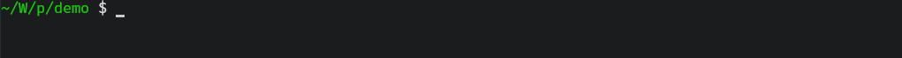
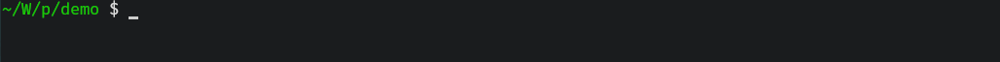

**Contents**
- [独立进度条](#独立进度条)
  - [`ProgressBar`](#progressbar)
    - [交互方式](#交互方式)
    - [配置选项](#配置选项)
      - [元素构成](#元素构成)
        - [可变的进度条长度](#可变的进度条长度)
      - [数据配置](#数据配置)
      - [线程安全性](#线程安全性)
      - [绑定的输出流](#绑定的输出流)
      - [渲染策略](#渲染策略)
    - [与可迭代类型的交互](#与可迭代类型的交互)
    - [自定义回调函数](#自定义回调函数)
  - [`BlockBar`](#blockbar)
    - [交互方式](#交互方式-1)
    - [配置选项](#配置选项-1)
      - [元素构成](#元素构成-1)
        - [可变的进度条长度](#可变的进度条长度-1)
      - [数据配置](#数据配置-1)
      - [线程安全性](#线程安全性-1)
      - [绑定的输出流](#绑定的输出流-1)
      - [渲染策略](#渲染策略-1)
    - [与可迭代类型的交互](#与可迭代类型的交互-1)
    - [自定义回调函数](#自定义回调函数-1)
  - [`SpinBar`](#spinbar)
    - [交互方式](#交互方式-2)
    - [配置选项](#配置选项-2)
      - [元素构成](#元素构成-2)
      - [数据配置](#数据配置-2)
      - [线程安全性](#线程安全性-2)
      - [绑定的输出流](#绑定的输出流-2)
      - [渲染策略](#渲染策略-2)
    - [与可迭代类型的交互](#与可迭代类型的交互-2)
    - [自定义回调函数](#自定义回调函数-2)
  - [`SweepBar`](#sweepbar)
    - [交互方式](#交互方式-3)
    - [配置选项](#配置选项-3)
      - [元素构成](#元素构成-3)
        - [可变的进度条长度](#可变的进度条长度-2)
      - [数据配置](#数据配置-3)
      - [线程安全性](#线程安全性-3)
      - [绑定的输出流](#绑定的输出流-3)
      - [渲染策略](#渲染策略-3)
    - [与可迭代类型的交互](#与可迭代类型的交互-3)
    - [自定义回调函数](#自定义回调函数-3)
  - [`FlowBar`](#flowbar)
    - [交互方式](#交互方式-4)
    - [配置选项](#配置选项-4)
      - [元素构成](#元素构成-4)
        - [可变的进度条长度](#可变的进度条长度-3)
      - [数据配置](#数据配置-4)
      - [线程安全性](#线程安全性-4)
      - [绑定的输出流](#绑定的输出流-4)
      - [渲染策略](#渲染策略-4)
    - [与可迭代类型的交互](#与可迭代类型的交互-4)
    - [自定义回调函数](#自定义回调函数-4)
- [进度条合成器](#进度条合成器)
  - [`MultiBar`](#multibar)
    - [交互方式](#交互方式-5)
    - [辅助函数](#辅助函数)
    - [渲染策略](#渲染策略-5)
    - [元组协议](#元组协议)
  - [`DynamicBar`](#dynamicbar)
    - [交互方式](#交互方式-6)
    - [辅助函数](#辅助函数-1)
    - [渲染策略](#渲染策略-6)
- [全局设置](#全局设置)
  - [着色效果](#着色效果)
  - [输出流检测](#输出流检测)
  - [渲染器工作间隔](#渲染器工作间隔)
  - [隐藏已完成的进度条](#隐藏已完成的进度条)
  - [断言检查](#断言检查)
- [辅助设施](#辅助设施)
  - [`NumericSpan`](#numericspan)
    - [成员方法](#成员方法)
    - [迭代器类型](#迭代器类型)
  - [`IteratorSpan`](#iteratorspan)
    - [成员方法](#成员方法-1)
    - [迭代器类型](#迭代器类型-1)
  - [`BoundedSpan`](#boundedspan)
    - [成员方法](#成员方法-2)
    - [迭代器类型](#迭代器类型-2)
  - [`TrackedSpan`](#trackedspan)
    - [成员方法](#成员方法-3)
    - [迭代器类型](#迭代器类型-3)
  - [`iterate`](#iterate)
- [FAQ](#faq)
  - [更新计数与任务总数一致性](#更新计数与任务总数一致性)
  - [进度条对象的生命周期](#进度条对象的生命周期)
  - [Unicode 支持](#unicode-支持)
  - [渲染器设计](#渲染器设计)
  - [异常传播机制](#异常传播机制)
  - [编译时长问题](#编译时长问题)
  - [设计架构](#设计架构)
    - [基础数据结构设计](#基础数据结构设计)
    - [进度条类型设计](#进度条类型设计)

# 独立进度条
## `ProgressBar`

### 交互方式
`pgbar::ProgressBar` 是一个模板类型；它需要手动配置任务数量才能开始使用，否则会抛出异常 `pgbar::exception::InvalidState`。

任务数量的配置可以通过调用 `config().tasks()` 方法并传递参数完成，也可以利用 `pgbar::option::Tasks` 包装类型传递给构造函数实现。

```cpp
#include "pgbar/pgbar.hpp"

int main()
{
  {
    pgbar::ProgressBar<> bar;
    try {
      bar.tick();
    } catch ( const pgbar::exception::InvalidState& e ) {
      std::cerr << e.what() << std::endl;
    }
  }
  {
    pgbar::ProgressBar<> bar;
    bar.config().tasks( 200 );

    bar.tick( 20 );    // 前进 20 步
    bar.tick_to( 50 ); // 将进度设置为 50%

    for ( int i = 0; i < 100; ++i )
      bar.tick(); // 每次调用仅前进 1 步
  }
  {
    pgbar::ProgressBar<> bar { pbar::option::Tasks( 150 ) };
    bar.tick_to( 20 );  // 将进度设置为 20%
    bar.tick_to( 130 ); // 超出 100% 的部分会被丢弃，并将进度条进度锁定到 100%
  }
}
```

在一些特别的场景中，如果想要检查进度条运行情况，或是强行终止进度条的运行，那么可以使用 `active()` 和 `reset()` 方法。

```cpp
#include "pgbar/pgbar.hpp"
#include <cassert>

int main()
{
  pgbar::ProgressBar<> bar { pgbar::option::Tasks( 500 ) };

  for ( int i = 0; i < 400; ++i ) {
    if ( i > 0 ) // 要注意，只有调用一次 tick() 后进度条才开始运行
      assert( bar.active() );
    bar.tick();
  }

  assert( bar.progress() == 400 ); // 该方法可以获取进度条当前的迭代数
  bar.reset();
  assert( bar.active() == false );
}
```

`ProgressBar` 是一个 move only 且 swappable 的类型，所以你可以使用另一个对象移动构造，或者与另一个对象交换彼此的配置数据。

```cpp
{
  pgbar::ProgressBar<> bar1 { /* 传递一些复杂的配置数据 */ };
  pgbar::ProgressBar<> bar2 { std::move( bar1 ) };
}
{
  pgbar::ProgressBar<> bar1 { /* 传递一些复杂的配置数据 */ };
  pgbar::ProgressBar<> bar2;
  bar2.swap( bar1 );
  // or
  using std::swap;
  swap( bar1, bar2 );
}
```

但不允许在进度条运行过程中交换或移动对象，否则会导致不可预知的错误。

```cpp
pgbar::ProgressBar<> bar1 { pgbar::option::Tasks( 500 ) };

bar1.tick();
assert( bar1.active() );

// pgbar::ProgressBar<> bar2 { std::move( bar1 ) }; No!
```
### 配置选项
正如前面一节中提到的，`ProgressBar` 的所有配置操作都需要经由方法 `config()` 完成。

该方法返回的是对内部配置对象的引用，该配置对象的类型可以在 `pgbar::config` 中找到，它是 `pgbar::config::Line`。

`pgbar::config::Line` 是一个数据类型，该类型存储了所有用于描述 `ProgressBar` 元素的数据成员；它满足可复制、可移动和可交换三个性质。

```cpp
#include "pgbar/pgbar.hpp"

int main()
{
  pgbar::config::Line cfg1;

  auto cfg2 = cfg1;              // copy
  auto cfg3 = std::move( cfg1 ); // move
  cfg3.swap( cfg2 );             // swap
  // or
  using std::swap;
  swap( cfg2, cfg3 );
}
```
#### 元素构成
`ProgressBar` 由以下几种元素组成：

```text
{LeftBorder}{Prefix}{Percent}{Starting}{Filler}{Lead}{Remains}{Ending}{Counter}{Speed}{Elapsed}{Countdown}{Postfix}{RightBorder}
```

其中可以自定义的部分有：`LeftBorder`、`Prefix`、`Starting`、`Filler`、`Lead`、`Remains`、`Ending`、`Speed`、`Postfix` 和 `RightBorder`，它们的功能与名字相同。

这些元素可以直接在 `pgbar::option` 中找到对应的包装类型：

```cpp
pgbar::option::Style;   // 决定以上元素哪些需要被渲染
pgbar::option::Colored; // 开关颜色效果
pgbar::option::Bolded;  // 开关字体加粗效果

pgbar::option::LeftBorder;  // 修改整个进度条左侧的起始边框
pgbar::option::RightBorder; // 修改整个进度条右侧的终止边框

pgbar::option::Prefix;      // 修改前置描述信息
pgbar::option::Postfix;     // 修改尾随描述信息

pgbar::option::Starting;  // 修改进度条块左侧、Percent 右侧的元素
pgbar::option::Ending;    // 修改进度条块右侧、Counter 左侧的元素
pgbar::option::Filler;    // 修改已迭代部分的填充字符
pgbar::option::Lead;      // 修改可变动画部分的各个帧
pgbar::option::Remains;   // 修改未迭代部分的填充字符
pgbar::option::Reversed;  // 调整进度条的增长方向（false 表示从左到右）
pgbar::option::Shift;     // 调整动画部分（Lead）的动画速度
pgbar::option::BarLength; // 调整进度条的长度

pgbar::option::SpeedUnit; // 修改 Speed 部分的单位
pgbar::option::Magnitude; // 调整 Speed 部分的进位倍率

pgbar::option::Tasks;   // 调整任务数量
pgbar::option::Divider; // 修改位于两个元素之间的间隔符

pgbar::option::PrefixColor;  // 修改 Prefix 的颜色
pgbar::option::PostfixColor; // 修改 Postfix 的颜色
pgbar::option::StartColor;   // 修改 Starting 的颜色
pgbar::option::EndColor;     // 修改 Ending 的颜色
pgbar::option::FillerColor;  // 修改 Filler 的颜色
pgbar::option::RemainsColor; // 修改 Remains 的颜色
pgbar::option::LeadColor;    // 修改 Lead 的颜色
pgbar::option::InfoColor;    // 修改 Divider、Percent、Counter、Speed、Elapsed 和 Countdown 的颜色
```

`pgbar::option::Style` 的参数可以由 `pgbar::config::Line` 内的多个静态成员执行位运算得到：

```cpp
pgbar::ProgressBar<> bar { pgbar::option::Style( pgbar::config::Line::Sped | pgbar::config::Line::Per
                                                 | pgbar::config::Line::Elpsd
                                                 | pgbar::config::Line::Cntdwn ) };
```

这种方法配置会显得很繁琐，所以 `Line` 提供了两个辅助方法 `enable()` 和 `disable()` 用于简化以上操作。

```cpp
pgbar::ProgressBar<> bar;
bar.config().enable().speed().percent().elapsed().countdown();
// or
bar.config().enable().entire();
bar.config().disable().animation().counter();
// Animation 就是进度指示器本身
// 并且不是所有元素都可以被关闭，例如 Prefix 就不行
```

以上元素在 `Line` 都有同名方法，调用这些方法并向其中传递参数同样能做到修改数据信息。
##### 可变的进度条长度
在元素 `Starting` 和 `Ending` 中间部分的是被称作 `Animation` 的进度指示器（不包括 `Starting` 和 `Ending`），这个进度指示器的长度是可变的。

每个进度条都有一个默认的初始长度（30 字符），如果希望进度条能够填满一个终端行，或者进度条太长需要缩窄，就需要使用到 `bar_length()` 方法或 `pgbar::option::BarLength` 包装器更改进度指示器的长度。

对于后者，直接使用对应的接口调整参数即可；而前者则需要一个辅助方法获取除了进度指示器之外部分的长度，才能正确计算得到恰好能让进度条占满一行的长度。

这个方法就是 `config().fixed_length()`。

```cpp
pgbar::ProgressBar<> bar;
assert( bar.config().bar_length() == 30 );  // 默认值
assert( bar.config().fixed_length() != 0 ); // 具体值取决于数据成员的内容
```

具体的终端行宽度（以字符为单位）可以使用 `pgbar::config::terminal_width()` 获取；如果传递的输出流不指向实际终端设备，那么返回值为 0。

> 如果运行平台既不是 `Windows` 也不是 `unix-like`，那么该函数只会返回一个固定值 100。

```cpp
assert( pgbar::config::terminal_width( pgbar::Channel::Stdout ) > bar.config().fixed_length() );
bar.bar_length( pgbar::config::terminal_width( pgbar::Channel::Stdout ) - bar.config().fixed_length() );
// 此时进度条恰能填满一行
```
#### 数据配置
`Line` 有两种数据配置方法：基于包装器类型的可变参数构造，和基于链式调用的流式接口风格。

```cpp
#include "pgbar/pgbar.hpp"

int main()
{
  pgbar::config::Line config1 {
    pgbar::option::Tasks( 100 ),
    pgbar::option::SpeedUnit( { "B/s", "kiB/s", "MiB/s", "GiB/s" } ),
    pgbar::option::Magnitude( 1024 ),
    pgbar::option::InfoColor( "#39C5BB" )
    // pgbar::option::InfoColor(0x39C5BB) Don't do that!
  };
  // 注意：传入相同的包装器类型两次会导致编译错误

  pgbar::config::Line config2;
  config2.tasks( 100 )
    .speed_unit( { "B/s", "kiB/s", "MiB/s", "GiB/s" } )
    .magnitude( 1024 )
    .info_color( "#39C5BB" );

  auto config3 = config2; // 构造完毕后也能使用可变模板参数调整
  config3.set( pgbar::option::Prefix( "Do something" ), pgbar::option::PrefixColor( 0xFFE211 ) );
}
```

尽管配置类型可以在进度条运行过程中被修改，但这一概念并不适用于任务数量；也就是说进度条一旦开始运行，它的任务数量就不可中途改变。

```cpp
#include "pgbar/pgbar.hpp

int main()
{
  pgbar::ProgressBar<> pbar;

  pbar.config().tasks( 100 );
  for ( auto i = 0; i < 100; ++i ) {
    pbar.tick();
    if ( i == 30 ) // nothing happens
      pbar.config().tasks( 50 );
    std::this_thread::sleep_for( std::chrono::milliseconds( 20 ) );
  }
}
```
#### 线程安全性
配置类型 `Line` 的一切方法都是线程安全的，这意味着你可以在进度条运行过程中修改其中的数据。

`ProgressBar` 只有 `tick()`、`tick_to()` 和 `reset()` 方法是线程安全的；其余方法，特别是 `iterate()`，是线程不安全的。

这表示进度条允许多个线程同时调用它的 `tick()`、`tick_to()` 和 `reset()` 方法；但这不包括移动赋值、移动构造和交换两个对象，以及 `iterate()` 方法。

并且绝对不应该在进度条运行过程中尝试移动或交换当前对象。
#### 绑定的输出流
`ProgressBar` 默认向标准错误流 `stderr` 输出字符串；具体绑定的输出流由第一个模板参数定义。

```cpp
#include "pgbar/pgbar.hpp"
#include <type_traits>

int main()
{
  static_assert( std::is_same<pgbar::ProgressBar<>,
                              pgbar::ProgressBar<pgbar::Channel::Stderr>>::value,
                 "" );

  pgbar::ProgressBar<pgbar::Channel::Stdout> bar; // 绑定到 stdout 上
}
```

特别需要注意的是，绑定到相同输出流上的对象不允许同时运行，否则会抛出异常 `pgbar::exception::InvalidState`；关于这一点的详细说明见 [FAQ-渲染器设计](#渲染器设计)。
#### 渲染策略
`ProgressBar` 的渲染调度策略有两种：同步（`pgbar::Policy::Sync`）或异步（`pgbar::Policy::Async`）；不同的调度策略会将渲染行为交给不同的线程执行。

启用异步渲染（默认）时，进度条的渲染由一个后台线程以固定时间间隔自动完成。

而在同步渲染模式下，渲染动作则由每次调用 `tick()` 或 `tick_to()` 的线程执行；每次调用 `tick()` 不仅会更新进度状态，也会立即将最新进度条输出到终端。

具体的渲染策略由第二个模板参数定义。

```cpp
#include "pgbar/pgbar.hpp"
#include <type_traits>

int main()
{
  static_assert( std::is_same<pgbar::ProgressBar<>,
                              pgbar::ProgressBar<pgbar::Channel::Stderr, pgbar::Policy::Async>>::value,
                 "" );

  pgbar::ProgressBar<pgbar::Channel::Stderr, pgbar::Policy::Sync> bar; // 使用同步渲染
}
```

无论选择哪种渲染调度策略，终端上的具体渲染方式都由第三个模板参数 `pgbar::Region` 决定。

该参数有两个可选值：默认的固定区域渲染 `pgbar::Region::Fixed`，以及基于相对位置的渲染 `pgbar::Region::Relative`。

`pgbar::Region::Fixed` 会在首次渲染时保存当前光标位置，并始终在该固定区域刷新进度条；此时同一输出流上的其他内容都会被进度条刷新覆盖。

`pgbar::Region::Relative` 会根据上一次渲染输出的行数、回退并覆盖旧进度条内容；此时向同一输出流写入信息后，若额外添加适当数量的换行符，那么写入的额外信息能够得到保留。

但如果进度条字符串长度过长，使用 `pgbar::Region::Relative` 会导致终端渲染异常。

> 对于任意一个独立的进度条而言，它的渲染结构共占两行：一行是进度条本身，一行则是空行；
>
> 因此使用 `pgbar::Region::Relative` 布局时，如果需要额外再输出信息，就需要在输出后再额外插入两个换行符；
>
> 否则由于进度条占据两行结构，后续渲染会错误覆盖已有输出。
>
> 示例：

```cpp
#include "pgbar/pgbar.hpp"
#include <iostream>

int main()
{
  pgbar::ProgressBar</* any channel */, /* any policy */, pgbar::Region::Relative> bar;
  bar.config().tasks( 100 );

  for ( size_t i = 0; i < 95; ++i )
    bar.tick(); /* do something... */

  // Notice: At least two newlines must be inserted after the output information
  std::cerr << "Extra log information" << std::endl << std::endl;

  while ( bar.active() )
    bar.tick();
}
```
### 与可迭代类型的交互
在处理一些可迭代类型、或者是数值范围的迭代任务时，`pgbar` 提供了一个更简单地迭代手段：`iterate()` 方法。

这个方法的使用与 Python 中的 `range()` 函数类似，它可以同时在由数值指定的范围上，和由可迭代类型划定的范围内进行遍历；具体的任务数量会由 `iterate()` 自己配置。

具体的迭代手段可以是使用 Enhanced-for，也可以像 `std::for_each` 一样传递一个一元函数。

```cpp
#include "pgbar/pgbar.hpp"
#include <thread>
using namespace std;

int main()
{
  pgbar::ProgressBar<> bar;

  // Iteration range: [100, 0), step: -1
  for ( auto num : bar.iterate( 100, 0, -1 ) ) {
    this_thread::sleep_for( 100ms );
  }
  // Iteration range: [0.0, -2.0), step: -0.01
  for ( auto fnum : bar.iterate( -2.0, -0.01 ) ) {
    this_thread::sleep_for( 100ms );
  }
  // Iteration range: [0, 100), step: 1
  bar.iterate( 100, []( int ) { this_thread::sleep_for( 100ms ); } );
}
```

在前两个 Enhanced-for 中，`iterate()` 方法返回的实际上是 `pgbar::slice::TrackedSpan`；关于这一类型的介绍可以见[辅助类型-`TrackedSpan`](#proxyspan)。

有关数值类型范围的使用，可以见[辅助类型-`NumericSpan`](#numericspan)。

除了在数值范围内工作之外，`ProgressBar` 也可以与存在迭代器的类型进行交互，例如 `std::vector` 和原始数组。

```cpp
#include "pgbar/pgbar.hpp"
#include <thread>
#include <vector>
using namespace std;

int main()
{
  pgbar::ProgressBar<> bar;

  vector<int> arr1 {
    0, 1, 2, 3, 4, 5, 6,
  };
  int arr2[] { 100, 99, 98, 97, 96, 95, 94, 93, 92, 91 };

  for ( auto& ele : bar.iterate( arr1.begin(), arr1.end() ) ) {
    ele += 1; // 此处的 ele 是对 vector 内元素的引用
    this_thread::sleep_for( 300ms );
  }
  // 逆序遍历
  bar.iterate( std::rbegin( arr2 ), std::rend( arr2 ), []( int& ) {
    this_thread::sleep_for( 300ms );
  } );
}
```

有关可迭代类型的范围划定，可以见[辅助类型-`IteratorSpan`](#iterspan)。

特别的，如果一个类型满足概念 `std::ranges::sized_range`，那么这个类型还可以以更简单的方式进行遍历；这包括了原始数组。

```cpp
#include "pgbar/pgbar.hpp"
#include <thread>
#include <vector>
using namespace std;

int main()
{
  pgbar::ProgressBar<> bar;

  vector<int> arr1 {
    0, 1, 2, 3, 4, 5, 6,
  };
  int arr2[] { 100, 99, 98, 97, 96, 95, 94, 93, 92, 91 };

  for ( auto& ele : bar.iterate( arr1 ) ) {
    ele += 1;
    this_thread::sleep_for( 300ms );
  }
  // 数组也没问题
  bar.iterate( arr2, []( int& ) { this_thread::sleep_for( 300ms ); } );
}
```

这类类型实际上是一个“有穷范围”，这意味着它的大小是已知的，而不能是类似 `std::views::iota( 0 )` 一样的无穷序列。

如果满足有穷范围约束，如果使用 C++20，那么 `iterate` 能够正确处理满足约束 `std::ranges::view` 的视图类型的引用生命周期。
### 自定义回调函数
`ProgressBar` 提供了一个 `action()` 方法，以接收或清除一个 `void()` 或 `void( ProgressBar& )` 类型的函数回调。

该回调会在进度条类型调用 `reset()` 方法时、终止进度条渲染（`active()` 函数返回值从 `true` 切换为 `false`）之前被调用。

同样的，如果进度条正常运行且正常终止，那么进度条类型会在内部自己调用 `reset()` 方法，此时回调函数依然会在进度条终止之前被调用。

`ProgressBar` 为 `action()` 提供了 `operator|` 和 `operator|=` 重载。

```cpp
#include "pgbar/pgbar.hpp"
using namespace std;

int main()
{
  pgbar::ProgressBar<> bar;
  bool flag = true;
  auto callback = [&]( pgbar::ProgressBar<>& self ) {
    if ( flag )
      self.config().prefix( "✔ Mission Accomplished" ).prefix_color( pgbar::color::Green );
    else
      self.config().prefix( "❌ Mission failed" ).prefix_color( pgbar::color::Red );
  };

  bar.action( callback );
  // or
  bar |= callback;
  // or
  bar | callback;
  callback | bar;
}
```

传递的回调函数类型必须满足 `std::is_move_constructible`；并且**不应该**在回调内部调用除了 `config()` 和 `progress()` 之外的方法，否则会导致*死锁*。

- - -

## `BlockBar`

### 交互方式
`pgbar::BlockBar` 是一个模板类型；它需要手动配置任务数量才能开始使用，否则会抛出异常 `pgbar::exception::InvalidState`。

任务数量的配置可以通过调用 `config().tasks()` 方法并传递参数完成，也可以利用 `pgbar::option::Tasks` 包装类型传递给构造函数实现。

```cpp
#include "pgbar/pgbar.hpp"

int main()
{
  {
    pgbar::BlockBar<> bar;
    try {
      bar.tick();
    } catch ( const pgbar::exception::InvalidState& e ) {
      std::cerr << e.what() << std::endl;
    }
  }
  {
    pgbar::BlockBar<> bar;
    bar.config().tasks( 200 );

    bar.tick( 20 );    // 前进 20 步
    bar.tick_to( 50 ); // 将进度设置为 50%

    for ( int i = 0; i < 100; ++i )
      bar.tick(); // 每次调用仅前进 1 步
  }
  {
    pgbar::BlockBar<> bar { pbar::option::Tasks( 150 ) };
    bar.tick_to( 20 );  // 将进度设置为 20%
    bar.tick_to( 130 ); // 超出 100% 的部分会被丢弃，并将进度条进度锁定到 100%
  }
}
```

在一些特别的场景中，如果想要检查进度条运行情况，或是强行终止进度条的运行，那么可以使用 `active()` 和 `reset()` 方法。

```cpp
#include "pgbar/pgbar.hpp"
#include <cassert>

int main()
{
  pgbar::BlockBar<> bar { pgbar::option::Tasks( 500 ) };

  for ( int i = 0; i < 400; ++i ) {
    if ( i > 0 ) // 要注意，只有调用一次 tick() 后进度条才开始运行
      assert( bar.active() );
    bar.tick();
  }

  assert( bar.progress() == 400 ); // 该方法可以获取进度条当前的迭代数
  bar.reset();
  assert( bar.active() == false );
}
```

`BlockBar` 是一个 move only 且 swappable 的类型，所以你可以使用另一个对象移动构造，或者与另一个对象交换彼此的配置数据。

```cpp
{
  pgbar::BlockBar<> bar1 { /* 传递一些复杂的配置数据 */ };
  pgbar::BlockBar<> bar2 { std::move( bar1 ) };
}
{
  pgbar::BlockBar<> bar1 { /* 传递一些复杂的配置数据 */ };
  pgbar::BlockBar<> bar2;
  bar2.swap( bar1 );
  // or
  using std::swap;
  swap( bar1, bar2 );
}
```

但不允许在进度条运行过程中交换或移动对象，否则会导致不可预知的错误。

```cpp
pgbar::BlockBar<> bar1 { pgbar::option::Tasks( 500 ) };

bar1.tick();
assert( bar1.active() );

// pgbar::BlockBar<> bar2 { std::move( bar1 ) }; No!
```
### 配置选项
正如前面一节中提到的，`BlockBar` 的所有配置操作都需要经由方法 `config()` 完成。

该方法返回的是对内部配置对象的引用，该配置对象的类型可以在 `pgbar::config` 中找到，它是 `pgbar::config::Block`。

`pgbar::config::Block` 是一个数据类型，该类型存储了所有用于描述 `BlockBar` 元素的数据成员；它满足可复制、可移动和可交换三个性质。

```cpp
#include "pgbar/pgbar.hpp"

int main()
{
  pgbar::config::Block cfg1;

  auto cfg2 = cfg1;              // copy
  auto cfg3 = std::move( cfg1 ); // move
  cfg3.swap( cfg2 );             // swap
  // or
  using std::swap;
  swap( cfg2, cfg3 );
}
```
#### 元素构成
`BlockBar` 由以下几种元素组成：

```text
{LeftBorder}{Prefix}{Percent}{Starting}{Filler}{Lead}{Remains}{Ending}{Counter}{Speed}{Elapsed}{Countdown}{Postfix}{RightBorder}
```

其中可以自定义的部分有：`LeftBorder`、`Prefix`、`Starting`、`Lead`、`Filler`、`Remains`、`Ending`、`Speed`、`Postfix` 和 `RightBorder`，它们的功能与名字相同。

这些元素可以直接在 `pgbar::option` 中找到对应的包装类型：

```cpp
pgbar::option::Style;   // 决定以上元素哪些需要被渲染
pgbar::option::Colored; // 开关颜色效果
pgbar::option::Bolded;  // 开关字体加粗效果

pgbar::option::LeftBorder;  // 修改整个进度条左侧的起始边框
pgbar::option::RightBorder; // 修改整个进度条右侧的终止边框

pgbar::option::Prefix;      // 修改前置描述信息
pgbar::option::Postfix;     // 修改尾随描述信息

pgbar::option::Starting;  // 修改进度条块左侧、Percent 右侧的元素
pgbar::option::Ending;    // 修改进度条块右侧、Counter 左侧的元素
pgbar::option::Lead;      // 修改可变动画部分的各个帧
pgbar::option::Filler;    // 修改已迭代部分的填充字符
pgbar::option::Remains;   // 修改未迭代部分的填充字符
pgbar::option::Reversed;  // 调整进度条的增长方向（false 表示从左到右）
pgbar::option::BarLength; // 调整进度条的长度

pgbar::option::SpeedUnit; // 修改 Speed 部分的单位
pgbar::option::Magnitude; // 调整 Speed 部分的进位倍率

pgbar::option::Tasks;   // 调整任务数量
pgbar::option::Divider; // 修改位于两个元素之间的间隔符

pgbar::option::PrefixColor;  // 修改 Prefix 的颜色
pgbar::option::PostfixColor; // 修改 Postfix 的颜色
pgbar::option::StartColor;   // 修改 Starting 的颜色
pgbar::option::EndColor;     // 修改 Ending 的颜色
pgbar::option::FillerColor;  // 修改 Filler 的颜色
pgbar::option::RemainsColor; // 修改 Remains 的颜色
pgbar::option::LeadColor;    // 修改 Lead 的颜色
pgbar::option::InfoColor;    // 修改 Divider、Percent、Counter、Speed、Elapsed 和 Countdown 的颜色
```

`pgbar::option::Style` 的参数可以由 `pgbar::config::Block` 内的多个静态成员执行位运算得到：

```cpp
pgbar::BlockBar<> bar { pgbar::option::Style( pgbar::config::Block::Sped | pgbar::config::Block::Per
                                              | pgbar::config::Block::Elpsd
                                              | pgbar::config::Block::Cntdwn ) };
```

这种方法配置会显得很繁琐，所以 `Block` 提供了两个辅助方法 `enable()` 和 `disable()` 用于简化以上操作。

```cpp
pgbar::BlockBar<> bar;
bar.config().enable().speed().percent().elapsed().countdown();
// or
bar.config().enable().entire();
bar.config().disable().animation().counter();
// Animation 就是指 BlockBar
// 并且不是所有元素都可以被关闭，例如 Prefix 就不行
```

以上元素在 `Block` 都有同名方法，调用这些方法并向其中传递参数同样能做到修改数据信息。
##### 可变的进度条长度
`BlockBar` 的元素 `BlockBar` 也被称作 `Animation`，它是一个使用 Unicode 方块字符实现的进度指示器，这个进度指示器的长度是可变的。

每个进度条都有一个默认的初始长度（30 字符），如果希望进度条能够填满一个终端行，或者进度条太长需要缩窄，就需要使用到 `bar_length()` 方法或 `pgbar::option::BarLength` 包装器更改进度指示器的长度。

对于后者，直接使用对应的接口调整参数即可；而前者则需要一个辅助方法获取除了进度指示器之外部分的长度，才能正确计算得到恰好能让进度条占满一行的长度。

这个方法就是 `config().fixed_length()`。

```cpp
pgbar::BlockBar<> bar;
assert( bar.config().bar_length() == 30 );  // 默认值
assert( bar.config().fixed_length() != 0 ); // 具体值取决于数据成员的内容
```

具体的终端行宽度（以字符为单位）可以使用 `pgbar::config::terminal_width()` 获取；如果传递的输出流不指向实际终端设备，那么返回值为 0。

> 如果运行平台既不是 Windows 也不是 unix-like，那么该函数只会返回一个固定值 100。

```cpp
assert( pgbar::config::terminal_width( pgbar::Channel::Stdout ) > bar.config().fixed_length() );
bar.bar_length( pgbar::config::terminal_width( pgbar::Channel::Stdout ) - bar.config().fixed_length() );
// 此时进度条恰能填满一行
```
#### 数据配置
`Block` 有两种数据配置方法：基于包装器类型的可变参数构造，和基于链式调用的流式接口风格。

```cpp
#include "pgbar/pgbar.hpp"

int main()
{
  pgbar::config::Block config1 {
    pgbar::option::Tasks( 100 ),
    pgbar::option::SpeedUnit( { "B/s", "kiB/s", "MiB/s", "GiB/s" } ),
    pgbar::option::Magnitude( 1024 ),
    pgbar::option::InfoColor( "#39C5BB" )
    // pgbar::option::InfoColor(0x39C5BB) Don't do that!
  };
  // 注意：传入相同的包装器类型两次会导致编译错误

  pgbar::config::Block config2;
  config2.tasks( 100 )
    .speed_unit( { "B/s", "kiB/s", "MiB/s", "GiB/s" } )
    .magnitude( 1024 )
    .info_color( "#39C5BB" );

  auto config3 = config2; // 构造完毕后也能使用可变模板参数调整
  config3.set( pgbar::option::Prefix( "Do something" ), pgbar::option::PrefixColor( 0xFFE211 ) );
}
```

尽管配置类型可以在进度条运行过程中被修改，但这一概念并不适用于任务数量；也就是说进度条一旦开始运行，它的任务数量就不可中途改变。

```cpp
#include "pgbar/pgbar.hpp

int main()
{
  pgbar::BlockBar<> pbar;

  pbar.config().tasks( 100 );
  for ( auto i = 0; i < 100; ++i ) {
    pbar.tick();
    if ( i == 30 ) // nothing happens
      pbar.config().tasks( 50 );
    std::this_thread::sleep_for( std::chrono::milliseconds( 20 ) );
  }
}
```
#### 线程安全性
配置类型 `Block` 的一切方法都是线程安全的，这意味着你可以在进度条运行过程中修改其中的数据。

`BlockBar` 只有 `tick()`、`tick_to()` 和 `reset()` 方法是线程安全的；其余方法，特别是 `iterate()` 是线程不安全的。

这表示进度条允许多个线程同时调用它的 `tick()`、`tick_to()` 和 `reset()` 方法；但这不包括移动赋值、移动构造和交换两个对象，以及 `iterate()` 方法。

并且绝对不应该在进度条运行过程中尝试移动或交换当前对象。
#### 绑定的输出流
`BlockBar` 默认向标准错误流 `stderr` 输出字符串；具体绑定的输出流由第一个模板参数定义。

```cpp
#include "pgbar/pgbar.hpp"
#include <type_traits>

int main()
{
  static_assert( std::is_same<pgbar::BlockBar<>, pgbar::BlockBar<pgbar::Channel::Stderr>>::value, "" );

  pgbar::BlockBar<pgbar::Channel::Stdout> bar; // 绑定到 stdout 上
}
```

特别需要注意的是，绑定到相同输出流上的对象不允许同时运行，否则会抛出异常 `pgbar::exception::InvalidState`；关于这一点的详细说明见 [FAQ-渲染器设计](#渲染器设计)。
#### 渲染策略
`BlockBar` 的渲染调度策略有两种：同步（`pgbar::Policy::Sync`）或异步（`pgbar::Policy::Async`）；不同的调度策略会将渲染行为交给不同的线程执行。

启用异步渲染（默认）时，进度条的渲染由一个后台线程以固定时间间隔自动完成。

而在同步渲染模式下，渲染动作则由每次调用 `tick()` 或 `tick_to()` 的线程执行；每次调用 `tick()` 不仅会更新进度状态，也会立即将最新进度条输出到终端。

具体的渲染策略由第二个模板参数定义。

```cpp
#include "pgbar/pgbar.hpp"
#include <type_traits>

int main()
{
  static_assert(
    std::is_same<pgbar::BlockBar<>, pgbar::BlockBar<pgbar::Channel::Stderr, pgbar::Policy::Async>>::value,
    "" );

  pgbar::BlockBar<pgbar::Channel::Stderr, pgbar::Policy::Sync> bar; // 使用同步渲染
}
```

无论选择哪种渲染调度策略，终端上的具体渲染方式都由第三个模板参数 `pgbar::Region` 决定。

该参数有两个可选值：默认的固定区域渲染 `pgbar::Region::Fixed`，以及基于相对位置的渲染 `pgbar::Region::Relative`。

`pgbar::Region::Fixed` 会在首次渲染时保存当前光标位置，并始终在该固定区域刷新进度条；此时同一输出流上的其他内容都会被进度条刷新覆盖。

`pgbar::Region::Relative` 会根据上一次渲染输出的行数、回退并覆盖旧进度条内容；此时向同一输出流写入信息后，若额外添加适当数量的换行符，那么写入的额外信息能够得到保留。

但如果进度条字符串长度过长，使用 `pgbar::Region::Relative` 会导致终端渲染异常。

> 对于任意一个独立的进度条而言，它的渲染结构共占两行：一行是进度条本身，一行则是空行；
>
> 因此使用 `pgbar::Region::Relative` 布局时，如果需要额外再输出信息，就需要在输出后再额外插入两个换行符；
>
> 否则由于进度条占据两行结构，后续渲染会错误覆盖已有输出。
>
> 示例：

```cpp
#include "pgbar/pgbar.hpp"
#include <iostream>

int main()
{
  pgbar::BlockBar</* any channel */, /* any policy */, pgbar::Region::Relative> bar;
  bar.config().tasks( 100 );

  for ( size_t i = 0; i < 95; ++i )
    bar.tick(); /* do something... */

  // Notice: At least two newlines must be inserted after the output information
  std::cerr << "Extra log information" << std::endl << std::endl;

  while ( bar.active() )
    bar.tick();
}
```
### 与可迭代类型的交互
在处理一些可迭代类型、或者是数值范围的迭代任务时，`pgbar` 提供了一个更简单地迭代手段：`iterate()` 方法。

这个方法的使用与 Python 中的 `range()` 函数类似，它可以同时在由数值指定的范围上，和由可迭代类型划定的范围内进行遍历；具体的任务数量会由 `iterate()` 自己配置。

具体的迭代手段可以是使用 Enhanced-for，也可以像 `std::for_each` 一样传递一个一元函数。

```cpp
#include "pgbar/pgbar.hpp"
#include <thread>
using namespace std;

int main()
{
  pgbar::BlockBar<> bar;

  // Iteration range: [100, 0), step: -1
  for ( auto num : bar.iterate( 100, 0, -1 ) ) {
    this_thread::sleep_for( 100ms );
  }
  // Iteration range: [0.0, -2.0), step: -0.01
  for ( auto fnum : bar.iterate( -2.0, -0.01 ) ) {
    this_thread::sleep_for( 100ms );
  }
  // Iteration range: [0, 100), step: 1
  bar.iterate( 100, []( int ) { this_thread::sleep_for( 100ms ); } );
}
```

在前两个 Enhanced-for 中，`iterate()` 方法返回的实际上是 `pgbar::slice::TrackedSpan`；关于这一类型的介绍可以见[辅助类型-`TrackedSpan`](#proxyspan)。

有关数值类型范围的使用，可以见[辅助类型-`NumericSpan`](#numericspan)。

除了在数值范围内工作之外，`BlockBar` 也可以与存在迭代器的类型进行交互，例如 `std::vector` 和原始数组。

```cpp
#include "pgbar/pgbar.hpp"
#include <thread>
#include <vector>
using namespace std;

int main()
{
  pgbar::BlockBar<> bar;

  vector<int> arr1 {
    0, 1, 2, 3, 4, 5, 6,
  };
  int arr2[] { 100, 99, 98, 97, 96, 95, 94, 93, 92, 91 };

  for ( auto& ele : bar.iterate( arr1.begin(), arr1.end() ) ) {
    ele += 1; // 此处的 ele 是对 vector 内元素的引用
    this_thread::sleep_for( 300ms );
  }
  // 逆序遍历
  bar.iterate( std::rbegin( arr2 ), std::rend( arr2 ), []( int& ) {
    this_thread::sleep_for( 300ms );
  } );
}
```

有关可迭代类型的范围划定，可以见[辅助类型-`IteratorSpan`](#iterspan)。

特别的，如果一个类型满足概念 `std::ranges::sized_range`，那么这个类型还可以以更简单的方式进行遍历；这包括了原始数组。

```cpp
#include "pgbar/pgbar.hpp"
#include <thread>
#include <vector>
using namespace std;

int main()
{
  pgbar::BlockBar<> bar;

  vector<int> arr1 {
    0, 1, 2, 3, 4, 5, 6,
  };
  int arr2[] { 100, 99, 98, 97, 96, 95, 94, 93, 92, 91 };

  for ( auto& ele : bar.iterate( arr1 ) ) {
    ele += 1;
    this_thread::sleep_for( 300ms );
  }
  // 数组也没问题
  bar.iterate( arr2, []( int& ) { this_thread::sleep_for( 300ms ); } );
}
```

这类类型实际上是一个“有穷范围”，这意味着它的大小是已知的，而不能是类似 `std::views::iota( 0 )` 一样的无穷序列。

如果满足有穷范围约束，如果使用 C++20，那么 `iterate` 能够正确处理满足约束 `std::ranges::view` 的视图类型的引用生命周期。
### 自定义回调函数
`BlockBar` 提供了一个 `action()` 方法，以接收或清除一个 `void()` 或 `void(  BlockBar& )` 类型的函数回调。

该回调会在进度条类型调用 `reset()` 方法时、终止进度条渲染（`active()` 函数返回值从 `true` 切换为 `false`）之前被调用。

同样的，如果进度条正常运行且正常终止，那么进度条类型会在内部自己调用 `reset()` 方法，此时回调函数依然会在进度条终止之前被调用。

`BlockBar` 为 `action()` 提供了 `operator|` 和 `operator|=` 重载。

```cpp
#include "pgbar/pgbar.hpp"
using namespace std;

int main()
{
  pgbar::BlockBar<> bar;
  bool flag = true;
  auto callback = [&]( pgbar::BlockBar<>& self ) {
    if ( flag )
      self.config().prefix( "✔ Mission Accomplished" ).prefix_color( pgbar::color::Green );
    else
      self.config().prefix( "❌ Mission failed" ).prefix_color( pgbar::color::Red );
  };

  bar.action( callback );
  // or
  bar |= callback;
  // or
  bar | callback;
  callback | bar;
}
```

传递的回调函数类型必须满足 `std::is_move_constructible`；并且**不应该**在回调内部调用除了 `config()` 和 `progress()` 之外的方法，否则会导致*死锁*。

- - -

## `SpinBar`

### 交互方式
`pgbar::SpinBar` 是一个模板类型；它不关心具体的任务数量，因此不需要为它配置任务数量也能够使用。

如果需要显示具体的任务数量，也可以通过调用 `config().tasks()` 方法并传递参数完成，利用 `pgbar::option::Tasks` 包装类型传递给构造函数同样也行。

```cpp
#include "pgbar/pgbar.hpp"

int main()
{
  {
    pgbar::SpinBar<> bar;
    bar.tick(); // no problem
  }
  {
    pgbar::SpinBar<> bar;
    bar.config().tasks( 200 );

    bar.tick( 20 );    // 前进 20 步
    bar.tick_to( 50 ); // 将进度设置为 50%

    for ( int i = 0; i < 100; ++i )
      bar.tick(); // 每次调用仅前进 1 步
  }
  {
    pgbar::SpinBar<> bar { pbar::option::Tasks( 150 ) };
    bar.tick_to( 20 );  // 将进度设置为 20%
    bar.tick_to( 130 ); // 超出 100% 的部分会被丢弃，并将进度条进度锁定到 100%
  }
}
```

在一些特别的场景中，如果想要检查进度条运行情况，或是强行终止进度条的运行，那么可以使用 `active()` 和 `reset()` 方法。

注意：因为 `SpinBar` 允许在任务数量为零的情况下启动，因此这种情况下 `SpinBar` 不会知道它应该在什么时候自动停止。

这也意味着如果需要停止一个无任务数量的 `SpinBar`，必须手动调用 `reset()` 方法。

> 也可以让 `SpinBar` 因超出作用域、被析构而停止运行，但并不建议这样做。

```cpp
#include "pgbar/pgbar.hpp"
#include <cassert>

int main()
{
  pgbar::SpinBar<> bar;

  bar.tick();
  // 要注意，只有调用一次 tick() 后进度条才开始运行
  assert( bar.active() );

  assert( bar.progress() == 0 ); // 该方法可以获取进度条当前的迭代数
  bar.reset();
  assert( bar.active() == false );
}
```

`SpinBar` 是一个 move only 且 swappable 的类型，所以你可以使用另一个对象移动构造，或者与另一个对象交换彼此的配置数据。

```cpp
{
  pgbar::SpinBar<> bar1 { /* 传递一些复杂的配置数据 */ };
  pgbar::SpinBar<> bar2 { std::move( bar1 ) };
}
{
  pgbar::SpinBar<> bar1 { /* 传递一些复杂的配置数据 */ };
  pgbar::SpinBar<> bar2;
  bar2.swap( bar1 );
  // or
  using std::swap;
  swap( bar1, bar2 );
}
```

但不允许在进度条运行过程中交换或移动对象，否则会导致不可预知的错误。

```cpp
pgbar::SpinBar<> bar1;

bar1.tick();
assert( bar1.active() );

// pgbar::SpinBar<> bar2 { std::move( bar1 ) }; No!
```
### 配置选项
正如前面一节中提到的，`SpinBar` 的所有配置操作都需要经由方法 `config()` 完成。

该方法返回的是对内部配置对象的引用，该配置对象的类型可以在 `pgbar::config` 中找到，它是 `pgbar::config::Spin`。

`pgbar::config::Spin` 是一个数据类型，该类型存储了所有用于描述 `SpinBar` 元素的数据成员；它满足可复制、可移动和可交换三个性质。

```cpp
#include "pgbar/pgbar.hpp"

int main()
{
  pgbar::config::Spin cfg1;

  auto cfg2 = cfg1;              // copy
  auto cfg3 = std::move( cfg1 ); // move
  cfg3.swap( cfg2 );             // swap
  // or
  using std::swap;
  swap( cfg2, cfg3 );
}
```
#### 元素构成
`SpinBar` 由以下几种元素组成：

```text
{LeftBorder}{Prefix}{Lead}{Percent}{Counter}{Speed}{Elapsed}{Countdown}{Postfix}{RightBorder}
```

其中可以自定义的部分有：`LeftBorder`、`Prefix`、`Lead`、`Speed`、`Postfix` 和 `RightBorder`，它们的功能与名字相同。

这些元素可以直接在 `pgbar::option` 中找到对应的包装类型：

```cpp
pgbar::option::Style;   // 决定以上元素哪些需要被渲染
pgbar::option::Colored; // 开关颜色效果
pgbar::option::Bolded;  // 开关字体加粗效果

pgbar::option::LeftBorder;  // 修改整个进度条左侧的起始边框
pgbar::option::RightBorder; // 修改整个进度条右侧的终止边框

pgbar::option::Prefix;      // 修改前置描述信息
pgbar::option::Postfix;     // 修改尾随描述信息

pgbar::option::Lead;      // 修改可变动画部分的各个帧
pgbar::option::Shift;     // 调整动画部分（Lead）的动画速度

pgbar::option::SpeedUnit; // 修改 Speed 部分的单位
pgbar::option::Magnitude; // 调整 Speed 部分的进位倍率

pgbar::option::Tasks;   // 调整任务数量
pgbar::option::Divider; // 修改位于两个元素之间的间隔符

pgbar::option::PrefixColor;  // 修改 Prefix 的颜色
pgbar::option::PostfixColor; // 修改 Postfix 的颜色
pgbar::option::LeadColor;    // 修改 Lead 的颜色
pgbar::option::InfoColor;    // 修改 Divider、Percent、Counter、Speed、Elapsed 和 Countdown 的颜色
```

`pgbar::option::Style` 的参数可以由 `pgbar::config::Spin` 内的多个静态成员执行位运算得到：

```cpp
pgbar::SpinBar<> bar { pgbar::option::Style( pgbar::config::Spin::Sped | pgbar::config::Spin::Per
                                             | pgbar::config::Spin::Elpsd
                                             | pgbar::config::Spin::Cntdwn ) };
```

这种方法配置会显得很繁琐，所以 `Spin` 提供了两个辅助方法 `enable()` 和 `disable()` 用于简化以上操作。

```cpp
pgbar::SpinBar<> bar;
bar.config().enable().speed().percent().elapsed().countdown();
// or
bar.config().enable().entire();
bar.config().disable().animation().counter();
// Animation 指的是左侧的动画组件 Lead
// 并且不是所有元素都可以被关闭，例如 Prefix 就不行
```

以上元素在 `Spin` 都有同名方法，调用这些方法并向其中传递参数同样能做到修改数据信息。
#### 数据配置
`Spin` 有两种数据配置方法：基于包装器类型的可变参数构造，和基于链式调用的流式接口风格。

```cpp
#include "pgbar/pgbar.hpp"

int main()
{
  pgbar::config::Spin config1 {
    pgbar::option::SpeedUnit( { "B/s", "kiB/s", "MiB/s", "GiB/s" } ),
    pgbar::option::Magnitude( 1024 ),
    pgbar::option::InfoColor( "#39C5BB" )
    // pgbar::option::InfoColor(0x39C5BB) Don't do that!
  };
  // 注意：传入相同的包装器类型两次会导致编译错误

  pgbar::config::Spin config2;
  config2.speed_unit( { "B/s", "kiB/s", "MiB/s", "GiB/s" } )
    .magnitude( 1024 )
    .info_color( "#39C5BB" );

  auto config3 = config2; // 构造完毕后也能使用可变模板参数调整
  config3.set( pgbar::option::Prefix( "Do something" ), pgbar::option::PrefixColor( 0xFFE211 ) );
}
```

尽管配置类型可以在进度条运行过程中被修改，但这一概念并不适用于任务数量；也就是说进度条一旦开始运行，它的任务数量就不可中途改变。

```cpp
#include "pgbar/pgbar.hpp

int main()
{
  pgbar::SpinBar<> pbar;

  pbar.config().tasks( 100 );
  for ( auto i = 0; i < 100; ++i ) {
    pbar.tick();
    if ( i == 30 ) // nothing happens
      pbar.config().tasks( 50 );
    std::this_thread::sleep_for( std::chrono::milliseconds( 20 ) );
  }
}
```
#### 线程安全性
配置类型 `Spin` 的一切方法都是线程安全的，这意味着你可以在进度条运行过程中修改其中的数据。

`SpinBar` 只有 `tick()`、`tick_to()` 和 `reset()` 方法是线程安全的；其余方法，特别是 `iterate()` 是线程不安全的。

这表示进度条允许多个线程同时调用它的 `tick()`、`tick_to()` 和 `reset()` 方法；但这不包括移动赋值、移动构造和交换两个对象，以及 `iterate()` 方法。

并且绝对不应该在进度条运行过程中尝试移动或交换当前对象。
#### 绑定的输出流
`SpinBar` 默认向标准错误流 `stderr` 输出字符串；具体绑定的输出流由第一个模板参数定义。

```cpp
#include "pgbar/pgbar.hpp"
#include <type_traits>

int main()
{
  static_assert( std::is_same<pgbar::SpinBar<>,
                              pgbar::SpinBar<pgbar::Channel::Stderr>>::value,
                 "" );

  pgbar::SpinBar<pgbar::Channel::Stdout> bar; // 绑定到 stdout 上
}
```

特别需要注意的是，绑定到相同输出流上的对象不允许同时运行，否则会抛出异常 `pgbar::exception::InvalidState`；关于这一点的详细说明见 [FAQ-渲染器设计](#渲染器设计)。
#### 渲染策略
`SpinBar` 的渲染调度策略有两种：同步（`pgbar::Policy::Sync`）或异步（`pgbar::Policy::Async`）；不同的调度策略会将渲染行为交给不同的线程执行。

启用异步渲染（默认）时，进度条的渲染由一个后台线程以固定时间间隔自动完成。

而在同步渲染模式下，渲染动作则由每次调用 `tick()` 或 `tick_to()` 的线程执行；每次调用 `tick()` 不仅会更新进度状态，也会立即将最新进度条输出到终端。

具体的渲染策略由第二个模板参数定义。

```cpp
#include "pgbar/pgbar.hpp"
#include <type_traits>

int main()
{
  static_assert( std::is_same<pgbar::SpinBar<>,
                              pgbar::SpinBar<pgbar::Channel::Stderr, pgbar::Policy::Async>>::value,
                 "" );

  pgbar::SpinBar<pgbar::Channel::Stderr, pgbar::Policy::Sync> bar; // 使用同步渲染
}
```

无论选择哪种渲染调度策略，进度条在终端的渲染方式都由第三个模板参数 `pgbar::Region` 决定。

该参数有两个可选值：在固定终端区域渲染的 `pgbar::Region::Fixed`（默认值），以及相较于上一次渲染输出位置渲染的 `pgbar::Region::Relative`。

`pgbar::Region::Fixed` 会在渲染开始时选中当前光标所在的终端区域，并在渲染过程中反复擦写这块区域以渲染进度条字符串；在这种情况下，任何向同一输出流写入的信息都会被进度条的下一帧刷新覆盖。

`pgbar::Region::Relative` 则仅根据上一次输出的进度条行数、在下一帧输出前回退适量的行数，并重新输出字符串以覆盖旧内容‘这种情况下，向同一输出流写入信息后，若额外添加适当数量的换行符，那么写入的额外信息能够得到保留。

但如果进度条字符串长度过长，`pgbar::Region::Relative` 会导致错误的终端渲染结果。

> 对于任意一个独立的进度条而言，它的渲染结构共占两行：一行是进度条本身，一行则是空行；
>
> 因此使用 `pgbar::Region::Relative` 布局时，如果需要额外再输出信息，就需要在输出后再额外插入两个换行符；
>
> 否则由于进度条占据两行结构，后续渲染将错误覆盖已有输出。
>
> 示例：

```cpp
#include "pgbar/pgbar.hpp"
#include <iostream>

int main()
{
  pgbar::SpinBar</* any channel */, /* any policy */, pgbar::Region::Relative> bar;
  bar.config().tasks( 100 );

  for ( size_t i = 0; i < 95; ++i )
    bar.tick(); /* do something... */

  // Notice: At least two newlines must be inserted after the output information
  std::cerr << "Extra log information" << std::endl << std::endl;

  while ( bar.active() )
    bar.tick();
}
```
### 与可迭代类型的交互
在处理一些可迭代类型、或者是数值范围的迭代任务时，`pgbar` 提供了一个更简单地迭代手段：`iterate()` 方法。

这个方法的使用与 Python 中的 `range()` 函数类似，它可以同时在由数值指定的范围上，和由可迭代类型划定的范围内进行遍历；具体的任务数量会由 `iterate()` 自己配置。

具体的迭代手段可以是使用 Enhanced-for，也可以像 `std::for_each` 一样传递一个一元函数。

```cpp
#include "pgbar/pgbar.hpp"
#include <thread>
using namespace std;

int main()
{
  pgbar::SpinBar<> bar;

  // Iteration range: [100, 0), step: -1
  for ( auto num : bar.iterate( 100, 0, -1 ) ) {
    this_thread::sleep_for( 100ms );
  }
  // Iteration range: [0.0, -2.0), step: -0.01
  for ( auto fnum : bar.iterate( -2.0, -0.01 ) ) {
    this_thread::sleep_for( 100ms );
  }
  // Iteration range: [100, 0), step: 1
  bar.iterate( 100, []( int ) { this_thread::sleep_for( 100ms ); } );
}
```

在前两个 Enhanced-for 中，`iterate()` 方法返回的实际上是 `pgbar::slice::TrackedSpan`；关于这一类型的介绍可以见[辅助类型-`TrackedSpan`](#proxyspan)。

有关数值类型范围的使用，可以见[辅助类型-`NumericSpan`](#numericspan)。

除了在数值范围内工作之外，`SpinBar` 也可以与存在迭代器的类型进行交互，例如 `std::vector` 和原始数组。

```cpp
#include "pgbar/pgbar.hpp"
#include <thread>
#include <vector>
using namespace std;

int main()
{
  pgbar::SpinBar<> bar;

  vector<int> arr1 {
    0, 1, 2, 3, 4, 5, 6,
  };
  int arr2[] { 100, 99, 98, 97, 96, 95, 94, 93, 92, 91 };

  for ( auto& ele : bar.iterate( arr1.begin(), arr1.end() ) ) {
    ele += 1; // 此处的 ele 是对 vector 内元素的引用
    this_thread::sleep_for( 300ms );
  }
  // 逆序遍历
  bar.iterate( std::rbegin( arr2 ), std::rend( arr2 ), []( int& ) {
    this_thread::sleep_for( 300ms );
  } );
}
```

有关可迭代类型的范围划定，可以见[辅助类型-`IteratorSpan`](#iterspan)。

特别的，如果一个类型满足概念 `std::ranges::sized_range`，那么这个类型还可以以更简单的方式进行遍历；这包括了原始数组。

```cpp
#include "pgbar/pgbar.hpp"
#include <thread>
#include <vector>
using namespace std;

int main()
{
  pgbar::SpinBar<> bar;

  vector<int> arr1 {
    0, 1, 2, 3, 4, 5, 6,
  };
  int arr2[] { 100, 99, 98, 97, 96, 95, 94, 93, 92, 91 };

  for ( auto& ele : bar.iterate( arr1 ) ) {
    ele += 1;
    this_thread::sleep_for( 300ms );
  }
  // 数组也没问题
  bar.iterate( arr2, []( int& ) { this_thread::sleep_for( 300ms ); } );
}
```

这类类型实际上是一个“有穷范围”，这意味着它的大小是已知的，而不能是类似 `std::views::iota( 0 )` 一样的无穷序列。

如果满足有穷范围约束，如果使用 C++20，那么 `iterate` 能够正确处理满足约束 `std::ranges::view` 的视图类型的引用生命周期。
### 自定义回调函数
`SpinBar` 提供了一个 `action()` 方法，以接收或清除一个 `void()` 或 `void( SpinBar& )` 类型的函数回调。

该回调会在进度条类型调用 `reset()` 方法时、终止进度条渲染（`active()` 函数返回值从 `true` 切换为 `false`）之前被调用。

同样的，如果进度条正常运行且正常终止，那么进度条类型会在内部自己调用 `reset()` 方法，此时回调函数依然会在进度条终止之前被调用。

`SpinBar` 为 `action()` 提供了 `operator|` 和 `operator|=` 重载。

```cpp
#include "pgbar/pgbar.hpp"
using namespace std;

int main()
{
  pgbar::SpinBar<> bar;
  bool flag = true;
  auto callback = [&]( pgbar::SpinBar<>& self ) {
    if ( flag )
      self.config().prefix( "✔ Mission Accomplished" ).prefix_color( pgbar::color::Green );
    else
      self.config().prefix( "❌ Mission failed" ).prefix_color( pgbar::color::Red );
  };

  bar.action( callback );
  // or
  bar |= callback;
  // or
  bar | callback;
  callback | bar;
}
```

传递的回调函数类型必须满足 `std::is_move_constructible`；并且**不应该**在回调内部调用除了 `config()` 和 `progress()` 之外的方法，否则会导致*死锁*。

- - -

## `SweepBar`

### 交互方式
`pgbar::SweepBar` 是一个模板类型；它不关心具体的任务数量，因此不需要为它配置任务数量也能够使用。

如果需要显示具体的任务数量，也可以通过调用 `config().tasks()` 方法并传递参数完成，利用 `pgbar::option::Tasks` 包装类型传递给构造函数同样也行。

```cpp
#include "pgbar/pgbar.hpp"

int main()
{
  {
    pgbar::SweepBar<> bar;
    bar.tick(); // no problem
  }
  {
    pgbar::SweepBar<> bar;
    bar.config().tasks( 200 );

    bar.tick( 20 );    // 前进 20 步
    bar.tick_to( 50 ); // 将进度设置为 50%

    for ( int i = 0; i < 100; ++i )
      bar.tick(); // 每次调用仅前进 1 步
  }
  {
    pgbar::SweepBar<> bar { pbar::option::Tasks( 150 ) };
    bar.tick_to( 20 );  // 将进度设置为 20%
    bar.tick_to( 130 ); // 超出 100% 的部分会被丢弃，并将进度条进度锁定到 100%
  }
}
```

在一些特别的场景中，如果想要检查进度条运行情况，或是强行终止进度条的运行，那么可以使用 `active()` 和 `reset()` 方法。

注意：因为 `SweepBar` 允许在任务数量为零的情况下启动，因此这种情况下 `SweepBar` 不会知道它应该在什么时候自动停止。

这也意味着如果需要停止一个无任务数量的 `SweepBar`，必须手动调用 `reset()` 方法。

> 也可以让 `SweepBar` 因超出作用域、被析构而停止运行，但并不建议这样做。

```cpp
#include "pgbar/pgbar.hpp"
#include <cassert>

int main()
{
  pgbar::SweepBar<> bar;

  bar.tick();
  // 要注意，只有调用一次 tick() 后进度条才开始运行
  assert( bar.active() );

  assert( bar.progress() == 0 ); // 该方法可以获取进度条当前的迭代数
  bar.reset();
  assert( bar.active() == false );
}
```

`SweepBar` 是一个 move only 且 swappable 的类型，所以你可以使用另一个对象移动构造，或者与另一个对象交换彼此的配置数据。

```cpp
{
  pgbar::SweepBar<> bar1 { /* 传递一些复杂的配置数据 */ };
  pgbar::SweepBar<> bar2 { std::move( bar1 ) };
}
{
  pgbar::SweepBar<> bar1 { /* 传递一些复杂的配置数据 */ };
  pgbar::SweepBar<> bar2;
  bar2.swap( bar1 );
  // or
  using std::swap;
  swap( bar1, bar2 );
}
```

但不允许在进度条运行过程中交换或移动对象，否则会导致不可预知的错误。

```cpp
pgbar::SweepBar<> bar1;

bar1.tick();
assert( bar1.active() );

// pgbar::SweepBar<> bar2 { std::move( bar1 ) }; No!
```
### 配置选项
正如前面一节中提到的，`SweepBar` 的所有配置操作都需要经由方法 `config()` 完成。

该方法返回的是对内部配置对象的引用，该配置对象的类型可以在 `pgbar::config` 中找到，它是 `pgbar::config::Sweep`。

`pgbar::config::Sweep` 是一个数据类型，该类型存储了所有用于描述 `SweepBar` 元素的数据成员；它满足可复制、可移动和可交换三个性质。

```cpp
#include "pgbar/pgbar.hpp"

int main()
{
  pgbar::config::Sweep cfg1;

  auto cfg2 = cfg1;              // copy
  auto cfg3 = std::move( cfg1 ); // move
  cfg3.swap( cfg2 );             // swap
  // or
  using std::swap;
  swap( cfg2, cfg3 );
}
```
#### 元素构成
`SweepBar` 由以下几种元素组成：

```text
{LeftBorder}{Prefix}{Percent}{Starting}{Filler}{Lead}{Filler}{Ending}{Counter}{Speed}{Elapsed}{Countdown}{Postfix}{RightBorder}
```

其中可以自定义的部分有：`LeftBorder`、`Prefix`、`Starting`、`Filler`、`Lead`、`Ending`、`Speed`、`Postfix` 和 `RightBorder`，它们的功能与名字相同。

这些元素可以直接在 `pgbar::option` 中找到对应的包装类型：

```cpp
pgbar::option::Style;   // 决定以上元素哪些需要被渲染
pgbar::option::Colored; // 开关颜色效果
pgbar::option::Bolded;  // 开关字体加粗效果

pgbar::option::LeftBorder;  // 修改整个进度条左侧的起始边框
pgbar::option::RightBorder; // 修改整个进度条右侧的终止边框

pgbar::option::Prefix;      // 修改前置描述信息
pgbar::option::Postfix;     // 修改尾随描述信息

pgbar::option::Starting;  // 修改进度条块左侧、Percent 右侧的元素
pgbar::option::Ending;    // 修改进度条块右侧、Counter 左侧的元素
pgbar::option::Filler;    // 修改进度条背景的填充字符
pgbar::option::Lead;      // 修改可变动画部分的各个帧
pgbar::option::Shift;     // 调整动画部分（Lead）的动画速度
pgbar::option::BarLength; // 调整进度条的长度

pgbar::option::SpeedUnit; // 修改 Speed 部分的单位
pgbar::option::Magnitude; // 调整 Speed 部分的进位倍率

pgbar::option::Tasks;   // 调整任务数量
pgbar::option::Divider; // 修改位于两个元素之间的间隔符

pgbar::option::PrefixColor;  // 修改 Prefix 的颜色
pgbar::option::PostfixColor; // 修改 Postfix 的颜色
pgbar::option::StartColor;   // 修改 Starting 的颜色
pgbar::option::EndColor;     // 修改 Ending 的颜色
pgbar::option::FillerColor;  // 修改 Filler 的颜色
pgbar::option::LeadColor;    // 修改 Lead 的颜色
pgbar::option::InfoColor;    // 修改 Divider、Percent、Counter、Speed、Elapsed 和 Countdown 的颜色
```

`pgbar::option::Style` 的参数可以由 `pgbar::config::Sweep` 内的多个静态成员执行位运算得到：

```cpp
pgbar::SweepBar<> bar { pgbar::option::Style( pgbar::config::Sweep::Sped | pgbar::config::Sweep::Per
                                              | pgbar::config::Sweep::Elpsd
                                              | pgbar::config::Sweep::Cntdwn ) };
```

这种方法配置会显得很繁琐，所以 `Sweep` 提供了两个辅助方法 `enable()` 和 `disable()` 用于简化以上操作。

```cpp
pgbar::SweepBar<> bar;
bar.config().enable().speed().percent().elapsed().countdown();
// or
bar.config().enable().entire();
bar.config().disable().animation().counter();
// Animation 指的是来回扫描的进度条
// 并且不是所有元素都可以被关闭，例如 Prefix 就不行
```

以上元素在 `Sweep` 都有同名方法，调用这些方法并向其中传递参数同样能做到修改数据信息。
##### 可变的进度条长度
在元素 `Starting` 和 `Ending` 中间部分的是被称作 `Animation` 的扫描进度条（不包括 `Starting` 和 `Ending`），这个扫描进度条的长度是可变的。

每个进度条都有一个默认的初始长度（30 字符），如果希望进度条能够填满一个终端行，或者进度条太长需要缩窄，就需要使用到 `bar_length()` 方法或 `pgbar::option::BarLength` 包装器更改进度指示器的长度。

对于后者，直接使用对应的接口调整参数即可；而前者则需要一个辅助方法获取除了进度指示器之外部分的长度，才能正确计算得到恰好能让进度条占满一行的长度。

这个方法就是 `config().fixed_length()`。

```cpp
pgbar::SweepBar<> bar;
assert( bar.config().bar_length() == 30 );  // 默认值
assert( bar.config().fixed_length() != 0 ); // 具体值取决于数据成员的内容
```

具体的终端行宽度（以字符为单位）可以使用 `pgbar::config::terminal_width()` 获取；如果传递的输出流不指向实际终端设备，那么返回值为 0。

> 如果运行平台既不是 Windows 也不是 unix-like，那么该函数只会返回一个固定值 100。

```cpp
assert( pgbar::config::terminal_width( pgbar::Channel::Stdout ) > bar.config().fixed_length() );
bar.bar_length( pgbar::config::terminal_width( pgbar::Channel::Stdout ) - bar.config().fixed_length() );
// 此时进度条恰能填满一行
```
#### 数据配置
`Sweep` 有两种数据配置方法：基于包装器类型的可变参数构造，和基于链式调用的流式接口风格。

```cpp
#include "pgbar/pgbar.hpp"

int main()
{
  pgbar::config::Sweep config1 {
    pgbar::option::SpeedUnit( { "B/s", "kiB/s", "MiB/s", "GiB/s" } ),
    pgbar::option::Magnitude( 1024 ),
    pgbar::option::InfoColor( "#39C5BB" )
    // pgbar::option::InfoColor(0x39C5BB) Don't do that!
  };
  // 注意：传入相同的包装器类型两次会导致编译错误

  pgbar::config::Sweep config2;
  config2.speed_unit( { "B/s", "kiB/s", "MiB/s", "GiB/s" } )
    .magnitude( 1024 )
    .info_color( "#39C5BB" );

  auto config3 = config2; // 构造完毕后也能使用可变模板参数调整
  config3.set( pgbar::option::Prefix( "Do something" ), pgbar::option::PrefixColor( 0xFFE211 ) );
}
```

尽管配置类型可以在进度条运行过程中被修改，但这一概念并不适用于任务数量；也就是说进度条一旦开始运行，它的任务数量就不可中途改变。

```cpp
#include "pgbar/pgbar.hpp

int main()
{
  pgbar::SweepBar<> pbar;

  pbar.config().tasks( 100 );
  for ( auto i = 0; i < 100; ++i ) {
    pbar.tick();
    if ( i == 30 ) // nothing happens
      pbar.config().tasks( 50 );
    std::this_thread::sleep_for( std::chrono::milliseconds( 20 ) );
  }
}
```
#### 线程安全性
配置类型 `Sweep` 的一切方法都是线程安全的，这意味着你可以在进度条运行过程中修改其中的数据。

`SweepBar` 只有 `tick()`、`tick_to()` 和 `reset()` 方法是线程安全的；其余方法，特别是 `iterate()` 是线程不安全的。

这表示进度条允许多个线程同时调用它的 `tick()`、`tick_to()` 和 `reset()` 方法；但这不包括移动赋值、移动构造和交换两个对象，以及 `iterate()` 方法。

并且绝对不应该在进度条运行过程中尝试移动或交换当前对象。
#### 绑定的输出流
`SweepBar` 默认向标准错误流 `stderr` 输出字符串；具体绑定的输出流由第一个模板参数定义。

```cpp
#include "pgbar/pgbar.hpp"
#include <type_traits>

int main()
{
  static_assert( std::is_same<pgbar::SweepBar<>,
                              pgbar::SweepBar<pgbar::Channel::Stderr>>::value,
                 "" );

  pgbar::SweepBar<pgbar::Channel::Stdout> bar; // 绑定到 stdout 上
}
```

特别需要注意的是，绑定到相同输出流上的对象不允许同时运行，否则会抛出异常 `pgbar::exception::InvalidState`；关于这一点的详细说明见 [FAQ-渲染器设计](#渲染器设计)。
#### 渲染策略
`SweepBar` 的渲染调度策略有两种：同步（`pgbar::Policy::Sync`）或异步（`pgbar::Policy::Async`）；不同的调度策略会将渲染行为交给不同的线程执行。

启用异步渲染（默认）时，进度条的渲染由一个后台线程以固定时间间隔自动完成。

而在同步渲染模式下，渲染动作则由每次调用 `tick()` 或 `tick_to()` 的线程执行；每次调用 `tick()` 不仅会更新进度状态，也会立即将最新进度条输出到终端。

具体的渲染策略由第二个模板参数定义。

```cpp
#include "pgbar/pgbar.hpp"
#include <type_traits>

int main()
{
  static_assert( std::is_same<pgbar::SweepBar<>,
                              pgbar::SweepBar<pgbar::Channel::Stderr, pgbar::Policy::Async>>::value,
                 "" );

  pgbar::SweepBar<pgbar::Channel::Stderr, pgbar::Policy::Sync> bar; // 使用同步渲染
}
```

无论选择哪种渲染调度策略，进度条在终端的渲染方式都由第三个模板参数 `pgbar::Region` 决定。

该参数有两个可选值：在固定终端区域渲染的 `pgbar::Region::Fixed`（默认值），以及相较于上一次渲染输出位置渲染的 `pgbar::Region::Relative`。

`pgbar::Region::Fixed` 会在渲染开始时选中当前光标所在的终端区域，并在渲染过程中反复擦写这块区域以渲染进度条字符串；在这种情况下，任何向同一输出流写入的信息都会被进度条的下一帧刷新覆盖。

`pgbar::Region::Relative` 则仅根据上一次输出的进度条行数、在下一帧输出前回退适量的行数，并重新输出字符串以覆盖旧内容‘这种情况下，向同一输出流写入信息后，若额外添加适当数量的换行符，那么写入的额外信息能够得到保留。

但如果进度条字符串长度过长，`pgbar::Region::Relative` 会导致错误的终端渲染结果。

> 对于任意一个独立的进度条而言，它的渲染结构共占两行：一行是进度条本身，一行则是空行；
>
> 因此使用 `pgbar::Region::Relative` 布局时，如果需要额外再输出信息，就需要在输出后再额外插入两个换行符；
>
> 否则由于进度条占据两行结构，后续渲染将错误覆盖已有输出。
>
> 示例：

```cpp
#include "pgbar/pgbar.hpp"
#include <iostream>

int main()
{
  pgbar::SweepBar</* any channel */, /* any policy */, pgbar::Region::Relative> bar;
  bar.config().tasks( 100 );

  for ( size_t i = 0; i < 95; ++i )
    bar.tick(); /* do something... */

  // Notice: At least two newlines must be inserted after the output information
  std::cerr << "Extra log information" << std::endl << std::endl;

  while ( bar.active() )
    bar.tick();
}
```
### 与可迭代类型的交互
在处理一些可迭代类型、或者是数值范围的迭代任务时，`pgbar` 提供了一个更简单地迭代手段：`iterate()` 方法。

这个方法的使用与 Python 中的 `range()` 函数类似，它可以同时在由数值指定的范围上，和由可迭代类型划定的范围内进行遍历；具体的任务数量会由 `iterate()` 自己配置。

具体的迭代手段可以是使用 Enhanced-for，也可以像 `std::for_each` 一样传递一个一元函数。

```cpp
#include "pgbar/pgbar.hpp"
#include <thread>
using namespace std;

int main()
{
  pgbar::SweepBar<> bar;

  // Iteration range: [100, 0), step: -1
  for ( auto num : bar.iterate( 100, 0, -1 ) ) {
    this_thread::sleep_for( 100ms );
  }
  // Iteration range: [0.0, -2.0), step: -0.01
  for ( auto fnum : bar.iterate( -2.0, -0.01 ) ) {
    this_thread::sleep_for( 100ms );
  }
  // Iteration range: [0, 100), step: 1
  bar.iterate( 100, []( int ) { this_thread::sleep_for( 100ms ); } );
}
```

在前两个 Enhanced-for 中，`iterate()` 方法返回的实际上是 `pgbar::slice::TrackedSpan`；关于这一类型的介绍可以见[辅助类型-`TrackedSpan`](#proxyspan)。

有关数值类型范围的使用，可以见[辅助类型-`NumericSpan`](#numericspan)。

除了在数值范围内工作之外，`SweepBar` 也可以与存在迭代器的类型进行交互，例如 `std::vector` 和原始数组。

```cpp
#include "pgbar/pgbar.hpp"
#include <thread>
#include <vector>
using namespace std;

int main()
{
  pgbar::SweepBar<> bar;

  vector<int> arr1 {
    0, 1, 2, 3, 4, 5, 6,
  };
  int arr2[] { 100, 99, 98, 97, 96, 95, 94, 93, 92, 91 };

  for ( auto& ele : bar.iterate( arr1.begin(), arr1.end() ) ) {
    ele += 1; // 此处的 ele 是对 vector 内元素的引用
    this_thread::sleep_for( 300ms );
  }
  // 逆序遍历
  bar.iterate( std::rbegin( arr2 ), std::rend( arr2 ), []( int& ) {
    this_thread::sleep_for( 300ms );
  } );
}
```

有关可迭代类型的范围划定，可以见[辅助类型-`IteratorSpan`](#iterspan)。

特别的，如果一个类型满足概念 `std::ranges::sized_range`，那么这个类型还可以以更简单的方式进行遍历；这包括了原始数组。

```cpp
#include "pgbar/pgbar.hpp"
#include <thread>
#include <vector>
using namespace std;

int main()
{
  pgbar::SweepBar<> bar;

  vector<int> arr1 {
    0, 1, 2, 3, 4, 5, 6,
  };
  int arr2[] { 100, 99, 98, 97, 96, 95, 94, 93, 92, 91 };

  for ( auto& ele : bar.iterate( arr1 ) ) {
    ele += 1;
    this_thread::sleep_for( 300ms );
  }
  // 数组也没问题
  bar.iterate( arr2, []( int& ) { this_thread::sleep_for( 300ms ); } );
}
```

这类类型实际上是一个“有穷范围”，这意味着它的大小是已知的，而不能是类似 `std::views::iota( 0 )` 一样的无穷序列。

如果满足有穷范围约束，如果使用 C++20，那么 `iterate` 能够正确处理满足约束 `std::ranges::view` 的视图类型的引用生命周期。
### 自定义回调函数
`SweepBar` 提供了一个 `action()` 方法，以接收或清除一个 `void()` 或 `void( SweepBar& )` 类型的函数回调。

该回调会在进度条类型调用 `reset()` 方法时、终止进度条渲染（`active()` 函数返回值从 `true` 切换为 `false`）之前被调用。

同样的，如果进度条正常运行且正常终止，那么进度条类型会在内部自己调用 `reset()` 方法，此时回调函数依然会在进度条终止之前被调用。

`SweepBar` 为 `action()` 提供了 `operator|` 和 `operator|=` 重载。

```cpp
#include "pgbar/pgbar.hpp"
using namespace std;

int main()
{
  pgbar::SweepBar<> bar;
  bool flag = true;
  auto callback = [&]( pgbar::SweepBar<>& self ) {
    if ( flag )
      self.config().prefix( "✔ Mission Accomplished" ).prefix_color( pgbar::color::Green );
    else
      self.config().prefix( "❌ Mission failed" ).prefix_color( pgbar::color::Red );
  };

  bar.action( callback );
  // or
  bar |= callback;
  // or
  bar | callback;
  callback | bar;
}
```

传递的回调函数类型必须满足 `std::is_move_constructible`；并且**不应该**在回调内部调用除了 `config()` 和 `progress()` 之外的方法，否则会导致*死锁*。

- - -

## `FlowBar`

### 交互方式
`pgbar::FlowBar` 是一个模板类型；它不关心具体的任务数量，因此不需要为它配置任务数量也能够使用。

如果需要显示具体的任务数量，也可以通过调用 `config().tasks()` 方法并传递参数完成，利用 `pgbar::option::Tasks` 包装类型传递给构造函数同样也行。

```cpp
#include "pgbar/pgbar.hpp"

int main()
{
  {
    pgbar::FlowBar<> bar;
    bar.tick(); // no problem
  }
  {
    pgbar::FlowBar<> bar;
    bar.config().tasks( 200 );

    bar.tick( 20 );    // 前进 20 步
    bar.tick_to( 50 ); // 将进度设置为 50%

    for ( int i = 0; i < 100; ++i )
      bar.tick(); // 每次调用仅前进 1 步
  }
  {
    pgbar::FlowBar<> bar { pbar::option::Tasks( 150 ) };
    bar.tick_to( 20 );  // 将进度设置为 20%
    bar.tick_to( 130 ); // 超出 100% 的部分会被丢弃，并将进度条进度锁定到 100%
  }
}
```

在一些特别的场景中，如果想要检查进度条运行情况，或是强行终止进度条的运行，那么可以使用 `active()` 和 `reset()` 方法。

注意：因为 `FlowBar` 允许在任务数量为零的情况下启动，因此这种情况下 `FlowBar` 不会知道它应该在什么时候自动停止。

这也意味着如果需要停止一个无任务数量的 `FlowBar`，必须手动调用 `reset()` 方法。

> 也可以让 `FlowBar` 因超出作用域、被析构而停止运行，但并不建议这样做。

```cpp
#include "pgbar/pgbar.hpp"
#include <cassert>

int main()
{
  pgbar::FlowBar<> bar;

  bar.tick();
  // 要注意，只有调用一次 tick() 后进度条才开始运行
  assert( bar.active() );

  assert( bar.progress() == 0 ); // 该方法可以获取进度条当前的迭代数
  bar.reset();
  assert( bar.active() == false );
}
```

`FlowBar` 是一个 move only 且 swappable 的类型，所以你可以使用另一个对象移动构造，或者与另一个对象交换彼此的配置数据。

```cpp
{
  pgbar::FlowBar<> bar1 { /* 传递一些复杂的配置数据 */ };
  pgbar::FlowBar<> bar2 { std::move( bar1 ) };
}
{
  pgbar::FlowBar<> bar1 { /* 传递一些复杂的配置数据 */ };
  pgbar::FlowBar<> bar2;
  bar2.swap( bar1 );
  // or
  using std::swap;
  swap( bar1, bar2 );
}
```

但不允许在进度条运行过程中交换或移动对象，否则会导致不可预知的错误。

```cpp
pgbar::FlowBar<> bar1;

bar1.tick();
assert( bar1.active() );

// pgbar::FlowBar<> bar2 { std::move( bar1 ) }; No!
```
### 配置选项
正如前面一节中提到的，`FlowBar` 的所有配置操作都需要经由方法 `config()` 完成。

该方法返回的是对内部配置对象的引用，该配置对象的类型可以在 `pgbar::config` 中找到，它是 `pgbar::config::Flow`。

`pgbar::config::Flow` 是一个数据类型，该类型存储了所有用于描述 `FlowBar` 元素的数据成员；它满足可复制、可移动和可交换三个性质。

```cpp
#include "pgbar/pgbar.hpp"

int main()
{
  pgbar::config::Flow cfg1;

  auto cfg2 = cfg1;              // copy
  auto cfg3 = std::move( cfg1 ); // move
  cfg3.swap( cfg2 );             // swap
  // or
  using std::swap;
  swap( cfg2, cfg3 );
}
```
#### 元素构成
`FlowBar` 由以下几种元素组成：

```text
{LeftBorder}{Prefix}{Percent}{Starting}{Filler}{Lead}{Filler}{Ending}{Counter}{Speed}{Elapsed}{Countdown}{Postfix}{RightBorder}
```

其中可以自定义的部分有：`LeftBorder`、`Prefix`、`Starting`、`Filler`、`Lead`、`Ending`、`Speed`、`Postfix` 和 `RightBorder`，它们的功能与名字相同。

这些元素可以直接在 `pgbar::option` 中找到对应的包装类型：

```cpp
pgbar::option::Style;   // 决定以上元素哪些需要被渲染
pgbar::option::Colored; // 开关颜色效果
pgbar::option::Bolded;  // 开关字体加粗效果

pgbar::option::LeftBorder;  // 修改整个进度条左侧的起始边框
pgbar::option::RightBorder; // 修改整个进度条右侧的终止边框

pgbar::option::Prefix;      // 修改前置描述信息
pgbar::option::Postfix;     // 修改尾随描述信息

pgbar::option::Starting;  // 修改进度条块左侧、Percent 右侧的元素
pgbar::option::Ending;    // 修改进度条块右侧、Counter 左侧的元素
pgbar::option::Filler;    // 修改进度条背景的填充字符
pgbar::option::Lead;      // 修改可变动画部分的各个帧
pgbar::option::Shift;     // 调整动画部分（Lead）的动画速度
pgbar::option::BarLength; // 调整进度条的长度

pgbar::option::SpeedUnit; // 修改 Speed 部分的单位
pgbar::option::Magnitude; // 调整 Speed 部分的进位倍率

pgbar::option::Tasks;   // 调整任务数量
pgbar::option::Divider; // 修改位于两个元素之间的间隔符

pgbar::option::PrefixColor;  // 修改 Prefix 的颜色
pgbar::option::PostfixColor; // 修改 Postfix 的颜色
pgbar::option::StartColor;   // 修改 Starting 的颜色
pgbar::option::EndColor;     // 修改 Ending 的颜色
pgbar::option::FillerColor;  // 修改 Filler 的颜色
pgbar::option::LeadColor;    // 修改 Lead 的颜色
pgbar::option::InfoColor;    // 修改 Divider、Percent、Counter、Speed、Elapsed 和 Countdown 的颜色
```

`pgbar::option::Style` 的参数可以由 `pgbar::config::Flow` 内的多个静态成员执行位运算得到：

```cpp
pgbar::FlowBar<> bar { pgbar::option::Style( pgbar::config::Flow::Sped | pgbar::config::Flow::Per
                                              | pgbar::config::Flow::Elpsd
                                              | pgbar::config::Flow::Cntdwn ) };
```

这种方法配置会显得很繁琐，所以 `Flow` 提供了两个辅助方法 `enable()` 和 `disable()` 用于简化以上操作。

```cpp
pgbar::FlowBar<> bar;
bar.config().enable().speed().percent().elapsed().countdown();
// or
bar.config().enable().entire();
bar.config().disable().animation().counter();
// Animation 指的是单向移动的进度条
// 并且不是所有元素都可以被关闭，例如 Prefix 就不行
```

以上元素在 `Flow` 都有同名方法，调用这些方法并向其中传递参数同样能做到修改数据信息。
##### 可变的进度条长度
在元素 `Starting` 和 `Ending` 中间部分的是被称作 `Animation` 的扫描进度条（不包括 `Starting` 和 `Ending`），这个扫描进度条的长度是可变的。

每个进度条都有一个默认的初始长度（30 字符），如果希望进度条能够填满一个终端行，或者进度条太长需要缩窄，就需要使用到 `bar_length()` 方法或 `pgbar::option::BarLength` 包装器更改进度指示器的长度。

对于后者，直接使用对应的接口调整参数即可；而前者则需要一个辅助方法获取除了进度指示器之外部分的长度，才能正确计算得到恰好能让进度条占满一行的长度。

这个方法就是 `config().fixed_length()`。

```cpp
pgbar::FlowBar<> bar;
assert( bar.config().bar_length() == 30 );  // 默认值
assert( bar.config().fixed_length() != 0 ); // 具体值取决于数据成员的内容
```

具体的终端行宽度（以字符为单位）可以使用 `pgbar::config::terminal_width()` 获取；如果传递的输出流不指向实际终端设备，那么返回值为 0。

> 如果运行平台既不是 Windows 也不是 unix-like，那么该函数只会返回一个固定值 100。

```cpp
assert( pgbar::config::terminal_width( pgbar::Channel::Stdout ) > bar.config().fixed_length() );
bar.bar_length( pgbar::config::terminal_width( pgbar::Channel::Stdout ) - bar.config().fixed_length() );
// 此时进度条恰能填满一行
```
#### 数据配置
`Flow` 有两种数据配置方法：基于包装器类型的可变参数构造，和基于链式调用的流式接口风格。

```cpp
#include "pgbar/pgbar.hpp"

int main()
{
  pgbar::config::Flow config1 {
    pgbar::option::SpeedUnit( { "B/s", "kiB/s", "MiB/s", "GiB/s" } ),
    pgbar::option::Magnitude( 1024 ),
    pgbar::option::InfoColor( "#39C5BB" )
    // pgbar::option::InfoColor(0x39C5BB) Don't do that!
  };
  // 注意：传入相同的包装器类型两次会导致编译错误

  pgbar::config::Flow config2;
  config2.speed_unit( { "B/s", "kiB/s", "MiB/s", "GiB/s" } )
    .magnitude( 1024 )
    .info_color( "#39C5BB" );

  auto config3 = config2; // 构造完毕后也能使用可变模板参数调整
  config3.set( pgbar::option::Prefix( "Do something" ), pgbar::option::PrefixColor( 0xFFE211 ) );
}
```

尽管配置类型可以在进度条运行过程中被修改，但这一概念并不适用于任务数量；也就是说进度条一旦开始运行，它的任务数量就不可中途改变。

```cpp
#include "pgbar/pgbar.hpp

int main()
{
  pgbar::FlowBar<> pbar;

  pbar.config().tasks( 100 );
  for ( auto i = 0; i < 100; ++i ) {
    pbar.tick();
    if ( i == 30 ) // nothing happens
      pbar.config().tasks( 50 );
    std::this_thread::sleep_for( std::chrono::milliseconds( 20 ) );
  }
}
```
#### 线程安全性
配置类型 `Flow` 的一切方法都是线程安全的，这意味着你可以在进度条运行过程中修改其中的数据。

`FlowBar` 只有 `tick()`、`tick_to()` 和 `reset()` 方法是线程安全的；其余方法，特别是 `iterate()` 是线程不安全的。

这表示进度条允许多个线程同时调用它的 `tick()`、`tick_to()` 和 `reset()` 方法；但这不包括移动赋值、移动构造和交换两个对象，以及 `iterate()` 方法。

并且绝对不应该在进度条运行过程中尝试移动或交换当前对象。
#### 绑定的输出流
`FlowBar` 默认向标准错误流 `stderr` 输出字符串；具体绑定的输出流由第一个模板参数定义。

```cpp
#include "pgbar/pgbar.hpp"
#include <type_traits>

int main()
{
  static_assert( std::is_same<pgbar::FlowBar<>,
                              pgbar::FlowBar<pgbar::Channel::Stderr>>::value,
                 "" );

  pgbar::FlowBar<pgbar::Channel::Stdout> bar; // 绑定到 stdout 上
}
```

特别需要注意的是，绑定到相同输出流上的对象不允许同时运行，否则会抛出异常 `pgbar::exception::InvalidState`；关于这一点的详细说明见 [FAQ-渲染器设计](#渲染器设计)。
#### 渲染策略
`FlowBar` 的渲染调度策略有两种：同步（`pgbar::Policy::Sync`）或异步（`pgbar::Policy::Async`）；不同的调度策略会将渲染行为交给不同的线程执行。

启用异步渲染（默认）时，进度条的渲染由一个后台线程以固定时间间隔自动完成。

而在同步渲染模式下，渲染动作则由每次调用 `tick()` 或 `tick_to()` 的线程执行；每次调用 `tick()` 不仅会更新进度状态，也会立即将最新进度条输出到终端。

具体的渲染策略由第二个模板参数定义。

```cpp
#include "pgbar/pgbar.hpp"
#include <type_traits>

int main()
{
  static_assert( std::is_same<pgbar::FlowBar<>,
                              pgbar::FlowBar<pgbar::Channel::Stderr, pgbar::Policy::Async>>::value,
                 "" );

  pgbar::FlowBar<pgbar::Channel::Stderr, pgbar::Policy::Sync> bar; // 使用同步渲染
}
```

无论选择哪种渲染调度策略，进度条在终端的渲染方式都由第三个模板参数 `pgbar::Region` 决定。

该参数有两个可选值：在固定终端区域渲染的 `pgbar::Region::Fixed`（默认值），以及相较于上一次渲染输出位置渲染的 `pgbar::Region::Relative`。

`pgbar::Region::Fixed` 会在渲染开始时选中当前光标所在的终端区域，并在渲染过程中反复擦写这块区域以渲染进度条字符串；在这种情况下，任何向同一输出流写入的信息都会被进度条的下一帧刷新覆盖。

`pgbar::Region::Relative` 则仅根据上一次输出的进度条行数、在下一帧输出前回退适量的行数，并重新输出字符串以覆盖旧内容‘这种情况下，向同一输出流写入信息后，若额外添加适当数量的换行符，那么写入的额外信息能够得到保留。

但如果进度条字符串长度过长，`pgbar::Region::Relative` 会导致错误的终端渲染结果。

> 对于任意一个独立的进度条而言，它的渲染结构共占两行：一行是进度条本身，一行则是空行；
>
> 因此使用 `pgbar::Region::Relative` 布局时，如果需要额外再输出信息，就需要在输出后再额外插入两个换行符；
>
> 否则由于进度条占据两行结构，后续渲染将错误覆盖已有输出。
>
> 示例：

```cpp
#include "pgbar/pgbar.hpp"
#include <iostream>

int main()
{
  pgbar::FlowBar</* any channel */, /* any policy */, pgbar::Region::Relative> bar;
  bar.config().tasks( 100 );

  for ( size_t i = 0; i < 95; ++i )
    bar.tick(); /* do something... */

  // Notice: At least two newlines must be inserted after the output information
  std::cerr << "Extra log information" << std::endl << std::endl;

  while ( bar.active() )
    bar.tick();
}
```
### 与可迭代类型的交互
在处理一些可迭代类型、或者是数值范围的迭代任务时，`pgbar` 提供了一个更简单地迭代手段：`iterate()` 方法。

这个方法的使用与 Python 中的 `range()` 函数类似，它可以同时在由数值指定的范围上，和由可迭代类型划定的范围内进行遍历；具体的任务数量会由 `iterate()` 自己配置。

具体的迭代手段可以是使用 Enhanced-for，也可以像 `std::for_each` 一样传递一个一元函数。

```cpp
#include "pgbar/pgbar.hpp"
#include <thread>
using namespace std;

int main()
{
  pgbar::FlowBar<> bar;

  // Iteration range: [100, 0), step: -1
  for ( auto num : bar.iterate( 100, 0, -1 ) ) {
    this_thread::sleep_for( 100ms );
  }
  // Iteration range: [0.0, -2.0), step: -0.01
  for ( auto fnum : bar.iterate( -2.0, -0.01 ) ) {
    this_thread::sleep_for( 100ms );
  }
  // Iteration range: [0, 100), step: 1
  bar.iterate( 100, []( int ) { this_thread::sleep_for( 100ms ); } );
}
```

在前两个 Enhanced-for 中，`iterate()` 方法返回的实际上是 `pgbar::slice::TrackedSpan`；关于这一类型的介绍可以见[辅助类型-`TrackedSpan`](#proxyspan)。

有关数值类型范围的使用，可以见[辅助类型-`NumericSpan`](#numericspan)。

除了在数值范围内工作之外，`FlowBar` 也可以与存在迭代器的类型进行交互，例如 `std::vector` 和原始数组。

```cpp
#include "pgbar/pgbar.hpp"
#include <thread>
#include <vector>
using namespace std;

int main()
{
  pgbar::FlowBar<> bar;

  vector<int> arr1 {
    0, 1, 2, 3, 4, 5, 6,
  };
  int arr2[] { 100, 99, 98, 97, 96, 95, 94, 93, 92, 91 };

  for ( auto& ele : bar.iterate( arr1.begin(), arr1.end() ) ) {
    ele += 1; // 此处的 ele 是对 vector 内元素的引用
    this_thread::sleep_for( 300ms );
  }
  // 逆序遍历
  bar.iterate( std::rbegin( arr2 ), std::rend( arr2 ), []( int& ) {
    this_thread::sleep_for( 300ms );
  } );
}
```

有关可迭代类型的范围划定，可以见[辅助类型-`IteratorSpan`](#iterspan)。

特别的，如果一个类型满足概念 `std::ranges::sized_range`，那么这个类型还可以以更简单的方式进行遍历；这包括了原始数组。

```cpp
#include "pgbar/pgbar.hpp"
#include <thread>
#include <vector>
using namespace std;

int main()
{
  pgbar::FlowBar<> bar;

  vector<int> arr1 {
    0, 1, 2, 3, 4, 5, 6,
  };
  int arr2[] { 100, 99, 98, 97, 96, 95, 94, 93, 92, 91 };

  for ( auto& ele : bar.iterate( arr1 ) ) {
    ele += 1;
    this_thread::sleep_for( 300ms );
  }
  // 数组也没问题
  bar.iterate( arr2, []( int& ) { this_thread::sleep_for( 300ms ); } );
}
```

这类类型实际上是一个“有穷范围”，这意味着它的大小是已知的，而不能是类似 `std::views::iota( 0 )` 一样的无穷序列。

如果满足有穷范围约束，如果使用 C++20，那么 `iterate` 能够正确处理满足约束 `std::ranges::view` 的视图类型的引用生命周期。
### 自定义回调函数
`FlowBar` 提供了一个 `action()` 方法，以接收或清除一个 `void()` 或 `void( FlowBar& )` 类型的函数回调。

该回调会在进度条类型调用 `reset()` 方法时、终止进度条渲染（`active()` 函数返回值从 `true` 切换为 `false`）之前被调用。

同样的，如果进度条正常运行且正常终止，那么进度条类型会在内部自己调用 `reset()` 方法，此时回调函数依然会在进度条终止之前被调用。

`FlowBar` 为 `action()` 提供了 `operator|` 和 `operator|=` 重载。

```cpp
#include "pgbar/pgbar.hpp"
using namespace std;

int main()
{
  pgbar::FlowBar<> bar;
  bool flag = true;
  auto callback = [&]( pgbar::FlowBar<>& self ) {
    if ( flag )
      self.config().prefix( "✔ Mission Accomplished" ).prefix_color( pgbar::color::Green );
    else
      self.config().prefix( "❌ Mission failed" ).prefix_color( pgbar::color::Red );
  };

  bar.action( callback );
  // or
  bar |= callback;
  // or
  bar | callback;
  callback | bar;
}
```

传递的回调函数类型必须满足 `std::is_move_constructible`；并且**不应该**在回调内部调用除了 `config()` 和 `progress()` 之外的方法，否则会导致*死锁*。

- - -

# 进度条合成器
## `MultiBar`

### 交互方式
`pgbar::MultiBar` 是一个 tuple-like 类型，它可以接收多个独立进度条类型，并将它们组合起来，实现多进度条的输出。

`MultiBar` 要求它持有的所有对象都必须指向同一个输出流。

```cpp
#include "pgbar/pgbar.hpp"

int main()
{
  pgbar::MultiBar<pgbar::ProgressBar<>, pgbar::ProgressBar<>, pgbar::BlockBar<>> bar1;
  // or
  pgbar::MultiBar<pgbar::ProgressBar<pgbar::Channel::Stdout>,
                  pgbar::ProgressBar<pgbar::Channel::Stdout>,
                  pgbar::BlockBar<pgbar::Channel::Stdout>>
    bar2;

  mbar.config<0>().tasks( 100 );
  mbar.config<1>().tasks( 200 );
  mbar.config<2>().tasks( 300 );

  // 可以直接访问对应的进度条对象
  mbar.at<0>().tick();
  // 也可以间接访问
  mbar.tick<1>();
  // 还可以使用无名称限定的 get() 调用访问
  using std::get;
  get<2>( mbar );

  // 不带模板参数的方法表示访问 MultiBar 对象本身
  assert( mbar.active() );

  // do tasks...
}
```

`MultiBar` 的构造函数可以接受独立进度条对象，也可以接受这些进度条对象的配置类型。

如果使用的 C++ 标准高于 C++17，`pgbar` 还为 `MultiBar` 添加了一个类型模板推导指引。

```cpp
#include "pgbar/pgbar.hpp"

int main()
{
  // MultiBar 要求它的模板参数列表中的所有类型，必须具有相同输出流属性和执行策略
  pgbar::ProgressBar<> bar1;
  pgbar::BlockBar<> bar2, bar3;

  // 由于 bar 是 move-only 对象，因此此处必须使用 std::move
  auto mbar1 =
    pgbar::MultiBar<pgbar::ProgressBar<>, pgbar::BlockBar<>, pgbar::BlockBar<>>( std::move( bar1 ),
                                                                                 std::move( bar2 ),
                                                                                 std::move( bar3 ) );
  auto mbar2 =
    pgbar::MultiBar<pgbar::ProgressBar<>, pgbar::BlockBar<>, pgbar::ProgressBar<>>( pgbar::config::Line(),
                                                                                    pgbar::config::Block(),
                                                                                    pgbar::config::Line() );

#if __cplusplus >= 201703L
  // 如果在 C++17 之后，以下语句将是合法的
  auto mbar3 = pgbar::MultiBar( pgbar::config::Line(), pgbar::config::Block(), pgbar::config::Line() );
  // 这个对象的类型将会是指向 pgbar::Channel::Stderr 的 MultiBar

  static_assert( std::is_same<decltype( mbar3 ), decltype( mbar2 )>::value, "" );
#endif
}
```

独立进度条的所有方法都可以在 `MultiBar` 中以模板函数的方式访问；某种程度上来说，`MultiBar` 更像是一个容器而非进度条类型。

与独立进度条类型相同，`MultiBar` 也是一个 movable 且 swappable 的类型；并且也同样不应该在 `MultiBar` 运行过程中移动或交换它。

特别需要注意的是，如果调用 `MultiBar` 自己的 `reset()` 方法，那么所有归属于该 `MultiBar` 对象的独立进度条都会立刻终止运行，这种终止运行的效果等价于析构这些独立进度条，但这里不会真的析构它们。

析构导致的进度条终止效果可以见[FAQ-进度条对象的生命周期](#进度条对象的生命周期)。
### 辅助函数
`pgbar` 提供了多个名为 `make_multi` 的重载函数，以简化构造 `MultiBar` 的类型构造操作。

这些函数及其作用分别是：

```cpp
#include "pgbar/pgbar.hpp"

int main()
{
  // 创建与参数数量相同大小的 MultiBar
  auto bar1 = pgbar::make_multi<pgbar::Channel::Stdout>( pgbar::config::Line(), pgbar::config::Block() );
  auto bar2 = pgbar::make_multi<>( pgbar::ProgressBar<>(), pgbar::BlockBar<>() );

  // 创建一个固定长度、所有进度条类型都相同的 MultiBar，并使用参数提供的配置对象初始化内部所有进度条对象
  auto bar3 = pgbar::make_multi<6, pgbar::Channel::Stdout>( pgbar::config::Spin() );
  auto bar4 = pgbar::make_multi<6>( pgbar::SpinBar<pgbar::Channel::Stdout>() );
  // bar3 和 bar4 内部的所有进度条的配置数据都是相同的

  // 创建一个固定长度、所有进度条类型都相同的 MultiBar，提供的参数会按顺序作用在内部的进度条对象上
  auto bar5 = pgbar::make_multi<pgbar::config::Sweep, 3>( pgbar::config::Sweep() );
  auto bar6 = pgbar::make_multi<pgbar::SweepBar<pgbar::Channel::Stdout>, 3>(
    pgbar::SweepBar<pgbar::Channel::Stdout>() );
  // bar5 和 bar6 只有第一个进度条对象被初始化为参数指定的内容，其他两个进度条均被默认初始化
}
```
### 渲染策略
`MutliBar` 的渲染策略与独立进度条相同，但渲染行为略有差异。

因为 `MutliBar` 会在多行同时渲染多个进度条，因此使用 `pgbar::Region::Relative` 时，进度条的渲染结构所占的行数将会由 `MutliBar` 容纳的进度条类型数量决定。

`MutliBar` 容纳的进度条数量可由 `active_size()` 方法得到，而渲染结构所占行数将会是该方法返回的数量 +1。

示例：

```cpp
#include "pgbar/pgbar.hpp"
#include <iostream>

int main()
{
  // Since the newline character is output successively here,
  // the scheduling strategy has chosen synchronization to avoid inconsistent output behavior
  auto bar = pgbar::make_multi</* any channel */, pgbar::Policy::Sync, pgbar::Region::Relative>(
    pgbar::config::Line( pgbar::option::Tasks( 100 ) ),
    pgbar::config::Line( pgbar::option::Tasks( 150 ) ),
    pgbar::config::Line( pgbar::option::Tasks( 200 ) ) );

  for ( size_t i = 0; i < 95; ++i ) {
    bar.tick<0>();
    bar.tick<1>();
  }

  std::cerr << "Extra log information";
  // Notice: At least `active_size() + 1` nextline must be inserted after the output information
  for ( size_t i = 0; i < bar.active_size() + 1; ++i )
    std::cerr << '\n';
  std::cerr << std::flush;

  bar.tick<2>();
  while ( bar.is_running<0>() )
    bar.tick<0>();
  while ( bar.is_running<1>() )
    bar.tick<1>();
  while ( bar.is_running<2>() )
    bar.tick<2>();
}
```
### 元组协议
`pgbar::MultiBar` 为标准库的 `std::tuple_element` 和 `std::tuple_size` 提供了特化实现，同时提供了 `get` 的重载版本。

因此可以将 `pgbar::MultiBar` 视作是一个特殊版本的 `std::tuple`。

在 C++17 以上标准时，可以对 `pgbar::MultiBar` 使用结构化绑定：

```cpp
#include "pgbar/pgbar.hpp"
#include <thread>

int main()
{
  static_assert( __cplusplus >= 201703L );

  auto mbar = pgbar::make_multi( pgbar::ProgressBar<>( pgbar::option::Tasks( 2 ) ),
                                 pgbar::BlockBar<>( pgbar::option::Tasks( 3 ) ) );
  auto& [bar1, bar2] = mbar;

  bar1.tick();
  bar2.tick();

  std::this_thread::sleep_for( std::chrono::seconds( 4 ) );
}
```

## `DynamicBar`

### 交互方式
`pgbar::DynamicBar` 是一个工厂类型，它（几乎）不持有任何数据，只负责为不同的进度条类型建立起一定的生命周期关系。

`DynamicBar` 与其他类型不同，该类型接收进度条类型或配置类类型，并返回一个指向对应进度条类型的 `std::shared_ptr` 对象；所有调用进度条方法的行为都需要解引用这个返回的指针对象。

`DynamicBar` 所返回的每一个 `std::shared_ptr` 都可以开启终端的进度条渲染；但只有所有的 `std::shared_ptr` 都被析构或者停止运行，终端渲染工作才会停止。

`DynamicBar` 可以在已创建多个 `std::shared_ptr` 的情况下被析构，这只会导致不能再查看这个 `DynamicBar` 是否正在运行，并且也不能经由这个 `DynamicBar` 关闭所有由它创建的 `std::shared_ptr` 指向的进度条对象。

如果 `DynamicBar` 返回的 `std::shared_ptr` 对象因为引用全部失效而被析构，那么如果此时 `DynamicBar` 正在运行中，它也能安全的识别所有已失效对象，并在稍后将它们移除出渲染列表。

根据以上原理，`DynamicBar` 可以在运行时接收任意多的进度条对象，并在后台协调它们向终端渲染的顺序；进度条的输出顺序将取决于它们被启动时的时间，越晚启动的进度条会出现在终端更下方。

同理，`DynamicBar` 也要求所有传入的进度条类型必须指向相同的输出流。

```cpp
#include "pgbar/pgbar.hpp"
#include <cassert>
#include <chrono>
#include <thread>
#include <vector>
using namespace std;

int main()
{
  vector<thread> pool;
  {
    pgbar::DynamicBar<> dbar;

    auto bar1 = dbar.insert<pgbar::ProgressBar<>>();
    // bar1, bar2 都是 std::shared_ptr</* ProgressBar */> 类型的对象
    auto bar2 = dbar.insert(
      pgbar::config::Line( pgbar::option::Prefix( "No.2" ), pgbar::option::Tasks( 8000 ) ) );

    pool.emplace_back( [bar1]() {
      bar1->config().prefix( "No.1" ).tasks( 1919 );
      this_thread::sleep_for( std::chrono::seconds( 5 ) );
      do {
        bar1->tick();
        this_thread::sleep_for( std::chrono::milliseconds( 5 ) );
      } while ( bar1->active() );
    } );
    pool.emplace_back( [bar2]() {
      this_thread::sleep_for( std::chrono::seconds( 3 ) );
      do {
        bar2->tick();
        this_thread::sleep_for( std::chrono::microseconds( 900 ) );
      } while ( bar2->active() );
    } );
    pool.emplace_back( [&dbar]() {
      auto bar = dbar.insert<pgbar::config::Line>( pgbar::option::Prefix( "No.3" ),
                                                   pgbar::option::Tasks( 1000 ) );
      for ( int i = 0; i < 850; ++i ) {
        bar->tick();
        this_thread::sleep_for( std::chrono::milliseconds( 5 ) );
      }
      bar->reset();

      // "No.3" 将会重新出现在终端的底部
      for ( int i = 0; i < 400; ++i ) {
        bar->tick();
        this_thread::sleep_for( std::chrono::milliseconds( 5 ) );
      }
      // 让 bar 被析构
    } );

    std::this_thread::sleep_for( std::chrono::seconds( 1 ) );
    assert( dbar.active() );
  } // dbar 在这里被析构了，但这是安全的

  for ( auto& td : pool )
    td.join();
}
```
### 辅助函数
因为 `DynamicBar` 允许在由它创建的多个 `std::shared_ptr` 存在的情况下被析构，所以 `pgbar` 提供了一个 `make_dynamic` 函数，用以简化不关心 `DynamicBar` 以及它所掌管的所有 `std::shared_ptr` 情况下的对象构造过程。

注意：这个函数返回的对象类型是 `std::shared_ptr`，而 `std::shared_ptr` 指向的对象本身**没有反向判断自身与另一个对象是否归属于同一个 `DynamicBar`**的功能；所以需要额外区分不同函数返回的 `std::shared_ptr`。

合理的策略是每次只使用同一个函数返回的所有 `std::shared_ptr`。

> 混用不同来源的 `std::shared_ptr` 往往会抛出异常 `pgbar::exception::InvalidState`，告知已经存在一个正在运行的进度条实例。

```cpp
#include "pgbar/pgbar.hpp"
#include <iostream>

int main()
{
  // 获得与参数数量相同的 std::shared_ptr
  auto bars1 = pgbar::make_dynamic<pgbar::Channel::Stdout>( pgbar::config::Line(), pgbar::config::Block() );
  auto bars2 = pgbar::make_dynamic<>( pgbar::ProgressBar<>(), pgbar::BlockBar<>() );
  // 为了存储不同进度条类型，bars1 和 bars2 都是 std::tuple 类型，内含多个 std::shared_ptr 对象
  // 如果使用的 C++ 标准大于 17，那么可以使用结构化绑定直接获取返回值的内容
#if __cplusplus >= 201703L
  auto& [progressbar, blockbar] = bars1;
#endif

  // 创建一个所有进度条类型都相同的 std::vector<std::shared_ptr</* Bar Type */>>
  // 并使用参数提供的配置对象初始化内部所有进度条对象
  auto bar3 = pgbar::make_dynamic<pgbar::Channel::Stdout>( pgbar::config::Spin(), 6 );
  auto bar4 = pgbar::make_dynamic( pgbar::SpinBar<pgbar::Channel::Stdout>(), 6 );
  // bar3 和 bar4 内部的所有进度条的配置数据都是相同的

  // 创建一个所有进度条类型都相同的 std::vector<std::shared_ptr</* Bar Type */>>
  // 提供的参数会按顺序作用在内部的进度条对象上
  auto bar5 = pgbar::make_dynamic<pgbar::config::Sweep>( 3, pgbar::config::Sweep() );
  auto bar6 =
    pgbar::make_dynamic<pgbar::SweepBar<pgbar::Channel::Stdout>>( 3,
                                                                  pgbar::SweepBar<pgbar::Channel::Stdout>() );
  // bar5 和 bar6 只有第一个进度条对象被初始化为参数指定的内容，其他两个进度条均被默认初始化

  // 对于最后两个函数，如果传入的数值和给定的对象数量不一致，会抛出异常 pgbar::exception::InvalidArgument
  try {
    auto _ = pgbar::make_dynamic<pgbar::config::Sweep>( 2,
                                                        pgbar::config::Sweep(),
                                                        pgbar::config::Sweep(),
                                                        pgbar::config::Sweep() );
  } catch ( const pgbar::exception::InvalidArgument& e ) {
    std::cerr << "Oops! " << e.what() << std::endl;
  }
}
```
### 渲染策略
`DynamicBar` 的渲染策略与独立进度条相同，但渲染行为略有差异。

因为 `DynamicBar` 会在多行同时渲染多个进度条，因此使用 `pgbar::Region::Relative` 时，进度条的渲染结构所占的行数将会由 `DynamicBar` 中正在运行的进度条数量决定。

`DynamicBar` 容纳的进度条数量可由 `active_size()` 方法得到，而渲染结构所占行数将会是该方法返回的数量 +1。

示例：

```cpp
#include "pgbar/pgbar.hpp"
#include <iostream>

int main()
{
  // Since the newline character is output successively here,
  // the scheduling strategy has chosen synchronization to avoid inconsistent output behavior
  pgbar::DynamicBar</* any channel */, pgbar::Policy::Sync, pgbar::Region::Relative> dbar;

  auto bar1 = dbar.insert( pgbar::config::Line( pgbar::option::Tasks( 100 ) ) );
  auto bar2 = dbar.insert( pgbar::config::Line( pgbar::option::Tasks( 150 ) ) );
  auto bar3 = dbar.insert( pgbar::config::Line( pgbar::option::Tasks( 200 ) ) );

  for ( size_t i = 0; i < 95; ++i ) {
    bar1->tick();
    bar2->tick();
  }

  std::cerr << "Extra log information";
  // Notice: At least `active_size() + 1` nextline must be inserted after the output information
  for ( size_t i = 0; i < dbar.active_size() + 1; ++i )
    std::cerr << '\n';
  std::cerr << std::flush;

  bar3->tick();
  while ( bar1->active() )
    bar1->tick();
  while ( bar2->active() )
    bar2->tick();
  while ( bar3->active() )
    bar3->tick();
}
```

- - -

# 全局设置
## 着色效果
`pgbar` 依赖于 ANSI 转义代码实现终端光标的位置控制、字符颜色着色和字体加粗效果；而因为不存在一种通用的、检测本地终端环境是否支持这项功能的方法，所以这需要由用户（也就是你）负责检查并保证使用的终端能够正常处理 ANSI 转义序列。

`pgbar` 支持使用 RGB 值定义渲染的进度条颜色。这里的 RGB 值可以是十六进制颜色代码字符串，如 `#123456` 和 `#7D1`；也可以是直接写成字面量形式的十六进制整数值，如 `0x123456`。

尝试传递错误的十六进制颜色代码字符串会导致异常 `pgbar::exception::InvalidArgument` 抛出。

对于一些不支持着色效果的终端，`pgbar` 允许使用宏开关 `PGBAR_NOCOLOR` 关闭全局的 RGB 支持；但这不会影响传入错误的 RGB 字符串时，抛出异常 `pgbar::exception::InvalidArgument` 的行为。

除此之外，每个独立进度条的配置类型都允许使用方法 `colored()` 单独关闭该对象的着色效果。

## 输出流检测
考虑到 `stdout`、`stderr` 会被重定向到其他文件中，因此 `pgbar` 还会在开始渲染进度条之前检查当前程序的输出流是否绑定到终端上。

`pgbar` 支持检查 Windows 和 unix-like（实际上是支持 POSIX 标准的）平台的输出流绑定；对于非 Windows 和 unix-like 平台，`pgbar` 将无法识别输出流是否绑定在终端上。

当 `pgbar` 发现某个输出流并不指向终端时，所有指向该输出流的进度条的着色效果都会被自动关闭，并且也不会再额外插入用于操纵终端光标的虚拟终端序列字符串。

着色效果的自动关闭与否可以由 `pgbar::config::disable_styling()` 函数开启或关闭。

在开启时（也就是默认情况），若进度条发现它所处的输出流并没有指向一个终端设备，就会调用配置对象的 `colored()` 和 `bolded()` 方法以关闭着色和字体效果。

你也可以调用在名称空间 `pgbar::config` 中的 `intty()` 方法检查某个输出流是否指向终端。

```cpp
#include "pgbar/pgbar.hpp"
#include <iostream>

int main()
{
  if ( pgbar::config::intty( pgbar::Channel::Stdout ) )
    std::cout << "Standard output is bound to a terminal." << std::endl;
  else
    std::cout << "Standard output is not bound to a terminal." << std::endl;
}
```

## 渲染器工作间隔
为了提升性能表现，后台渲染器会停顿一个固定的时间间隔后再执行渲染任务，这个时间间隔的大小可以经由 `pgbar::config::refresh_interval()` 方法获取和修改。

`pgbar::config::refresh_interval()` 使用的时间单位被定义在 `pgbar::config::TimeUnit` 中；一般来说，它是类型 `std::chrono::nanoseconds` 的别名。

调用该方法是完全线程安全的，因此可以在任意进度条运行过程中调整渲染器的停顿间隔。

因为在不同的输出流上都有一个单独的渲染器，因此 `pgbar::config::refresh_interval()` 被定义为一个模板函数，你需要传入具体的 `pgbar::Channel` 值决定修改哪个输出流上渲染器的工作间隔。

```cpp
pgbar::config::refresh_interval<pgbar::Channel::Stderr>(
  std::chrono::milliseconds( 20 ) ); // Increase the refresh rate from the default 25 Hz to 60 Hz
```

由于单次渲染工作的执行时间不可能为零，因此若将工作间隔下调为零，则表示渲染器永不停顿；这会带来更高的视觉流畅度以及处理器负载。

若仅需修改动画组件的视觉流畅度，可以使用 `pgbar::option::Shift` 类型和配置类型中的 `shift()` 方法进行调整。

## 隐藏已完成的进度条
`pgbar` 允许自动隐藏已经完成的进度条字符串，这项功能可以由 `pgbar::config::hide_completed()` 开启或关闭。

特别需要注意的是，这项功能会受到意外析构的进度条的影响，导致某些情况下的终端渲染混乱。

## 断言检查
`pgbar` 使用 `<cassert>` 中的 `assert` 在代码中插入了多处断言检查，这些断言仅会在定义宏 `PGBAR_DEBUG`、且开启标准库断言时生效。

绝大多数的断言都是为了在内部组件中确认某些参数的有效性，仅有少数断言会被放置在诸如构造函数和赋值运算符等位置，这些断言用于检查当前对象状态是否符合预期。

例如，`pgbar` 不允许任何进度条对象在其方法 `active()` 返回 `true` 时调用 `operator=()` 或 `swap()` 函数，因此这些位置的断言有助于检查程序中是否存在这样的非法情况。

自赋值操作同样会被断言检查并拒绝。

- - -

# 辅助设施
## `NumericSpan`
`pgbar::slice::NumericSpan` 是一个模板类型，它被用于表达一个数值范围的起始点、终止点和步长；该数值范围在数学上被表示为：`[start, end)`。

在构造过程、或者更改成员数值过程中，以下情况会导致异常 `pgbar::exception::InvalidArgument` 抛出：
1. 起点大于终点，而步长是正数；
2. 起点小于终点，而步长是负数；
3. 步长为零。

### 成员方法
`NumericSpan` 有以下几个方法：

```cpp
iterator begin() const noexcept; // 返回一个指向数值范围起点的迭代器
iterator end() const noexcept;   // 返回一个指向数值范围终点的迭代器

N front() const noexcept;           // 返回当前起始点数值
N back() const noexcept;            // 返回当前终止点数值
N step() const noexcept;            // 返回当前步长
/* size_t */ size() const noexcept; // 返回当前数值范围的步数

void swap( NumericSpan& ) noexcept; // 交换两个数值范围
```
### 迭代器类型
`NumericSpan::iterator` 属于前向迭代器，重载了包括但不限于 `operator++()`、`operator++( int )`、`operator+=()`、`operator*()` 和判等运算符在内的运算符函数。

迭代器的有效迭代次数与 `NumericSpan` 的方法 `size()` 返回的值相同；特别的，如果步长大于数值范围，那么迭代器在前进一步后的值将会超出数值范围的终止点。

## `IteratorSpan`
`pgbar::slice::IteratorSpan` 是一个模板类型，它被用于表达两个迭代器所划定的抽象范围；可以被视作是 `std::views::ref_view` 的极度简化版本。

`IteratorSpan` 要求传入的迭代器类型必须可以复制构造或移动构造，并且必须能够计算两个迭代器对象之间的距离，否则会导致编译失败。

如果传入的迭代器是一组非逆序类型的逆序迭代器，那么会抛出异常 `pgbar::exception::InvalidArgument`。

```cpp
#include "pgbar/pgbar.hpp"
#include <vector>

int main()
{
  int arr1[50] = {};
  std::vector<int> arr2;

  try {
    auto reverse_span1 = pgbar::slice::IteratorSpan<int*>( arr1 + 49, arr1 - 1 );
  } catch ( const pgbar::exception::InvalidArgument& ) {
    // ...
  }
  auto reverse_span2 =
    pgbar::slice::IteratorSpan<std::reverse_iterator<std::vector<int>::iterator>>( arr2.rbegin(), arr2.rend() );
}
```
### 成员方法
`IteratorSpan` 有以下几个方法：

```cpp
iterator begin() const noexcept; // 返回一个指向抽象范围起点的迭代器
iterator end() const noexcept;   // 返回一个指向抽象范围终点的迭代器

/* reference */ front() const noexcept; // 返回抽象范围起点迭代器指向的元素的引用
/* reference */ back() const noexcept;  // 返回抽象范围终点迭代器指向的前一个元素的引用
/* size_t */ step() const noexcept;     // 返回当前步长，通常是编译期常数 1
/* size_t */ size() const noexcept;     // 返回当前抽象范围的大小

void swap( IteratorSpan& ) noexcept; // 交换两个抽象范围
```
### 迭代器类型
`IteratorSpan::iterator` 属于前向迭代器，重载了包括但不限于 `operator++()`、`operator++( int )`、`operator+=()`、`operator*()` 和判等运算符在内的运算符函数。

由于是前向迭代器且没有提供自减运算符，因此所有逆序操作都依赖于迭代器类型实现。

## `BoundedSpan`
`pgbar::slice::BoundedSpan` 是一个可空模板类型，它用于表示满足概念 `std::ranges::sized_range` 且不满足概念 `std::ranges::view` 的迭代范围。

简单来说，`pgbar::slice::BoundedSpan` 可以看作是 `std::ranges::ref_view` 的简化版本；它是对容器类型以及数组类型的**视图**。
### 成员方法
`BoundedSpan` 有以下几个方法：
```cpp
/* iterator */ begin() const; // 返回一个指向抽象范围起点的迭代器
/* sentinel */ end() const;   // 返回一个指向抽象范围终点的迭代器

/* reference */ front() const;      // 返回抽象范围起点迭代器指向的元素的引用
/* reference */ back() const;       // 返回抽象范围终点迭代器指向的前一个元素的引用
/* size_t */ step() const noexcept; // 返回当前步长，通常是编译期常数 1
/* size_t */ size() const;          // 返回当前抽象范围的大小

void swap( BoundedSpan& ) noexcept; // 交换两个抽象范围
```
### 迭代器类型
`BoundedSpan::iterator` 的迭代器类型等价于其底层范围的迭代器类型。

## `TrackedSpan`
`pgbar::slice::TrackedSpan` 是一个可空的模板类型，它用于表达某个独立进度条的迭代范围。

`TrackedSpan` 只能接受一个满足概念 `std::ranges::sized_range`  的视图类型对象，和一个独立进度条对象；它的作用是为了简化进度条实例与 Enhanced-for 等需要使用迭代器的场景的交互。

这是一个 move-only 的特殊类型，它只应该被工厂函数，如进度条的 `iterate()` 方法，构造并返回，而不应该手动构造。

调用 `TrackedSpan` 的 `begin()` 方法会导致 `TrackedSpan` 对象尝试根据内部的抽象范围大小，对其持有的进度条实例设置任务数量。
### 成员方法
`TrackedSpan` 有以下几个方法：

```cpp
/* iterator */ begin() &;          // 为内部的进度条实例赋值，并返回起始迭代器
/* sentinel */ end() const;        // 返回终止迭代器
bool empty() const noexcept;       // 检查当前对象是否指向了一个有效的进度条实例
explicit operator bool() noexcept; // 检查当前对象是否非空

void swap( TrackedSpan& ) noexcept; // 交换两个代理范围
```
### 迭代器类型
`TrackedSpan::iterator` 属于前向迭代器，该迭代器的自增运算符会尝试调用与之绑定的进度条实例的 `tick()` 方法，因此会在意料之外的场景触发副作用。

- - -

## `iterate`
`iterate` 是一系列模板函数的重载名称，它是[独立进度条类型](#独立进度条)的 `iterate` 方法的包装接口。

这个函数允许不显式构造一个进度条对象，同时使用进度条的 `iterate` 方法可视化一个迭代进度过程。

使用方法与 `iterate` 方法相同；但 `iterate` 函数允许传入任意数量的额外参数以定制进度条的样式。

```cpp
#include "pgbar/pgbar.hpp"
#include <thread>
#include <vector>
using namespace std;

int main()
{
  // Iteration range: [100, 0), step: -1
  pgbar::iterate<pgbar::ProgressBar<>>( 100, 0, -1, []( int ) { this_thread::sleep_for( 100ms ); } );

  // Iteration range: [0.0, -2.0), step: -0.01
  pgbar::iterate<pgbar::config::Line>(
    -2.0,
    -0.01,
    []( int ) { this_thread::sleep_for( 100ms ); },
    pgbar::option::InfoColor( "#FFDD88" ),
    pgbar::option::Prefix( "Iterating..." ) );

  // Iteration range: [100, 0), step: 1
  pgbar::iterate<pgbar::ProgressBar<>>(
    100,
    []( int ) { this_thread::sleep_for( 100ms ); },
    pgbar::config::Line( pgbar::option::InfoColor( "#FF8899" ),
                         pgbar::option::SpeedUnit( { "files/s", "k files/s", "M files/s", "G files/s" } ) ) );

  int arr1[] { 100, 99, 98, 97, 96, 95, 94, 93, 92, 91 };
  vector<int> arr2 {
    0, 1, 2, 3, 4, 5, 6,
  };

  pgbar::iterate<pgbar::BlockBar<pgbar::Channel::Stdout>>( arr1,
                                                           arr1 + ( sizeof( arr1 ) / sizeof( int ) ),
                                                           []( int& ele ) {
                                                             ele += 1;
                                                             this_thread::sleep_for( 300ms );
                                                           } );
  // Iteration over a STL container.
  pgbar::iterate<pgbar::config::Block, pgbar::Channel::Stderr, pgbar::Policy::Sync>( arr2, []( int ) {
    this_thread::sleep_for( 300ms );
  } );
}
```

- - -

# FAQ
## 更新计数与任务总数一致性
`pgbar` 中的进度条类型会在第一次调用任意一个 `tick()` 方法时启动，在调用 `tick()` 所产生的已完成任务数量恰好达到预定任务数量时，进度条类型就会自动停止。

同时，`pgbar` 保证在同一个任务周期内（从第一个 `tick()` 开始到最后一个 `tick()` 为止），所有对 `tick()`、`reset()` 方法的调用都是线程安全的。

但如果总计调用 `tick()` 的次数超过了任务总数，这一保证会失效：

```cpp
#include "pgbar/pgbar.hpp"
#include <chrono>
#include <thread>
#include <vector>
using namespace std;

int main()
{
  pgbar::ProgressBar<> bar;
  bar.config().tasks( 1000 );

  vector<thread> pool;
  pool.emplace_back( [&]() {
    for ( size_t i = 0; i < 500; ++i )
      bar.tick();
  } );
  pool.emplace_back( [&]() {
    this_thread::sleep_for( chrono::milliseconds( 200 ) );
    bar.tick( 700 );
  } );
  pool.emplace_back( [&]() {
    this_thread::sleep_for( chrono::milliseconds( 100 ) );
    bar.tick_to( 80 );
  } );
}
```

在上述代码中，两个线程累计调用 `tick()` 的次数超过了预定任务数 `1000`，因此多余的 `( 500 + 700 + 1000 * 0.8 ) - 1000 = 1000` 次调用不受线程安全保障，它们既可能被丢弃、也可能正常计入下一轮进度条运行时的计数器中。

此外，`tick_to()` 只保证调用后，进度条的累计任务数**不低于**指定的百分比，它不保证跨线程的 `tick()` 次数同步；也就是说，如果有多个线程*正在*同时调用 `tick()`，此时调用 `tick_to()` 有可能会丢失若干次 `tick()`。

## 进度条对象的生命周期
每个进度条对象的生命周期都服从于 C++ 标准的对象生命周期机制：
- 在局部作用域创建的对象，会在控制流离开该作用域时被析构；
- 被动态创建的对象，它的生命周期从 `new` 开始，到 `delete` 终止。

这里之所以提及生命周期问题，是因为进度条在被析构过程中，会无视当前迭代进度立即终止运行。

这种强制性终止与调用 `reset()` 方法停止不同：`reset()` 方法允许进度条在即将停止之前，调用（可能）预先传递的回调函数；而析构导致的终止则不会执行这个过程，只会立即关闭与之关联的全局渲染器并清理资源。

因析构而停止的进度条不会向终端再追加任何信息，因此这可能会导致一定程度上的终端渲染混乱。

## Unicode 支持
`pgbar` 默认所有传入的字符串都以 UTF-8 格式编码；使用任何不以 UTF-8 编码的字符串都会有以下四种结果：

1. 被认为是不完整的 UTF-8 字符串，并抛出 `pgbar::exception::InvalidArgument` 异常；
2. 被认为是部分字节存在错误的破损 UTF-8 字符串，同样抛出 `pgbar::exception::InvalidArgument` 异常；
3. 被认为是非标准的 UTF-8 字符串，行为同上；
4. 被错误认为是 UTF-8 字符串，无异常抛出。

`pgbar` 仅处理有关字符类型的 Unicode 编码，并不会在运行时主动更改终端编码环境。

但如果程序运行在 Windows 上，那么 `pgbar` 会在输出流绑定到终端时、于输出字符串之前，将内部的 UTF-8 字符串经过 winapi 转换为对应终端代码页编码的字符，然后再输出；此时即使不改变终端编码环境也能看到正常的字符输出。

> `pgbar` 不保证对应 UTF-8 字符在该终端编码环境下有正确的字体映射。

如果使用的 C++ 标准在 C++20 以上，那么 `pgbar` 也能接受标准库的 `std::u8string` 和 `std::u8string_view` 等类型；但不会在 C++20 之外的标准接受字面量 UTF-8 字符串，也就是这种类型：`u8"This is a UTF-8 literal string"`.

## 渲染器设计
`pgbar` 采用了多线程协作模式设计，因此渲染器实际上是一个在后台工作的子线程；并且 `pgbar` 的渲染器采用了单例模式设计。

具体来说，每个独立进度条的 `tick()` 和 `tick_to()` 等方法都会被视作是一次状态更新，并将状态变迁作用到进度条类型内部的原子量上；在每个进度条实例的全局第一次 `tick()` 调用时，都会向 `pgbar` 的全局单例渲染器派发一个任务，并在迭代结束后清空这个任务。

> 使用同步渲染模式 `Policy::Sync` 时*绝大多数情况下*都不会使用后台渲染线程执行渲染任务，而是由调用 `tick()` 或 `tick_to()` 的线程主动执行渲染任务。

派发任务后，进度条实例会启动渲染器，在这期间调用 `tick()` 方法的线程会循环等待后台渲染线程启动；同理，当进度条实例关闭渲染器时也会等待后台渲染线程挂起。

进度条实例可以工作在不同的输出流上，所以全局单例的渲染器也被分为了指向 `stdout` 和 `stderr` 的两个单独实例；它们之间互不影响且不存在依赖关系。

在全局范围内，`pgbar` 要求同一时刻，指向同一个输出流的情况下，只能有一个进度条实例向全局渲染器派发任务。

如果在同一作用域内创建了多个进度条对象并先后发起任务，则最先派发任务的进度条会成功工作，后续尝试派发任务的进度条会因全局渲染器已被占用而在其任务调用处抛出 `pgbar::exception::InvalidState` 异常。

在多线程环境下，哪个线程是“最先派发任务”的线程要取决于具体的线程调度策略。

```cpp
#include "pgbar/pgbar.hpp"
#include <iostream>

int main()
{
  {
    pgbar::ProgressBar<> bar1;
    pgbar::SweepBar<> bar2;
    pgbar::SpinBar<pgbar::Channel::Stdout> bar3;

    bar1.config().tasks( 100 );
    bar1.tick();

    try {
      bar2.tick(); // Oops!
    } catch ( const pgbar::exception::InvalidState& e ) {
      std::cerr << std::endl << e.what() << std::endl;
    }

    bar3.tick(); // Ok!
  }

  pgbar::ProgressBar<> bar;
  bar.config().tasks( 100 );

  bar.tick(); // Ok!
}
```

> 在这段代码中，首先创建了三个不同类型的进度条对象：
>
> `bar1` 通过 `bar1.config().tasks( 100 )` 成功配置任务数量，并调用 `bar1.tick()` 向全局渲染器派发任务。
>
> 接着，`bar2` 调用 `bar2.tick()` 时，由于全局渲染器已被 `bar1` 占用，因而触发了异常。
>
> 而 `bar3` 则能正常调用 `bar3.tick()`，这是因为它所使用的输出流与前两个进度条不同，不会与已被占用的全局渲染器产生冲突。
>
> 此外，当代码块结束后，之前占用全局渲染器的进度条对象被销毁，随后在全局范围内新建的 `ProgressBar` 对象再次能够正常派发任务；也就是说，全局渲染器在前一个进度条生命周期结束后恢复为可用状态。

如果有多进度条输出需求，请使用 [`pgbar::MultiBar`](#multibar) 或 [`pgbar::DynamicBar`](#dynamicbar)。

## 异常传播机制
`pgbar` 内涉及了非常多的动态内存分配申请，因此在大部分复制拷贝/构造和默认初始化过程中，标准库的异常都有可能被抛出。

`pgbar` 会在内部自行处理 IO 过程，所以在不同平台下也会有一些不同的异常检查机制。

如果在 Windows 平台下，`pgbar` 无法获取到当前进程的标准输出流 Handle，那么会抛出一个本地系统错误异常 `pgbar::exception::SystemError`。

## 编译时长问题
因为 `pgbar` 内部使用了大量模板元编程技巧实现更复杂的抽象能力，所以在使用一些“更静态”的类型（如 `pgbar::MultiBar`）时会产生相当多的模板计算工作，进而严重降低编译速度。

由于受到下节[设计架构](#设计架构)的约束，`pgbar` 的一些底层类型完全依赖模板元编程在编译期生成它自身，而不是直接编码在代码文件中，所以编译时长长的这一缺点目前没有很好的解决方法。

## 设计架构
### 基础数据结构设计
从性能角度出发，`pgbar` 在内部编写了许多针对性优化的数据结构，包括但不限于模板元编程组件、简化版的 `std::move_only_function`、根据 C++ 标准提供不同实现的数值格式化函数、绕过标准库缓冲区的 IO 函数等。

这些组件只适用于 `pgbar` 自身，`pgbar` 不对外做任何可用性和兼容性保证。
### 进度条类型设计
受到[这篇文章](https://zhuanlan.zhihu.com/p/106672814)的启发，`pgbar` 的独立进度条使用了 Mixin 模式组合继承自内部的多个不同模板基类，这些基类都采用 CRTP 设计，因此在配置类型中可以以链式调用的形式顺序访问不同的配置方法。

为了避免 Mixin 组合继承时引入多继承导致基类构造顺序不确定、且 C++ 虚继承情况下不允许使用 CRTP 设计的问题，`pgbar` 使用了一个编译期 C3 线性化算法生成最终的组合继承结构。

这个线性化算法就是 Python 等语言使用的 C3 线性化算法。
