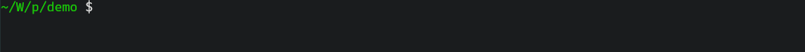

## 特点
- **Header-only**: 所有功能都包含在 `include/pgbar` 下的单个 `.hpp` 文件中。
- **低运行时开销**: 更新进度条的开销成本极低。
- **Unicode 支持**: 按 UTF-8 编码解析每个字符串。
- **RGB 支持**: 可通过十六进制 RGB 值定制进度条颜色。
- **可选的线程安全**: 可以通过模板参数调节进度条的线程安全性。
- **类 `tqdm` 接口**: 利用模板技巧提供了友好的使用方式。
- **Modern C++ 规范**: （基本上）遵循 Modern C++ 的最佳实践。

## 样式
### ProgressBar
```
{LeftBorder}{Description}{Percent}{Starting}{Filler}{Lead}{Remains}{Ending}{Counter}{Speed}{Elapsed}{Countdown}{RightBorder}
 30.87% | [=========>                    ] |  662933732/2147483647 |  11.92 MHz | 00:00:55 < 00:02:03
```


### BlockProgressBar
```
{LeftBorder}{Description}{Percent}{Starting}{BlockBar}{Ending}{Counter}{Speed}{Elapsed}{Countdown}{RightBorder}
 35.22% | ██████████▋                    |  47275560/134217727 |  16.80 MHz | 00:00:02 < 00:00:05
```


### SpinnerBar
```
{LeftBorder}{Lead}{Description}{Percent}{Counter}{Speed}{Elapsed}{Countdown}{RightBorder}
\ |  48.64% |  65288807/134217727 |  17.84 MHz | 00:00:03 < 00:00:03
```


### ScannerBar
```
{LeftBorder}{Description}{Percent}{Starting}{Filler}{Lead}{Filler}{Ending}{Counter}{Speed}{Elapsed}{Countdown}{RightBorder}
 39.82% | [---------------------<==>----] |  53458698/134217727 |  17.89 MHz | 00:00:02 < 00:00:04
```


### MultiBar


## 用例
```cpp
#include "pgbar/pgbar.hpp"

int main()
{
  pgbar::ProgressBar<> bar { pgbar::option::Remains( "-" ),
                             pgbar::option::Filler( "=" ),
                             pgbar::option::Styles( pgbar::configs::CharBar::Entire ),
                             pgbar::option::TodoColor( "#A52A2A" ),
                             pgbar::option::DoneColor( 0x0099FF ),
                             pgbar::option::StatusColor( pgbar::color::Yellow ),
                             pgbar::option::Tasks( 100 ) };

  for ( auto _ = 0; _ < 100; ++_ )
    bar.tick();
}
```

更多用例详见 [QuickStart_zh.md](QuickStart_zh.md) 及 [demo.cpp](../demo/demo.cpp)。

## FAQ
### 进度条的更新工作会拖慢程序本身吗？
不，正如[特点](#特点)中指出的，进度条的更新是*基本上*零开销。

在开启 `O2/O3` 优化的情况下，下面代码中的第二个迭代的性能开销会*趋近于*上面迭代的开销[^1]。

[^1]: 实际上进度条更新的代码会仅多出一次函数调用跳转、以及条件分支的开销。

```cpp
#include "pgbar/pgbar.hpp"

int main()
{
  std::size_t count = 0;
  for ( std::size_t _ = 0; _ < 2147483647; ++_ )
    ++count;

  pgbar::ProgressBar<> bar { pgbar::options::Tasks( 2147483647 ) };
  for ( std::size_t _ = 0; _ < 2147483647; ++_ )
    bar.tick();
}
```

不过显示效果流畅与否，就取决于使用的处理器的单核性能了。
### 可以运行在 Windows/Linux 上吗？
没问题，我写这个库的初衷就是想在两个系统上同时使用一个可视化迭代进度的库。
### 支持 Unicode 吗？
正如一开头指出的，没有问题。

虽然目前也仅支持 UTF-8 编码的字符串，使用任何非 UTF-8 编码字符串都会导致异常。

如果你使用的是 C++20 标准，那么 `pgbar` 的函数也支持 `u8string`。



## 许可
项目遵从 [MIT](LICENSE) 许可。
