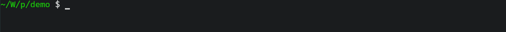
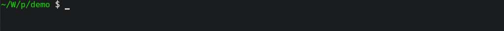
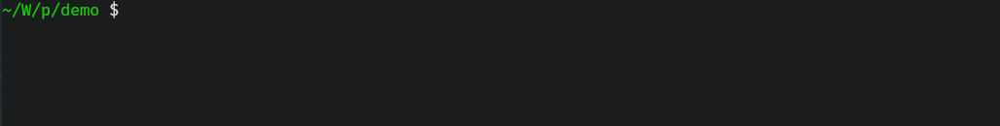

## 特点
- **Header-only**: 所有功能都包含在 `include/pgbar` 下的单个 `.hpp` 文件中。
- **低运行时开销**: 纳秒级别的调用开销。[^1]
- **C++11 及更高版本兼容**: 支持从 C++11 到 C++23 的所有已发布标准。
- **Unicode 支持**: 按 UTF-8 编码解析每个字符串。
- **RGB 支持**: 可通过十六进制 RGB 值定制进度条颜色。
- **线程安全设计**: 可以在多线程环境下安全使用。
- **类 `tqdm` 接口**: 基于模板元编程的链式调用方法。
- **Modern C++ 范式**: 利用 `constexpr`、RAII 和类型萃取实现零成本抽象。

[^1]: 在 AMD Ryzen 7 5800H 上以 `-Og` 优化等级和 `Policy::Async` 执行策略测得，在 tight loop 测试中 `tick` 的平均调用开销 `≤5ns`。

## 样式
### ProgressBar
```
{LeftBorder}{Prefix}{Percent}{Starting}{Filler}{Lead}{Remains}{Ending}{Counter}{Speed}{Elapsed}{Countdown}{Postfix}{RightBorder}
 30.87% | [=========>                    ] |  662933732/2147483647 |  11.92 MHz | 00:00:55 | ~00:02:03
```


### BlockBar
```
{LeftBorder}{Prefix}{Percent}{Starting}{Filler}{Lead}{Remains}{Ending}{Counter}{Speed}{Elapsed}{Countdown}{Postfix}{RightBorder}
 35.22% | ██████████▋                    |  47275560/134217727 |  16.80 MHz | 00:00:02 | ~00:00:05
```


### SpinBar
```
{LeftBorder}{Prefix}{Lead}{Percent}{Counter}{Speed}{Elapsed}{Countdown}{Postfix}{RightBorder}
\ |  48.64% |  65288807/134217727 |  17.84 MHz | 00:00:03 | ~00:00:03
```


### SweepBar
```
{LeftBorder}{Prefix}{Percent}{Starting}{Filler}{Lead}{Filler}{Ending}{Counter}{Speed}{Elapsed}{Countdown}{Postfix}{RightBorder}
 39.82% | [-------<=>--------------------] |  53458698/134217727 |  17.89 MHz | 00:00:02 | ~00:00:04
```


### FlowBar
```
{LeftBorder}{Prefix}{Percent}{Starting}{Filler}{Lead}{Filler}{Ending}{Counter}{Speed}{Elapsed}{Countdown}{Postfix}{RightBorder}
 73.93% | [                     ====     ] |   99224978/134217727 |  81.02 MHz | 00:00:01 | ~00:00:00
```


### MultiBar


### DynamicBar


## 用例
```cpp
#include "pgbar/ProgressBar.hpp"

int main()
{
  pgbar::ProgressBar<> bar { pgbar::option::Remains( "-" ),
                             pgbar::option::Filler( "=" ),
                             pgbar::option::Styles( pgbar::config::Line::Entire ),
                             pgbar::option::RemainsColor( "#A52A2A" ),
                             pgbar::option::FillerColor( 0x0099FF ),
                             pgbar::option::InfoColor( pgbar::color::Yellow ),
                             pgbar::option::Tasks( 100 ) };

  for ( auto _ = 0; _ < 100; ++_ )
    bar.tick();
}
```

更多用例详见 [QuickStart_zh.md](QuickStart_zh.md) 及 [demo/](../demo/)。

## FAQ
### 如何构建？
#### 仅头文件
你可以将 `include/pgbar` 复制到项目的包含路径中，随后在源文件内直接包含对应头文件。
#### C++20 Module
如果你在使用已经支持 `module` 功能的编译器，那么可以使用 `include/` 下的 `*.ixx` 模块接口文件，并在项目中调用它。

> `include/` 下包含了一个适用于 `gcc 15.1` 的编译用 `Makefile`。

`pgbar` 支持以下形式的 `import`：

```cpp
import pgbar.Core;        // 仅引入核心功能，如异常类型等
import pgbar.ProgressBar; // 按需引入。所有进度条模块都会自动引入 pgbar.Core
import pgbar.MultiBar;    // 不同模块之间引入的功能是彼此正交的
import pgbar;             // 引入所有功能
```

在正式使用时，请务必一并在代码文件中 `import std`，否则就目前来看会出现奇怪的编译错误。
#### 子模块（submodule）
使用 `git` 将 `pgbar` 作为子模块引入你的项目目录中：

```bash
git submodule add https://github.com/Konvt/pgbar path/to/pgbar
git submodule update --init --recursive
```

并将以下代码添加到项目中 `CMakeLists.txt` 的对应位置即可。

```cmake
add_subdirectory(${CMAKE_SOURCE_DIR}/path/to/pgbar)
# ...
add_executable(TargetName ${SOURCES})
target_link_libraries(TargetName PRIVATE pgbar)
```

可以使用以下命令编译 `demo/` 下的示例文件。

```bash
cmake -S . -DPGBAR_BUILD_DEMO=ON -B build
cmake --build build --target demo
# 或者使用 demo_{filename} 编译 demo/ 下的指定文件
```

或者在 `demo/` 文件夹中直接使用 `make` 指令编译。

```bash
make all
# 或者使用 {filename} 编译 demo/ 下的指定文件
```
#### 安装
执行以下命令将 `pgbar` 安装到系统默认目录。

```bash
cmake -S . -DPGBAR_INSTALL=ON -B build
# 或者安装到指定目录：
# cmake -S . -DPGBAR_INSTALL=ON -DCMAKE_INSTALL_PREFIX=/usr -B build
cmake --install build
# 等价指令可以是：
# cmake --build build --target install
```

卸载时需要依赖安装时生成的缓存文件；如果缓存文件已经被移除了，那么可以再执行一次安装命令生成。

执行以下命令将 `pgbar` 从系统中移除。

```bash
cmake --build build --target uninstall
```

### 进度条的更新工作会拖慢程序本身吗？
不，正如[特点](#特点)中指出的，进度条的更新是*基本上*零开销。

在开启 `O2/O3` 优化的情况下，下面代码中的第二个迭代的性能开销会*趋近于*上面迭代的开销。[^2]

[^2]: 实际上进度条更新的代码会仅多出若干次调用跳转和分支的开销。

```cpp
#include "pgbar/pgbar.hpp"

int main()
{
  std::size_t count = 0;
  for ( std::size_t _ = 0; _ < 2147483647; ++_ )
    ++count;

  pgbar::ProgressBar<> bar { pgbar::option::Tasks( 2147483647 ) };
  for ( std::size_t _ = 0; _ < 2147483647; ++_ )
    bar.tick();
}
```

不过显示效果流畅与否，就取决于使用的处理器的单核性能了。
### 可以运行在 Windows/Linux 上吗？
没问题，我写这个库的初衷就是想在两个系统上同时使用一个可视化迭代进度的库。

不过需要注意：如果是在 Windows 平台下，那么 `pgbar` 会依赖于 `Windows.h` 头文件；而且会定义 `NOMINMAX` 禁用 `min` 与 `max` 宏。
### 支持 Unicode 吗？
正如一开头指出的，没有问题。

虽然目前也仅支持 UTF-8 编码的字符串，使用任何非 UTF-8 编码字符串都会导致异常。

如果你使用的是 C++20 标准，那么 `pgbar` 的函数也支持 `u8string`。


## 许可
项目遵从 [MIT](../LICENSE) 许可。
